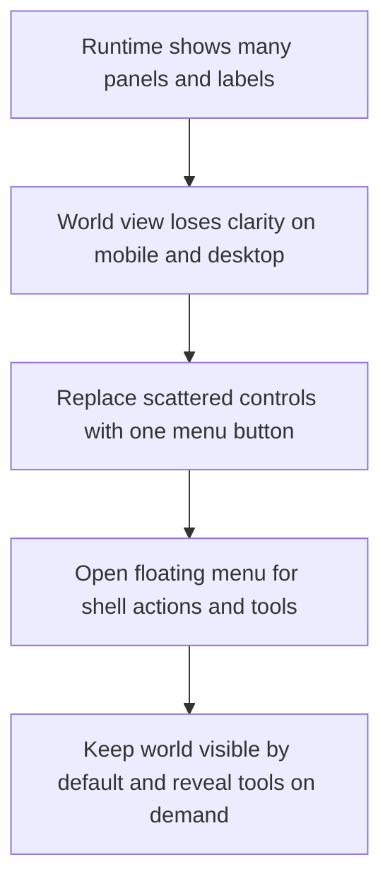

## req_017_redesign_runtime_overlay_into_a_single_floating_menu - Redesign runtime overlay into a single floating menu
> From version: 0.1.3
> Status: Done
> Understanding: 98%
> Confidence: 95%
> Complexity: Medium
> Theme: UX
> Reminder: Update status/understanding/confidence and references when you edit this doc.

# Needs
- Rework the runtime overlay model across mobile and desktop because the current always-visible panels consume too much screen space and expose too many non-essential elements.
- Replace the current top bar and persistent player-facing cards with a single menu button that opens a floating menu for secondary actions and tools.
- Make the floating menu the standard entry point for choosing what to do or see in the shell, including `fullscreen`, `reset camera`, `diagnostics`, and `inspecteur`.
- Standardize the default shell posture so implementation does not reopen basic UX decisions during delivery: place the menu trigger in the top-right corner, use a floating inspection panel on desktop, use a bottom-sheet inspection panel on mobile, and keep diagnostics behind debug-oriented access rather than treating them as a normal production-facing surface.
- Remove non-actionable always-visible labels that add chrome without helping interaction, including `Emberwake runtime` and `Movement-first loop`.
- Keep the world render visually dominant by default so the player can steer and read the scene without large permanent overlay panels blocking the surface.
- Preserve access to debug and inspection features without forcing them into the baseline player-facing view.

# Context
The current shell already follows a thin DOM overlay direction in principle, but the runtime presentation has drifted into a panel-heavy layout. The app can currently show a branded top bar, multiple top-level buttons, a movement card, an inspection panel, and diagnostics surfaces inside the same view. On mobile this reduces the usable play area too aggressively, and on desktop it still adds visual noise that does not earn its place.

This request is not about polishing the existing cards. It is about redefining the interaction posture of the shell so optional tools stay optional. The baseline runtime should present the world first, with a single compact menu affordance for revealing secondary actions only when the player or tester explicitly asks for them.

The floating menu should become the common control hub for shell-level actions and visibility toggles. That means fullscreen entry, camera reset, diagnostics visibility, and inspection visibility should no longer require separate persistent controls scattered around the screen. Inspection and diagnostics may still exist as DOM-owned overlays, but they should be hidden by default and opened intentionally through the menu.

Default posture for this request: the menu trigger lives in the top-right corner on both mobile and desktop unless a later request deliberately changes it. The inspection experience should not use the same presentation across all breakpoints: desktop should favor a compact floating panel, while mobile should favor a bottom-sheet presentation that preserves horizontal space and keeps the world readable.

Diagnostics should remain available for development and debug workflows, but this request should not normalize them as a standard production-facing player surface. The menu may expose diagnostics when debug conditions allow it, while the baseline player-facing runtime remains free of developer instrumentation by default.

This request must cover both mobile and desktop because the current issue is structural rather than breakpoint-specific. The solution should simplify the overlay hierarchy everywhere while keeping the fullscreen shell, render-surface ownership, and debug tooling direction already established elsewhere.

Scope includes shell-level information hierarchy, persistent-versus-contextual overlay rules, menu posture, and explicit removal of unnecessary labels from the baseline runtime. Scope excludes final visual art direction, full settings architecture, and unrelated gameplay-system changes.

# Acceptance criteria
- AC1: The request defines a dedicated UX simplification scope for runtime overlays rather than treating the current screen clutter as a styling-only issue.
- AC2: The baseline runtime view on mobile and desktop keeps the world visually dominant and limits permanent chrome to a compact menu trigger rather than multiple persistent cards and top-level controls.
- AC3: The shell exposes a single menu button that opens a floating menu for choosing what to do or see in the runtime.
- AC3.1: The default placement of the persistent menu trigger is the top-right corner across mobile and desktop unless an explicit later request changes that posture.
- AC4: The floating menu includes explicit entries for `fullscreen`, `reset camera`, `diagnostics`, and `inspecteur`.
- AC5: `diagnostics` and `inspecteur` are hidden by default and only become visible after an explicit user choice through the menu.
- AC5.1: `inspecteur` uses a compact floating panel posture on desktop and a bottom-sheet posture on mobile.
- AC5.2: `diagnostics` remain debug-oriented and are not treated as default production-facing HUD content even if a menu entry exists for them in debug-capable environments.
- AC6: The request removes the always-visible labels `Emberwake runtime` and `Movement-first loop` from the baseline runtime presentation.
- AC7: The request remains compatible with the fullscreen shell and thin DOM overlay ownership already established, while reducing overlay competition with the render surface.
- AC8: The request addresses both mobile and desktop behavior at a product level and does not solve the problem only for one breakpoint.
- AC9: The request distinguishes between the persistent menu trigger, the floating menu itself, and optional contextual panels revealed from that menu.
- AC10: The request preserves access to developer-facing tools such as diagnostics and inspection without treating them as default player-facing HUD content.
- AC11: The request avoids prematurely defining full settings, meta-navigation, or final production art direction beyond the shell simplification needed here.

# Definition of Ready (DoR)
- [x] Problem statement is explicit and user impact is clear.
- [x] Scope boundaries (in/out) are explicit.
- [x] Acceptance criteria are testable.
- [x] Dependencies and known risks are listed.

# Companion docs
- Product brief(s): `prod_001_minimal_overlay_and_feedback_for_early_runtime`
- Architecture decision(s): `adr_002_separate_react_shell_from_pixi_runtime_ownership`
- Task(s): `task_025_orchestrate_runtime_overlay_simplification_around_a_floating_menu`

# Backlog
- `item_066_define_floating_shell_menu_actions_for_fullscreen_and_camera_reset`
- `item_067_define_menu_driven_diagnostics_access_and_debug_gating`
- `item_068_define_minimal_runtime_chrome_and_single_menu_trigger_baseline`
- `item_069_define_menu_driven_inspection_presentation_across_mobile_and_desktop`
