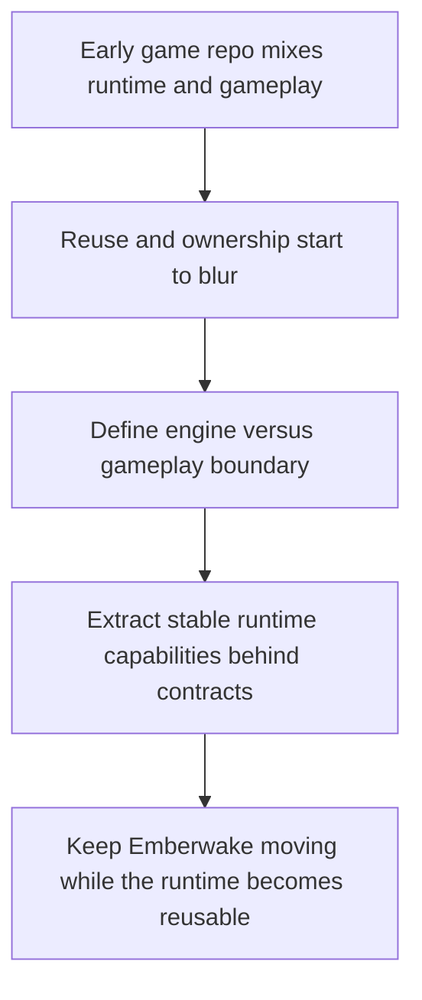

## req_018_define_engine_and_gameplay_boundary_for_runtime_reuse - Define engine and gameplay boundary for runtime reuse
> From version: 0.1.3
> Status: Done
> Understanding: 99%
> Confidence: 96%
> Complexity: High
> Theme: Architecture
> Reminder: Update status/understanding/confidence and references when you edit this doc.

# Needs
- Define a dedicated refactor scope that separates reusable runtime or engine capabilities from Emberwake-specific gameplay and content.
- Keep the project evolvable as a game while also allowing the runtime foundation to become reusable for later top-down 2D web games.
- Treat the first step as an in-repository modularization effort rather than an immediate multi-repository split.
- Define a concrete target module topology for `app shell`, `engine runtime`, and `Emberwake gameplay` ownership.
- Identify which current modules are strong candidates for engine extraction and which should remain owned by Emberwake gameplay.
- Require explicit contracts between engine-owned systems and game-owned systems so the engine does not directly encode Emberwake rules, entities, content, or progression.
- Preserve the existing `React shell owns overlays` and `Pixi owns world runtime` architecture boundaries while the refactor happens.
- Keep the refactor incremental and release-safe so the current playable runtime does not have to stop evolving during the extraction work.
- Avoid prematurely designing a fully generic engine; prefer a reusable web top-down runtime posture with concrete boundaries and narrow abstractions.
- Ensure tests, smoke validation, and release readiness continue to work during and after the extraction.

# Context
The repository currently has a good feature-oriented structure, but `src/game` still mixes two different concerns:
- reusable runtime capabilities such as camera math, viewport transforms, runtime surface wiring, input primitives, fixed-step simulation cadence, and technical diagnostics
- Emberwake-specific gameplay and content concerns such as the current entity simulation rules, debug scenario content, world presentation choices, and player-facing runtime behavior

That mixture is acceptable for an early vertical slice, but it becomes limiting if the project wants to do two things at once:
- keep evolving Emberwake as a real game
- make the runtime reusable for later projects without dragging Emberwake assumptions into every future game

Without a dedicated request, later refactors will likely happen opportunistically and inconsistently. Some gameplay rules may leak into shared modules, while some reusable runtime code may remain trapped inside Emberwake-owned folders. That would create a weak “engine” that is neither cleanly reusable nor simple to maintain.

The repository already has useful architecture posture to build on:
- `adr_000_adopt_feature_oriented_organic_frontend_structure` favors clear ownership and disciplined promotion to shared space
- `adr_002_separate_react_shell_from_pixi_runtime_ownership` already defines a strong platform boundary
- `adr_003_define_coordinate_spaces_and_camera_contract` already identifies stable runtime primitives that should not depend on one game’s fiction

This request should therefore define a concrete, staged refactor model that clarifies what belongs to:
- a reusable engine or runtime layer
- the Emberwake game module
- the web app shell and delivery layer

The preferred outcome is not a vague “generic engine initiative.” The preferred outcome is an explicit runtime boundary that stays specialized enough to be useful, especially for top-down 2D web games, while removing direct dependence on Emberwake gameplay rules and content.

At the current codebase level, likely engine candidates include camera primitives, world-view transforms, low-level input math, runtime surface ownership, and other systems whose purpose does not depend on Emberwake fiction. Likely Emberwake-owned modules include debug scenario content, entity behavior rules, content definitions, world generation flavor, and player-facing game states.

The request should also define a staged extraction path. A same-repository modular structure such as `apps/`, `packages/`, or `games/` is a valid target if it keeps ownership clear and avoids breaking ongoing delivery. The request should not assume a package publish strategy, a separate npm distribution model, or a final multi-repo split unless those become justified later.

# Acceptance criteria
- AC1: The request defines a dedicated refactor scope for separating reusable engine or runtime concerns from Emberwake gameplay concerns rather than leaving the extraction as ad hoc cleanup.
- AC2: The request defines the primary ownership zones that should exist after the refactor, covering at least `app shell`, `engine runtime`, and `Emberwake gameplay`.
- AC3: The request treats the first extraction phase as an in-repository modularization effort rather than requiring an immediate split into multiple repositories.
- AC4: The request defines a concrete target direction for repository or source topology, such as `apps`, `packages`, `games`, or another equally explicit ownership model.
- AC5: The request identifies the kinds of current modules that should become engine candidates, including stable runtime primitives such as camera, transforms, simulation cadence, runtime surface wiring, or low-level input math where appropriate.
- AC6: The request identifies the kinds of current modules that should remain Emberwake-owned, including gameplay rules, content data, scenario definitions, progression logic, and player-facing game-specific presentation.
- AC7: The request requires explicit engine-to-game contracts so reusable runtime modules do not directly encode Emberwake entity rules, content definitions, or long-term gameplay systems.
- AC8: The request stays compatible with the existing architecture boundaries that keep React responsible for shell and overlays while Pixi owns the interactive world runtime.
- AC9: The request defines an incremental migration posture that keeps the current playable runtime buildable and testable throughout the refactor instead of relying on a stop-the-world rewrite.
- AC10: The request explicitly avoids over-generalizing into a speculative universal engine and instead favors pragmatic reuse for the project’s actual web top-down runtime needs.
- AC11: The request remains compatible with current CI, browser smoke, release-readiness, and changelog expectations so the extraction can happen without suspending delivery discipline.
- AC12: The request leaves room for later package publishing or multi-project reuse, but does not require those operational decisions to be solved before the code boundary itself is made explicit.

# Open questions
- What reuse target should the engine optimize for: only web 2D top-down games close to Emberwake, or very different genres as well?
  Recommended default: optimize for reusable `web 2D top-down runtime` capabilities rather than a universal engine.
- Should the repository stay a single modular monorepo for the foreseeable future, or should the refactor explicitly prepare a near-term multi-repository split?
  Recommended default: treat the single repository as the durable structure for at least the next few versions and postpone any multi-repo decision.
- What should the exact `world` boundary be between engine and gameplay ownership?
  Recommended default: keep coordinates, chunk addressing, transforms, visibility, and generic picking in the engine, while Emberwake owns world generation flavor, traversal rules, and authored content.
- Should `entities` move into the engine as a full system, or should only entity-related primitives become reusable?
  Recommended default: move only entity primitives such as representation contracts, occupancy, spatial indexing, and generic lifecycle helpers into the engine, while Emberwake keeps archetypes, states, and gameplay behavior.
- Should Pixi rendering be extracted aggressively now, or should only the stable render surface and scene contracts move first?
  Recommended default: extract the render surface, camera integration, and scene contracts first, while keeping Emberwake-specific scene composition and visual treatment in the game layer until they stabilize.
- What is the minimum engine-to-game contract needed for the first refactor phase?
  Recommended default: keep the contract narrow around `initialize`, `update`, `present render data`, and `map input`, rather than introducing a plugin architecture early.
- Does input ownership belong primarily to the engine or to the game layer?
  Recommended default: let the engine own low-level input capture and normalized input frames, while the game owns action mapping and gameplay meaning.
- Where should diagnostics and debug tooling live after the split?
  Recommended default: keep technical runtime diagnostics in the engine and move scenario-specific or content-specific debugging into the Emberwake game layer.
- What migration safety bar should apply while the refactor is in progress?
  Recommended default: require no user-visible regression in the current playable runtime, with `npm run ci`, `npm run test:browser:smoke`, and `npm run release:ready` remaining green throughout the staged extraction.
- Are temporary cross-boundary imports acceptable during migration?
  Recommended default: allow temporary `game -> engine` and `app -> engine/game` wiring, but disallow `engine -> game` imports from the start.
- Should the engine be versioned as an internal package immediately?
  Recommended default: no; make the code boundary explicit first, then decide on package versioning only if real cross-project reuse starts happening.
- What repository topology should be treated as the preferred target during backlog splitting?
  Recommended default: use a structure close to `apps/emberwake-web`, `packages/engine-core`, `packages/engine-pixi`, and `games/emberwake`.

# Definition of Ready (DoR)
- [x] Problem statement is explicit and user impact is clear.
- [x] Scope boundaries (in/out) are explicit.
- [x] Acceptance criteria are testable.
- [x] Dependencies and known risks are listed.

# Companion docs
- Product brief(s): `prod_000_initial_single_entity_navigation_loop`, `prod_003_high_density_top_down_survival_action_direction`
- Architecture decision(s): `adr_000_adopt_feature_oriented_organic_frontend_structure`, `adr_002_separate_react_shell_from_pixi_runtime_ownership`, `adr_003_define_coordinate_spaces_and_camera_contract`, `adr_014_adopt_a_modular_app_engine_game_topology_with_one_way_dependencies`, `adr_015_define_engine_to_game_runtime_contract_boundaries`
- Spec(s): `spec_000_define_initial_engine_to_game_typescript_contract_shapes`
- Task(s): `task_026_orchestrate_engine_gameplay_boundary_extraction_for_runtime_reuse`

# Backlog
- `item_070_define_target_repository_topology_for_engine_runtime_and_game_modules`
- `item_071_define_engine_to_game_contracts_for_update_render_and_input_integration`
- `item_072_extract_reusable_runtime_primitives_from_current_game_modules`
- `item_073_separate_emberwake_specific_gameplay_content_and_scenarios_from_runtime_code`
- `item_074_define_incremental_migration_and_validation_strategy_for_engine_gameplay_extraction`

# Delivery note
- Implemented through `task_026_orchestrate_engine_gameplay_boundary_extraction_for_runtime_reuse`.
- The repository now materializes the target ownership split with `apps/emberwake-web`, `packages/engine-core`, `packages/engine-pixi`, and `games/emberwake`.
