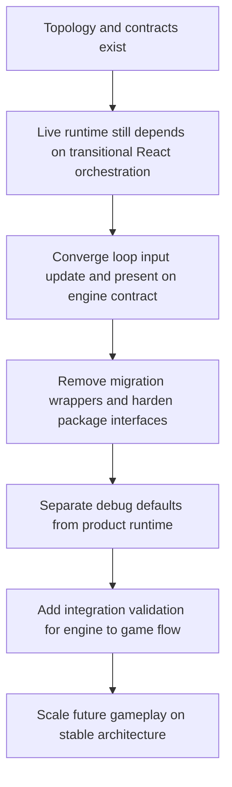

## req_019_complete_runtime_convergence_and_harden_modular_architecture_boundaries - Complete runtime convergence and harden modular architecture boundaries
> From version: 0.1.2
> Status: Done
> Understanding: 99%
> Confidence: 96%
> Complexity: High
> Theme: Architecture
> Reminder: Update status/understanding/confidence and references when you edit this doc.

# Needs
- Complete the migration from the current transitional runtime wiring to the intended modular `app shell -> engine runtime -> Emberwake game` architecture.
- Make the `GameModule` contract the real runtime orchestration boundary rather than a parallel abstraction that exists beside React-owned hooks.
- Move fixed-step simulation ownership, normalized input flow, update cadence, and presentation orchestration into an engine-owned runtime loop instead of leaving the active game loop primarily inside React hooks.
- Reduce or remove transitional wrapper modules under `src/game/*` that only re-export `@engine` or `@game` modules and blur ownership.
- Harden package and module boundaries so `engine-core`, `engine-pixi`, `games/emberwake`, and the web app shell expose clearer public interfaces and accumulate less incidental coupling over time.
- Separate product runtime behavior from debug-only scenarios, fixtures, and development visualization so the shipping game loop does not depend on debug content as its default source of truth.
- Strengthen the persistence architecture beyond the current narrow local-session posture so future runtime growth can add persisted domains and schema evolution without reworking storage assumptions.
- Add integration validation around the engine-to-game runtime contract, especially across `input -> mapInput -> update -> present`, rather than relying mostly on unit tests around isolated helpers.
- Keep the migration incremental and release-safe, with current CI, browser smoke, and release-readiness commands remaining green throughout the convergence work.

# Context
The repository now has a meaningful architectural foundation:
- a modular repository topology with `apps/emberwake-web`, `packages/engine-core`, `packages/engine-pixi`, and `games/emberwake`
- reusable camera, world, geometry, and input primitives in engine-owned modules
- Emberwake-owned gameplay and content modules
- a documented engine-to-game contract shape
- a validated shell with CI, browser smoke coverage, release checks, and a deterministic single-entity runtime slice

That is a strong intermediate state, but it is still an intermediate state.

The current application runtime remains split between two architectural centers:
- the intended modular runtime contract represented by `GameModule` and the `games/emberwake` runtime exports
- the currently active React hook orchestration in `src/`, where simulation cadence, world assembly, and presentation selection are still coordinated directly in app-owned hooks

This means the repository has already solved the ownership map at a structural level, but has not yet fully converged on that structure operationally. The target architecture exists, but the shipped runtime still flows through transitional adapters and React-level orchestration that bypass part of the intended engine contract.

That gap is manageable while the project is small, but it will become a scaling problem once Emberwake adds more gameplay systems, persistence domains, authored content, diagnostics, or alternative runtime scenes. Without a dedicated follow-up request, the codebase risks drifting into a hybrid model where:
- React owns too much runtime behavior
- engine contracts stay underused
- transitional wrappers become permanent
- debug fixtures silently become product dependencies
- package boundaries stay conceptual rather than technically meaningful

This request therefore focuses on architectural convergence rather than another content or feature slice. The goal is not to redesign the project from scratch. The goal is to finish the move from a validated transitional vertical slice to a runtime architecture that can absorb game growth without structural ambiguity.

The current architectural review highlights seven concrete convergence gaps:
- the runtime loop is not yet truly engine-owned end to end
- `GameModule` is not yet the mandatory orchestration path for the live app
- transitional wrapper modules still blur ownership and migration state
- package boundaries are clear in naming but still soft in practice
- runtime defaults still lean on debug scenario content and debug-oriented presentation
- persistence is versioned but still too narrow for medium-term state growth
- tests do not yet strongly validate the engine-to-game contract at integration level

The preferred outcome is a staged convergence effort that preserves current delivery quality while making the architecture genuinely executable at its intended boundaries.

# Acceptance criteria
- AC1: The request defines a convergence scope whose primary goal is to make the intended modular runtime architecture operational, not merely documented.
- AC2: The request requires the live runtime path to use the engine-to-game contract as the authoritative orchestration boundary for initialization, normalized input mapping, fixed-step update, and presentation output.
- AC3: The request requires simulation cadence and runtime-loop ownership to move out of app-specific React orchestration and into an engine-owned or engine-directed runtime layer, while keeping React responsible for shell composition and DOM overlays.
- AC4: The request identifies transitional wrapper modules and adapter layers that should be removed, reduced, or given explicit sunset scope so ownership no longer remains ambiguous.
- AC5: The request requires clearer package or module interfaces for `engine-core`, `engine-pixi`, `games/emberwake`, and the app shell, with explicit avoidance of new `engine -> game` coupling and reduced incidental cross-imports.
- AC6: The request separates debug-only scenarios, fixtures, or development visualization from product runtime defaults so the shipping loop is not structurally dependent on debug content.
- AC7: The request expands the persistence discussion from the current single-session slice to a more durable storage posture that can support versioned growth across multiple runtime domains without assuming a backend.
- AC8: The request introduces integration validation for the engine-to-game runtime chain, including checks around `input -> mapInput -> update -> present`, in addition to existing unit and browser-smoke coverage.
- AC9: The request keeps the migration incremental and compatible with current `npm run ci`, `npm run test:browser:smoke`, and release-readiness expectations.
- AC10: The request remains scoped to architectural convergence and does not expand into a broad gameplay redesign, backend introduction, or speculative universal-engine initiative.

# Open questions
- Should the first convergence phase create a reusable engine-owned runtime runner immediately, or should it first route the existing runtime through `GameModule` while still leaving some orchestration inside the app layer?
  Recommended default: introduce a narrow engine-owned runtime runner early so the architectural center moves decisively instead of preserving a long-lived hybrid.
- How aggressively should transitional `src/game/*` wrappers be removed in the first wave?
  Recommended default: remove pure re-export wrappers first, keep only adapters that still absorb active migration risk, and mark any remaining adapters as explicitly temporary.
- Should debug scenarios remain available as fixtures for tests and tooling after convergence?
  Recommended default: yes, but keep them as fixtures or development inputs rather than the implicit default source of truth for the player-facing runtime.
- What persistence boundary should be designed now versus later?
  Recommended default: define a domain-oriented versioned storage model now, but only implement the minimal domains needed for the next gameplay wave.
- Where should integration tests sit after convergence?
  Recommended default: place contract-level integration tests close to the engine-to-game boundary so they validate runtime flow without depending on the full browser shell.

# Definition of Ready (DoR)
- [x] Problem statement is explicit and user impact is clear.
- [x] Scope boundaries (in/out) are explicit.
- [x] Acceptance criteria are testable.
- [x] Dependencies and known risks are listed.

# Companion docs
- Product brief(s): `prod_000_initial_single_entity_navigation_loop`, `prod_003_high_density_top_down_survival_action_direction`
- Architecture decision(s): `adr_002_separate_react_shell_from_pixi_runtime_ownership`, `adr_004_run_simulation_on_a_fixed_timestep`, `adr_014_adopt_a_modular_app_engine_game_topology_with_one_way_dependencies`, `adr_015_define_engine_to_game_runtime_contract_boundaries`
- Request(s): `req_018_define_engine_and_gameplay_boundary_for_runtime_reuse`
- Task(s): `task_027_orchestrate_runtime_convergence_and_modular_boundary_hardening`

# Backlog
- `item_075_route_live_runtime_through_engine_game_module_orchestration`
- `item_076_extract_an_engine_owned_runtime_runner_for_fixed_step_input_update_and_present_flow`
- `item_077_remove_or_sunset_transitional_runtime_wrappers_under_src_game`
- `item_078_harden_public_module_boundaries_and_dependency_rules_across_app_engine_and_game`
- `item_079_separate_debug_fixtures_from_product_runtime_defaults_and_scene_bootstrapping`
- `item_080_define_domain_oriented_versioned_persistence_for_runtime_growth`
- `item_081_add_engine_to_game_integration_tests_for_runtime_contract_flow`

# Delivery note
- Implemented through `task_027_orchestrate_runtime_convergence_and_modular_boundary_hardening`.
- The live runtime now executes through an engine-owned runner and the `GameModule` contract, product bootstrap defaults no longer depend structurally on the official debug scenario, persistence is organized around explicit storage domains, and contract-level integration tests now cover the runtime chain.
