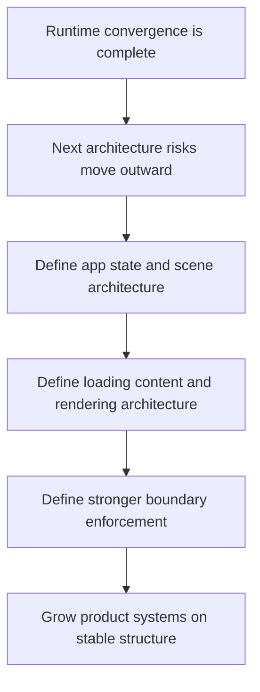

## req_020_define_the_next_architecture_wave_for_app_state_loading_content_rendering_and_boundary_enforcement - Define the next architecture wave for app state loading content rendering and boundary enforcement
> From version: 0.1.2
> Status: Ready
> Understanding: 98%
> Confidence: 95%
> Complexity: High
> Theme: Architecture
> Reminder: Update status/understanding/confidence and references when you edit this doc.

# Needs
- Define the next architecture wave after runtime convergence so the project does not immediately re-accumulate ambiguity at the app, runtime, content, and rendering layers.
- Define an explicit scene and app-state architecture for `boot`, `runtime`, `pause`, `failure`, `settings`, and other future meta-surfaces so `AppShell` does not become the next oversized orchestration hub.
- Define a runtime-loading and performance architecture for Pixi startup, mobile-first loading posture, chunk strategy, and lazy-loading boundaries rather than relying only on warning-threshold suppression.
- Define a content-authoring and validation architecture for gameplay, world, entity, and scenario data so future systems can grow on typed, validated, reference-safe contracts.
- Define a render-pipeline and scene-composition architecture that clarifies what belongs to engine-level Pixi adapters, what belongs to game-owned scene composition, and how future layers such as VFX, overlays, and world feedback should be introduced.
- Define a stronger boundary-enforcement strategy for public modules, import rules, and architecture-regression checks so the modular topology remains durable as the codebase grows.
- Keep the request architecture-focused rather than turning it into immediate gameplay design, large UI redesign, or backend planning.

# Context
The repository has just closed a major runtime-convergence wave:
- the live runtime now executes through an engine-owned runner and the `GameModule` contract
- product runtime defaults are no longer structurally tied to debug fixtures
- some legacy wrappers have been removed
- persistence now has a domain-oriented storage foundation
- integration tests now cover the engine-to-game contract chain

That closes the most urgent runtime-center ambiguity, but it also changes what the next architecture risks look like.

The next set of risks are broader and more horizontal:
- the app still needs a durable state-and-scene model before more player-facing surfaces accumulate around the runtime
- the loading strategy still treats Pixi as a large static upfront cost rather than an intentionally designed startup boundary
- the content model still needs stronger authoring and validation posture before gameplay density increases
- render-scene composition still risks drifting into ad hoc ownership once more feedback, effects, and visual layers appear
- the repository still needs stronger anti-regression rules if the modular split is expected to survive future growth

Without a dedicated request, those concerns will likely be addressed piecemeal:
- scene and meta-state will leak into shell code opportunistically
- performance decisions will remain local hacks instead of architecture
- content rules will emerge from implementation details rather than an explicit authoring contract
- render layers will grow wherever it is easiest in the moment
- import boundaries will stay partly conventional rather than meaningfully enforced

This request is therefore meant to define the next architecture wave after runtime convergence. It should not attempt to solve every implementation detail in one move. It should frame the target architecture and split the work into the right backlog slices so the next months of delivery do not reopen structural confusion.

The request deliberately groups five related architecture points because they interact tightly:
- scene or app-state structure determines how runtime, pause, settings, and meta-surfaces coexist
- loading and startup architecture influence how scene entry and runtime activation should be staged
- content authoring architecture determines how scenes and systems consume data safely
- render-pipeline architecture determines how content becomes visible through engine and game boundaries
- boundary enforcement determines whether all of the above remain clean after the first implementation pass

The preferred outcome is one coherent architecture request for the next phase, not five unrelated mini-requests that each optimize locally and create contradictions at the edges.

# Acceptance criteria
- AC1: The request defines a dedicated next-phase architecture scope after runtime convergence rather than leaving the follow-up architecture work implicit.
- AC2: The request defines an app-state or scene-architecture direction for at least `boot`, `runtime`, `pause`, `failure`, `settings`, and equivalent meta-surfaces that may emerge around the core runtime.
- AC3: The request defines a runtime-loading and performance architecture direction covering at least Pixi startup posture, chunking or lazy-loading strategy, and mobile-sensitive startup constraints.
- AC4: The request defines a content-authoring and validation architecture direction covering at least gameplay-facing data, world or entity content, references or ids, and validation posture.
- AC5: The request defines a render-pipeline or scene-composition architecture direction that clarifies ownership between engine-level Pixi adapters and game-owned visual composition.
- AC6: The request defines a stronger boundary-enforcement posture for public modules, import rules, or architecture-regression checks so the modular topology remains durable.
- AC7: The request keeps these five points coordinated as one architecture wave rather than treating them as unrelated local optimizations.
- AC8: The request remains architecture-focused and does not collapse into immediate gameplay design, broad product redesign, or backend planning.
- AC9: The request stays compatible with the current static frontend, engine-game contract posture, CI workflow, and release-readiness discipline.

# Open questions
- Should the next implementation wave prioritize scene architecture first, or should performance-loading architecture lead because it shapes runtime entry cost?
  Recommended default: define both in the same request, but sequence implementation so scene or app-state ownership is decided first.
- How much of the loading posture should become code-level lazy loading immediately versus documented architecture first?
  Recommended default: define the target loading architecture first, then implement only the highest-leverage lazy boundary.
- Should content-authoring architecture aim for a general content platform now, or a pragmatic Emberwake-specific typed content layer?
  Recommended default: keep the content architecture Emberwake-specific but disciplined enough to scale without a rewrite.
- How much render-pipeline abstraction is justified now?
  Recommended default: define ownership and layer boundaries first, but avoid a heavy render framework until additional visual systems force it.
- Should boundary enforcement rely mainly on lint rules, or also on tests and review checklists?
  Recommended default: use lightweight technical enforcement plus explicit regression checks in tests or CI where the signal is strong.

# Definition of Ready (DoR)
- [x] Problem statement is explicit and user impact is clear.
- [x] Scope boundaries (in/out) are explicit.
- [x] Acceptance criteria are testable.
- [x] Dependencies and known risks are listed.

# Companion docs
- Product brief(s): `prod_000_initial_single_entity_navigation_loop`, `prod_003_high_density_top_down_survival_action_direction`
- Architecture decision(s): `adr_002_separate_react_shell_from_pixi_runtime_ownership`, `adr_004_run_simulation_on_a_fixed_timestep`, `adr_014_adopt_a_modular_app_engine_game_topology_with_one_way_dependencies`, `adr_015_define_engine_to_game_runtime_contract_boundaries`
- Request(s): `req_019_complete_runtime_convergence_and_harden_modular_architecture_boundaries`
- Task(s): `task_027_orchestrate_runtime_convergence_and_modular_boundary_hardening`

# Backlog
- `item_082_define_scene_and_app_state_architecture_for_boot_flow_runtime_pause_and_meta_surfaces`
- `item_083_define_runtime_loading_and_performance_architecture_for_pixi_mobile_startup_and_chunk_strategy`
- `item_084_define_content_authoring_and_validation_architecture_for_gameplay_world_and_entity_data`
- `item_085_define_render_pipeline_and_scene_composition_boundary_between_engine_pixi_and_game_visual_layers`
- `item_086_define_boundary_enforcement_strategy_for_public_modules_import_rules_and_architecture_regression_checks`
