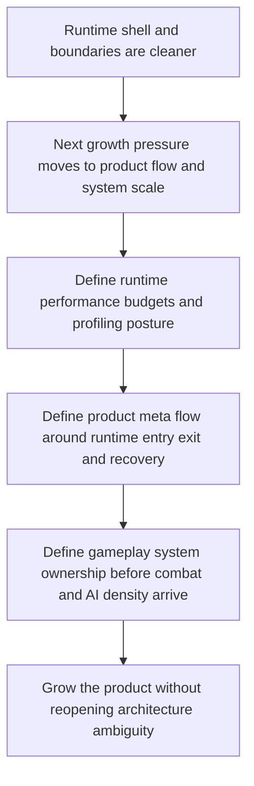

## req_021_define_the_next_runtime_product_and_gameplay_system_architecture_wave - Define the next runtime product and gameplay system architecture wave
> From version: 0.5.0
> Status: Done
> Understanding: 100%
> Confidence: 98%
> Complexity: High
> Theme: Architecture
> Reminder: Update status/understanding/confidence and references when you edit this doc.
> Schema version: 1.0

# Needs
- Define the next architecture wave after `task_028` so the project can grow from a structurally clean runtime into a scalable product runtime and gameplay stack.
- Define explicit runtime-performance budgets, profiling posture, and mobile-sensitive operating limits for shell startup, Pixi activation, and gameplay runtime load.
- Define a product meta-flow architecture for `pause`, `settings`, `failure`, `runtime re-entry`, and equivalent player-facing shell surfaces that now sit on top of the new app-scene model.
- Define gameplay-system ownership boundaries for future combat, status effects, AI, progression, and other cross-cutting systems so game complexity can grow without collapsing back into ad hoc runtime coupling.
- Keep the request architecture-focused rather than turning it into immediate full feature implementation, broad UX redesign, or content-production planning.

# Context
The repository has just completed a substantial architecture wave through `req_020` and `task_028`:
- the shell now owns an explicit scene model and a lazy runtime-loading boundary
- content validation now works as a game-owned cross-catalog graph
- runtime render-layer composition is now declared by the game while Pixi adapters stay reusable
- architecture boundaries are enforced more explicitly through targeted lint rules and ADRs

That closes the most urgent next-wave architecture gaps, but it also exposes the next set of constraints more clearly.

The project now has a cleaner runtime shell, yet three larger architecture questions remain unresolved:
- startup and runtime performance still lack explicit budgets, profiling thresholds, and mobile-operating limits even though the loading boundary now exists
- the shell-scene model exists, but the actual product-facing meta-flow around pause, settings, failure, and return-to-runtime behavior is still mostly reserved rather than architected end to end
- gameplay complexity is still low enough that system ownership is manageable informally, but combat, AI, effects, progression, and denser player-facing rules will require stronger architecture before they arrive

Without a dedicated request for those three concerns, the likely failure mode is not a single dramatic break. It is a gradual loss of clarity:
- performance work will stay reactive and local instead of budget-driven
- player-facing meta-surfaces will accumulate in the shell without a consistent flow model
- gameplay systems will expand inside the game module without explicit seams between state, update logic, presentation derivation, content inputs, and persistence boundaries

This request is therefore meant to define the next practical architecture wave above the already-converged runtime foundation. It should establish the right architecture for the next product and gameplay growth phase, not try to implement every future system in one step.

The three architecture points are intentionally grouped together:
- performance budgets shape what runtime entry, scene transitions, and system density are allowed to cost
- product meta-flow determines how the shell and runtime cooperate once the player can pause, fail, resume, or change settings
- gameplay-system ownership determines how future player-facing systems fit inside the runtime without recreating the structural ambiguity that the previous waves removed

The preferred outcome is one coherent architecture request for the next growth layer, with a clean split into backlog work after the request is accepted.

# Acceptance criteria
- AC1: The request defines a dedicated next-phase architecture scope after `req_020` rather than leaving runtime performance, meta-flow, and gameplay-system ownership implicit.
- AC2: The request defines a runtime-performance architecture direction covering at least startup budgets, profiling posture, and mobile-sensitive operating limits for shell and runtime activation.
- AC3: The request defines a product meta-flow architecture direction covering at least `pause`, `settings`, `failure`, and `runtime re-entry`, with explicit ownership between shell state and gameplay state.
- AC4: The request defines a gameplay-system ownership architecture direction covering at least combat-adjacent logic, AI or autonomous system logic, status or effect systems, progression-facing state, and their relation to update or presentation flow.
- AC5: The request keeps the three points coordinated as one architecture wave rather than treating them as unrelated local concerns.
- AC6: The request remains compatible with the current static frontend, app-scene posture, runtime runner, engine-game contract, CI workflow, and release-readiness discipline.
- AC7: The request remains architecture-focused and does not collapse into immediate implementation of combat, full menu UX, or broad optimization churn.

# Open questions
- Should performance budgets be enforced immediately in CI, or only documented first?
  Recommended default: define concrete budgets and profiling checkpoints now, then enforce only the highest-signal thresholds first.
- Should the product meta-flow treat pause and failure as purely shell-owned scenes, or should gameplay modules expose explicit runtime states that the shell reflects?
  Recommended default: keep shell-scene ownership in the app layer, but require game-owned signals where gameplay meaning is needed.
- How early should gameplay-system architecture distinguish simulation state from presentation state for future combat or AI systems?
  Recommended default: define those ownership seams before new cross-cutting systems land, even if the first implementations stay lightweight.
- Should performance budgets and gameplay-system limits be connected?
  Recommended default: yes, because future entity density, VFX, AI, and update cadence directly affect runtime budgets and mobile limits.

# Definition of Ready (DoR)
- [x] Problem statement is explicit and user impact is clear.
- [x] Scope boundaries (in/out) are explicit.
- [x] Acceptance criteria are testable.
- [x] Dependencies and known risks are listed.

# Companion docs
- Product brief(s): `prod_000_initial_single_entity_navigation_loop`, `prod_003_high_density_top_down_survival_action_direction`
- Architecture decision(s): `adr_015_define_engine_to_game_runtime_contract_boundaries`, `adr_016_define_shell_scene_state_and_meta_surface_ownership`, `adr_017_lazy_load_pixi_runtime_behind_a_shell_owned_boot_boundary`, `adr_018_validate_emberwake_content_as_a_typed_cross_catalog_graph`, `adr_019_keep_engine_pixi_as_adapter_and_game_as_runtime_scene_composer`, `adr_020_enforce_architecture_boundaries_with_targeted_module_scoped_lint_rules`, `adr_021_define_runtime_performance_budgets_and_profiling_at_the_shell_to_runtime_boundary`, `adr_022_keep_product_meta_flow_shell_owned_while_runtime_state_remains_game_preserved`, `adr_023_model_gameplay_systems_as_game_owned_state_slices_around_the_game_module`
- Request(s): `req_019_complete_runtime_convergence_and_harden_modular_architecture_boundaries`, `req_020_define_the_next_architecture_wave_for_app_state_loading_content_rendering_and_boundary_enforcement`
- Task(s): `task_027_orchestrate_runtime_convergence_and_modular_boundary_hardening`, `task_028_orchestrate_the_next_architecture_wave_for_app_state_loading_content_rendering_and_boundary_enforcement`, `task_029_orchestrate_runtime_performance_product_meta_flow_and_gameplay_system_architecture`

# AI Context
- Summary: Define the next architecture wave after task_028 so the project can grow from a structurally clean runtime into...
- Keywords: the, next, runtime, product, and, gameplay, system, architecture
- Use when: Use when framing scope, context, and acceptance checks for Define the next runtime product and gameplay system architecture wave.
- Skip when: Skip when the work targets another feature, repository, or workflow stage.

# Backlog
- `item_087_define_runtime_performance_budgets_profiling_and_mobile_limits_for_shell_and_pixi_startup`
- `item_088_define_product_meta_flow_architecture_for_pause_settings_failure_and_runtime_reentry`
- `item_089_define_gameplay_system_ownership_for_combat_status_effects_ai_and_progression`

# Delivery note
- Implemented through `task_029_orchestrate_runtime_performance_product_meta_flow_and_gameplay_system_architecture`.
- Accepted architecture decisions now cover runtime startup budgets and profiling, shell-owned meta-flow and runtime re-entry, and game-owned gameplay system slices for future combat, status, autonomy, and progression work.
