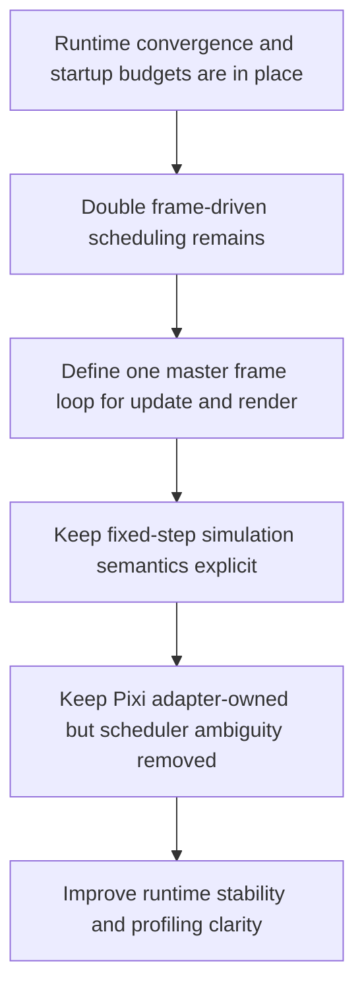

## req_022_define_a_unified_frame_loop_architecture_for_runtime_stability_and_render_scheduling - Define a unified frame loop architecture for runtime stability and render scheduling
> From version: 0.1.2
> Status: Done
> Understanding: 99%
> Confidence: 96%
> Complexity: High
> Theme: Architecture
> Reminder: Update status/understanding/confidence and references when you edit this doc.

# Needs
- Define a single coherent frame-loop architecture for Emberwake so simulation cadence, presentation publication, and Pixi rendering are driven by one explicit scheduling model instead of two partially independent frame-driven loops.
- Reduce the risk of visible micro-stutter, jitter, and main-thread spikes caused by separate scheduling between the engine-owned runtime runner and the Pixi application ticker.
- Define how fixed-step gameplay update, frame-time clamping, presentation derivation, and renderer submission should cooperate without weakening the existing engine-to-game contract or shell-owned runtime boundary.
- Keep the request architecture-focused rather than collapsing into immediate broad rendering optimization, VFX redesign, or premature deep engine rewrites.

# Context
The repository now has a much healthier runtime architecture than before:
- the live runtime is owned by the engine runner and `GameModule`
- shell-scene and runtime-entry ownership are explicit
- startup budgets and browser smoke now validate shell-to-runtime activation
- gameplay systems have their own ownership seam inside game state

That said, one important runtime-performance ambiguity still remains: the project currently relies on two frame-driven schedulers on the main thread.

The current posture is structurally valid, but not yet ideal for runtime smoothness:
- the engine-owned runtime runner advances through `requestAnimationFrame`
- Pixi renders through its own application ticker
- React still republishes runtime snapshots into the shell-facing tree

This creates a likely source of mild frame pacing instability even when average FPS looks acceptable:
- update and render cadence are not owned by one explicit clock
- profiler traces are harder to interpret because simulation and rendering can drift relative to one another
- future growth in world density, text overlays, effects, UI overlays, or gameplay systems will amplify the cost of scheduling ambiguity

The immediate symptom is not necessarily catastrophic performance loss. It is subtle instability:
- small spikes during camera motion or world movement
- extra variability in frame timing on midrange devices
- difficulty deciding whether a stutter came from simulation catch-up, React publication, Pixi redraw, or scheduler interaction

This request should define the next architectural step after the existing runtime and performance waves. The target is not “make it faster somehow.” The target is to choose a durable scheduling model for the runtime.

The preferred direction is to clarify one master frame loop that:
- preserves fixed-step gameplay update semantics
- preserves engine ownership of runtime progression
- preserves Pixi as a rendering adapter rather than turning the engine into a Pixi-specific scheduler
- gives the repository a cleaner path for future profiling and optimization

# Acceptance criteria
- AC1: The request defines a dedicated architecture scope for unified runtime frame scheduling rather than leaving the current dual-loop posture implicit.
- AC2: The request defines how one master frame loop should coordinate fixed-step simulation, presentation derivation, and render submission.
- AC3: The request defines the intended ownership boundary between engine runtime orchestration, game-module update flow, React publication, and Pixi rendering.
- AC4: The request defines how the unified-loop posture should remain compatible with the current shell-owned runtime boundary, `GameModule` contract, and fixed-step simulation guarantees.
- AC5: The request defines a profiling and validation direction for proving reduced scheduler ambiguity or improved frame pacing.
- AC6: The request remains architecture-focused and does not expand into broad content simplification, generic rendering-platform work, or unrelated optimization churn.

# Open questions
- Should the engine runner become the single master clock, or should Pixi ticker drive a higher-level frame coordinator?
  Recommended default: keep engine runtime ownership central and let rendering follow a master runtime frame coordinator rather than making Pixi the source of truth for gameplay cadence.
- Should presentation derivation happen on every visual frame, every simulation step, or as a staged phase between the two?
  Recommended default: keep fixed-step simulation authoritative, then derive presentation from the current authoritative state once per visual frame.
- How much React should stay in the hot runtime path after loop unification?
  Recommended default: preserve shell ownership and diagnostics, but minimize React work that republishes per-frame runtime state unless it serves shell-facing behavior directly.
- Should this request also include local rendering optimizations such as text reduction or chunk caching?
  Recommended default: no, except where those optimizations are required to validate the unified scheduling architecture.
- How should browser-facing VSync assumptions be treated?
  Recommended default: assume browser/Pixi VSync behavior remains the transport, but remove scheduler duplication above that layer.

# Definition of Ready (DoR)
- [x] Problem statement is explicit and user impact is clear.
- [x] Scope boundaries (in/out) are explicit.
- [x] Acceptance criteria are testable.
- [x] Dependencies and known risks are listed.

# Companion docs
- Product brief(s): `prod_000_initial_single_entity_navigation_loop`, `prod_003_high_density_top_down_survival_action_direction`
- Architecture decision(s): `adr_015_define_engine_to_game_runtime_contract_boundaries`, `adr_017_lazy_load_pixi_runtime_behind_a_shell_owned_boot_boundary`, `adr_019_keep_engine_pixi_as_adapter_and_game_as_runtime_scene_composer`, `adr_021_define_runtime_performance_budgets_and_profiling_at_the_shell_to_runtime_boundary`, `adr_023_model_gameplay_systems_as_game_owned_state_slices_around_the_game_module`, `adr_024_drive_live_runtime_from_the_pixi_visual_frame_while_engine_keeps_fixed_step_authority`, `adr_025_keep_shell_chrome_event_driven_and_sample_diagnostics_off_the_runtime_hot_path`, `adr_026_validate_unified_runtime_scheduling_with_frame_pacing_telemetry_and_browser_smoke`
- Request(s): `req_019_complete_runtime_convergence_and_harden_modular_architecture_boundaries`, `req_020_define_the_next_architecture_wave_for_app_state_loading_content_rendering_and_boundary_enforcement`, `req_021_define_the_next_runtime_product_and_gameplay_system_architecture_wave`
- Task(s): `task_027_orchestrate_runtime_convergence_and_modular_boundary_hardening`, `task_028_orchestrate_the_next_architecture_wave_for_app_state_loading_content_rendering_and_boundary_enforcement`, `task_029_orchestrate_runtime_performance_product_meta_flow_and_gameplay_system_architecture`, `task_030_orchestrate_unified_frame_loop_architecture_for_runtime_stability_and_render_scheduling`

# Backlog
- `define_the_target_master_frame_loop_between_runtime_runner_presentation_and_pixi_render_submission`
- `define_hot_path_state_publication_rules_between_runtime_shell_and_diagnostics_surfaces`
- `define_frame_pacing_profiling_and_validation_for_unified_runtime_scheduling`

# Delivery note
- Implemented through `task_030_orchestrate_unified_frame_loop_architecture_for_runtime_stability_and_render_scheduling`.
- Accepted architecture decisions now cover Pixi-driven live frame transport with engine-owned fixed-step authority, sampled diagnostics and event-driven shell chrome publication, and frame-pacing validation through runtime telemetry plus browser smoke.
