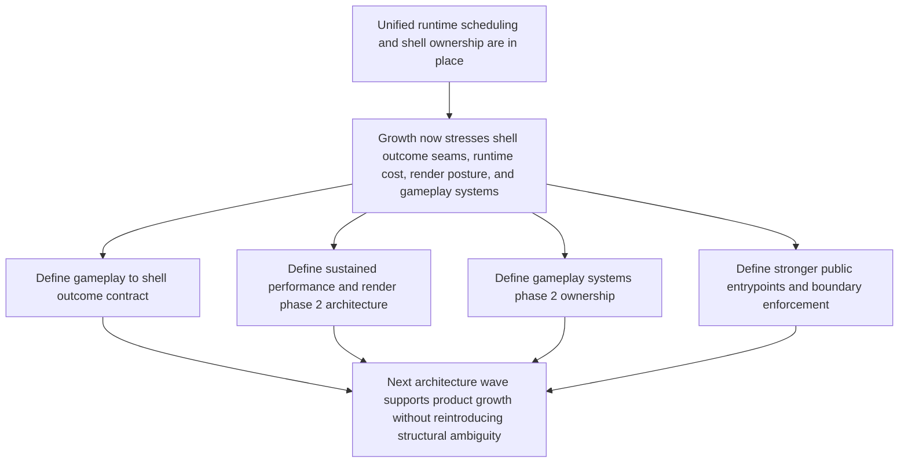

## req_023_define_the_next_runtime_shell_render_and_system_boundary_architecture_wave - Define the next runtime, shell, render, and system boundary architecture wave
> From version: 0.1.2
> Status: Done
> Understanding: 99%
> Confidence: 96%
> Complexity: High
> Theme: Architecture
> Reminder: Update status/understanding/confidence and references when you edit this doc.

# Needs
- Define the next architecture wave after runtime convergence and unified frame scheduling so Emberwake can grow from a technically stable slice into a product-ready runtime without reintroducing ownership ambiguity.
- Define a clear contract for gameplay outcomes flowing back to the shell so product scenes such as defeat, victory, restart, recovery, and soft-lock handling are not improvised inside the hot runtime path.
- Define the next sustained-performance and render-architecture posture so the repository can reduce long-session frame spikes, redraw churn, and debug-first rendering costs without collapsing into ad hoc micro-optimizations.
- Define the next gameplay-system ownership posture so combat, status effects, AI, progression, and future systemic features grow through explicit seams instead of accumulating inside one opaque update pipeline.
- Define a stricter public-entrypoint and boundary-enforcement direction so package and module ownership remain durable as complexity increases.

# Context
The repository has already completed several architecture waves:
- runtime ownership converged around `GameModule` and an engine-owned runner
- shell scene ownership, lazy runtime boot, and product meta surfaces were clarified
- performance budgets now cover startup activation and first frame-pacing telemetry
- the live runtime runs on a unified visual frame model instead of two unrelated frame-driven schedulers

That means the most urgent runtime-foundation work is now largely in place. The next problems are no longer “who owns the loop?” or “who boots the runtime?” They are the next-order seams above and around that runtime.

There are now five closely related architecture concerns that should be treated as one intentional wave instead of isolated local fixes:

1. Gameplay outcomes still need a first-class contract back into the shell.
The shell currently owns scenes and product surfaces, but the runtime still lacks a fully explicit pathway for gameplay-defined outcomes such as:
- defeat
- victory
- restart-needed
- recoverable interruption
- soft-lock or invalid runtime state requiring shell intervention

Without that seam, future gameplay growth risks leaking product flow logic into runtime internals or forcing the shell to infer game meaning from low-level state.

2. Sustained runtime performance still lacks a fully defined architecture.
Startup budgets and frame-pacing telemetry exist, but long-session runtime cost is still under-specified:
- chunk density growth
- entity density growth
- render-layer cost
- debug-overlay cost
- CPU/GPU cost under prolonged movement and world traversal

Without a sustained-performance architecture, the codebase will continue to rely on local fixes after spikes have already appeared.

3. Render architecture is still partially debug-first.
The runtime loop is healthier, but visual composition and draw policy still need a more explicit architecture:
- when to cache or reuse world visuals
- when to redraw `Graphics`
- how `Text` should be used in runtime versus debug surfaces
- how debug visuals are separated from player-facing visuals

Without that decision layer, render cost will drift upward as more feedback, entities, and FX are added.

4. Gameplay systems need a richer phase-2 ownership model.
The repository now has a gameplay-system seam, but not yet a sufficiently rich architecture for:
- ordered system phases
- inter-system dependencies
- event or signal flow between systems
- persistence-facing responsibilities
- content-facing responsibilities

Without that next step, combat and progression work will likely create a new monolithic gameplay layer around the module boundary.

5. Public entrypoints and boundary enforcement still need a stronger posture.
The repository now has better lint rules and better structural ownership than before, but package and module APIs are not yet strict enough to prevent:
- deep opportunistic imports
- unstable internal helper coupling
- accidental boundary regressions during feature work

This request should frame the next architecture wave as one coherent move: connect gameplay outcomes to the shell, harden sustained runtime/render posture, grow gameplay-system ownership, and reinforce public boundaries.

# Acceptance criteria
- AC1: The request defines a single architecture wave that explicitly groups gameplay-to-shell outcome contracts, sustained runtime performance posture, render phase-2 posture, gameplay-system phase-2 ownership, and stronger public boundary enforcement.
- AC2: The request defines the intended ownership seam between gameplay outcomes and shell-owned product scenes such as defeat, victory, restart, or recovery flows.
- AC3: The request defines an architecture direction for sustained runtime performance and render cost, distinct from startup-only budgets or broad unscoped optimization work.
- AC4: The request defines a gameplay-system phase-2 direction covering ordered phases, inter-system coordination, and responsibility boundaries with content and persistence.
- AC5: The request defines a stronger public-entrypoint and architecture-regression posture for `app`, `engine-core`, `engine-pixi`, and `games/emberwake`.
- AC6: The request remains architecture-focused and does not collapse into immediate implementation-level micro-optimizations, content production, or broad gameplay feature delivery.

# Open questions
- Should gameplay outcomes be modeled as explicit runtime-to-shell events, shell-readable state slices, or a dedicated outcome contract exposed by the game module?
  Recommended default: prefer an explicit game-owned outcome contract that the shell can consume without reading arbitrary gameplay internals.
- Should sustained runtime performance architecture treat debug visuals as part of the runtime budget or as a separately degraded surface?
  Recommended default: treat debug visuals as separately budgeted and explicitly degradable so player runtime cost is not anchored to debug-first rendering.
- Should render phase 2 include chunk caching and text policy in the same wave as sustained performance?
  Recommended default: yes, because redraw policy, caching posture, and text usage are structural render decisions rather than isolated optimizations.
- Should gameplay-system phase 2 adopt a full event bus?
  Recommended default: no by default; first define ordered phases and narrow signals before introducing a more general event substrate.
- How strict should public entrypoints become?
  Recommended default: prefer narrow documented public entrypoints plus lint-enforced deep-import restrictions before considering heavier packaging changes.

# Definition of Ready (DoR)
- [x] Problem statement is explicit and user impact is clear.
- [x] Scope boundaries (in/out) are explicit.
- [x] Acceptance criteria are testable.
- [x] Dependencies and known risks are listed.

# Companion docs
- Product brief(s): `prod_000_initial_single_entity_navigation_loop`, `prod_003_high_density_top_down_survival_action_direction`
- Architecture decision(s): `adr_015_define_engine_to_game_runtime_contract_boundaries`, `adr_016_define_shell_scene_state_and_meta_surface_ownership`, `adr_017_lazy_load_pixi_runtime_behind_a_shell_owned_boot_boundary`, `adr_019_keep_engine_pixi_as_adapter_and_game_as_runtime_scene_composer`, `adr_021_define_runtime_performance_budgets_and_profiling_at_the_shell_to_runtime_boundary`, `adr_022_keep_product_meta_flow_shell_owned_while_runtime_state_remains_game_preserved`, `adr_023_model_gameplay_systems_as_game_owned_state_slices_around_the_game_module`, `adr_024_drive_live_runtime_from_the_pixi_visual_frame_while_engine_keeps_fixed_step_authority`, `adr_025_keep_shell_chrome_event_driven_and_sample_diagnostics_off_the_runtime_hot_path`, `adr_026_validate_unified_runtime_scheduling_with_frame_pacing_telemetry_and_browser_smoke`, `adr_027_expose_gameplay_outcomes_as_a_game_owned_shell_consumable_contract`, `adr_028_budget_player_runtime_and_debug_visuals_as_separate_render_modes`, `adr_029_model_phase_two_gameplay_systems_with_ordered_phases_and_narrow_signals`, `adr_030_harden_public_package_entrypoints_with_targeted_deep_import_rules`
- Request(s): `req_019_complete_runtime_convergence_and_harden_modular_architecture_boundaries`, `req_020_define_the_next_architecture_wave_for_app_state_loading_content_rendering_and_boundary_enforcement`, `req_021_define_the_next_runtime_product_and_gameplay_system_architecture_wave`, `req_022_define_a_unified_frame_loop_architecture_for_runtime_stability_and_render_scheduling`
- Task(s): `task_027_orchestrate_runtime_convergence_and_modular_boundary_hardening`, `task_028_orchestrate_the_next_architecture_wave_for_app_state_loading_content_rendering_and_boundary_enforcement`, `task_029_orchestrate_runtime_performance_product_meta_flow_and_gameplay_system_architecture`, `task_030_orchestrate_unified_frame_loop_architecture_for_runtime_stability_and_render_scheduling`, `task_031_orchestrate_the_remaining_open_architecture_and_runtime_input_reliability_wave`

# Backlog
- `define_gameplay_to_shell_outcome_contracts_for_defeat_victory_restart_and_runtime_recovery`
- `define_sustained_runtime_performance_and_render_phase_two_architecture_for_density_redraw_and_debug_budgeting`
- `define_gameplay_system_phase_two_ownership_for_ordered_phases_signals_and_progression_scale`
- `define_public_entrypoint_hardening_and_architecture_regression_rules_for_app_engine_and_game_modules`

# Delivery note
- Implemented through `task_031_orchestrate_the_remaining_open_architecture_and_runtime_input_reliability_wave`.
- Accepted architecture decisions now cover gameplay-to-shell outcome contracts, sustained player-versus-diagnostics render budgeting, phase-two gameplay-system ordering with narrow signals, and targeted public-entrypoint hardening for shell and render boundaries.
