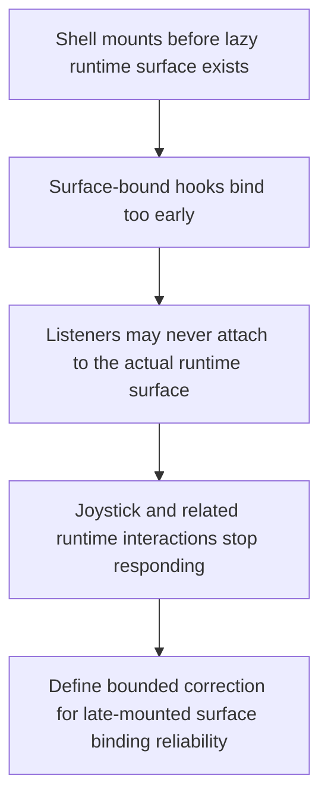

## req_024_restore_runtime_surface_input_binding_reliability_after_lazy_mount - Restore runtime surface input binding reliability after lazy mount
> From version: 0.1.2
> Status: Done
> Understanding: 99%
> Confidence: 97%
> Complexity: Medium
> Theme: Quality
> Reminder: Update status/understanding/confidence and references when you edit this doc.

# Needs
- Restore reliable runtime-surface input binding after the lazy-mounted Pixi runtime boundary so mobile joystick interaction works again and surface-bound controls are not silently lost when the runtime appears after shell mount.
- Define the fix as a bounded correction wave rather than a broad architecture rewrite, because the main issue is runtime input reliability under the current shell-owned lazy runtime posture.
- Ensure the correction covers not only the mobile virtual stick but the wider class of hooks that subscribe to the runtime surface element and currently assume the element is present during the initial effect pass.

# Context
The repository recently converged around a healthier shell/runtime architecture:
- the runtime is lazy-loaded behind a shell-owned scene boundary
- the live frame loop is unified
- runtime diagnostics and publication are sampled more carefully

That architecture direction is still correct, but it introduced a reliability risk around surface-bound interactions.

Several hooks bind listeners directly to `surfaceRef.current` inside effects. Under a lazily mounted runtime, the first effect pass can happen before the Pixi surface element exists. If the hook only depends on the ref object rather than the resolved element, the listeners may never be attached once the runtime surface actually appears.

The immediate user-facing symptom is severe enough to justify a dedicated correction request:
- the mobile joystick no longer responds even though the overlay and control path still exist conceptually

The likely impact is broader than the joystick alone:
- touch pointer binding can fail after lazy mount
- mouse or touch diagnostics can miss the runtime surface
- surface-local camera interactions can become timing-sensitive or unavailable

This request should therefore define a narrow correction wave for runtime-surface input binding reliability. The goal is not to redesign input ownership. The goal is to make the existing ownership model robust against delayed surface availability.

# Acceptance criteria
- AC1: The request defines a bounded correction scope for restoring reliable input binding to the lazy-mounted runtime surface.
- AC2: The request explicitly covers the mobile virtual stick regression and the broader class of hooks that attach interaction listeners to the runtime surface element.
- AC3: The request defines the intended reliability posture when the shell mounts before the Pixi runtime surface exists.
- AC4: The request defines a validation direction that proves the joystick and related surface-bound interactions still work after delayed runtime mount.
- AC5: The request remains compatible with the current shell-owned runtime boundary, lazy runtime loading, and unified frame-loop posture.
- AC6: The request remains a correction-focused wave and does not expand into broad input redesign, product UX redesign, or unrelated runtime optimization work.

# Open questions
- Should the correction be centered on callback refs, resolved-element dependencies, or a shared surface-subscription helper?
  Recommended default: prefer the smallest robust mechanism that makes listener attachment depend on the real surface element rather than the stable ref object.
- Should the fix cover only the joystick path?
  Recommended default: no; include all hooks that bind directly to the runtime surface so the same timing bug does not reappear through camera or diagnostics interactions.
- How much validation is needed?
  Recommended default: add focused automated coverage for delayed surface mount plus a lightweight runtime validation path for joystick behavior.
- Should this request include a broader touch-input redesign?
  Recommended default: no; keep scope on restoring reliability of the existing model.

# Definition of Ready (DoR)
- [x] Problem statement is explicit and user impact is clear.
- [x] Scope boundaries (in/out) are explicit.
- [x] Acceptance criteria are testable.
- [x] Dependencies and known risks are listed.

# Companion docs
- Product brief(s): `prod_000_initial_single_entity_navigation_loop`
- Architecture decision(s): `adr_016_define_shell_scene_state_and_meta_surface_ownership`, `adr_017_lazy_load_pixi_runtime_behind_a_shell_owned_boot_boundary`, `adr_024_drive_live_runtime_from_the_pixi_visual_frame_while_engine_keeps_fixed_step_authority`, `adr_025_keep_shell_chrome_event_driven_and_sample_diagnostics_off_the_runtime_hot_path`, `adr_031_bind_runtime_surface_interactions_to_resolved_elements_after_lazy_mount`
- Request(s): `req_020_define_the_next_architecture_wave_for_app_state_loading_content_rendering_and_boundary_enforcement`, `req_022_define_a_unified_frame_loop_architecture_for_runtime_stability_and_render_scheduling`
- Task(s): `task_028_orchestrate_the_next_architecture_wave_for_app_state_loading_content_rendering_and_boundary_enforcement`, `task_030_orchestrate_unified_frame_loop_architecture_for_runtime_stability_and_render_scheduling`, `task_031_orchestrate_the_remaining_open_architecture_and_runtime_input_reliability_wave`

# Backlog
- `restore_surface_bound_interaction_hooks_to_attach_after_lazy_runtime_mount`
- `add_regression_coverage_for_mobile_joystick_and_surface_interactions_after_delayed_surface_availability`
- `validate_runtime_surface_input_reliability_without_reopening_input_ownership_design`

# Delivery note
- Implemented through `task_031_orchestrate_the_remaining_open_architecture_and_runtime_input_reliability_wave`.
- Accepted architecture decisions now cover resolved-surface binding after lazy mount, focused regression coverage for delayed surface availability, and bounded validation that keeps the current input-ownership model intact.
