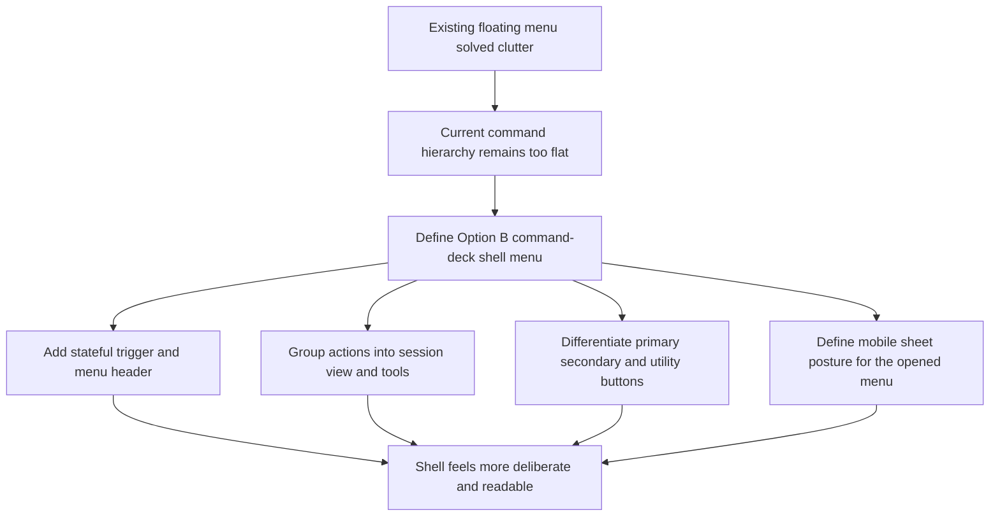

## req_025_define_a_command_deck_shell_menu_and_button_hierarchy_for_runtime_option_b - Define a command-deck shell menu and button hierarchy for runtime Option B
> From version: 0.2.1
> Status: Done
> Understanding: 99%
> Confidence: 96%
> Complexity: Medium
> Theme: UX
> Reminder: Update status/understanding/confidence and references when you edit this doc.

# Needs
- Redesign the current shell menu and shell button language so the runtime overlay no longer presents every action with the same visual weight and generic pill styling.
- Evolve the existing floating-menu posture into a more product-ready `Option B` interaction model: a command-deck menu with explicit sections, a primary runtime action, stronger state signaling, and a more deliberate button hierarchy.
- Make the shell feel more readable and intentional for both player-facing and debug-capable usage without reopening core runtime ownership, scene ownership, or gameplay architecture.
- Define a mobile-aware menu posture that preserves the existing compact top-right trigger on desktop while allowing the opened menu itself to behave more like a sheet on constrained viewports.

# Context
The repository already completed an important overlay simplification step through the floating menu request and its implementation wave:
- the shell moved away from a cluttered always-visible overlay posture
- the runtime now keeps the world mostly dominant
- secondary tools such as diagnostics and inspection are hidden until explicitly requested

That direction is still correct, but the current shell menu has reached the limits of its first-pass UX.

Today the menu works, but its hierarchy is too flat:
- `Pause`, `Settings`, `Reset camera`, `Diagnostics`, `Inspecteur`, `Fullscreen`, and `Install` all read as nearly equivalent rows
- the top-right trigger is visually functional but not stateful enough
- button styling is too uniform across action-critical, secondary, and debug utility behaviors
- the menu feels like a technically tidy list rather than a deliberate control surface for the runtime

The main issue is no longer “too much overlay chrome.” The issue is insufficient command hierarchy.

This request should define `Option B` as the next shell UX refinement:
- keep the current shell-owned floating-menu architecture
- keep the same action coverage
- but restructure the menu into a clearer command deck

Recommended target posture:
1. A stateful trigger that reflects the current shell/runtime situation such as `Live`, `Paused`, `Settings`, or recovery/error state.
2. A menu header or status band that establishes current runtime context rather than dropping directly into an undifferentiated list.
3. Explicit grouped sections such as:
- `Session`
- `View`
- `Tools`
4. A clearly emphasized primary action for the current state:
- `Pause` when the runtime is live
- `Resume` when the user is in pause or settings
- `Retry` or equivalent when recovery is needed
5. A sharper distinction between:
- primary actions
- secondary shell actions
- debug or utility toggles
6. A mobile presentation that behaves more like a sheet while preserving the same action model and command hierarchy.

This request is not a full visual rebrand. It is a shell information-architecture and control-hierarchy refinement.

Scope includes:
- menu information hierarchy
- trigger posture
- command grouping
- button hierarchy
- stateful labeling
- mobile versus desktop opened-menu behavior

Scope excludes:
- gameplay HUD redesign
- diagnostics data redesign
- full settings IA redesign
- unrelated render/runtime architecture work

# Acceptance criteria
- AC1: The request defines `Option B` as a refinement of the current floating shell menu rather than a return to persistent overlay clutter or a total shell redesign.
- AC2: The request defines a stateful shell-menu trigger that communicates runtime or shell context more clearly than the current generic `Menu` button.
- AC3: The request defines a command-deck posture for the opened menu, including an explicit contextual header or status area.
- AC4: The request defines a grouped information architecture for the menu, with at least distinct `Session`, `View`, and `Tools` families or equivalent explicit sections.
- AC5: The request defines a stronger button hierarchy that distinguishes the primary current-state action from secondary actions and utility/debug toggles.
- AC6: The request defines how existing actions such as pause/resume, settings, reset camera, camera mode, fullscreen, diagnostics, inspecteur, and install should be re-presented without losing access to them.
- AC7: The request defines a mobile-specific opened-menu posture that behaves more like a sheet while remaining compatible with the existing shell-owned overlay model.
- AC8: The request preserves compatibility with the current shell-owned scene state, runtime boundary, diagnostics gating, and menu-driven access posture established by earlier waves.
- AC9: The request remains focused on shell interaction hierarchy and does not expand into broad gameplay HUD redesign, content art direction, or unrelated architecture work.

# Open questions
- Should the trigger show explicit text such as `Live` or remain branded as `Menu` with a secondary state badge?
  Recommended default: keep the menu affordance explicit, but add a clear runtime-state signal rather than a generic static trigger.
- Should `Diagnostics` and `Inspecteur` remain peer rows inside the same list?
  Recommended default: no; group them under a lower-priority `Tools` section so player-facing actions read first.
- Should camera mode remain a segmented control inside the menu?
  Recommended default: yes, but visually subordinate it to the main session CTA and the core shell actions.
- Should the mobile variant move the trigger itself?
  Recommended default: no; keep the trigger stable and adapt the opened panel posture instead.
- Should this request also redefine copy?
  Recommended default: yes, lightly; use shorter and more decisive labels where they improve command clarity.

# Definition of Ready (DoR)
- [x] Problem statement is explicit and user impact is clear.
- [x] Scope boundaries (in/out) are explicit.
- [x] Acceptance criteria are testable.
- [x] Dependencies and known risks are listed.

# Companion docs
- Product brief(s): `prod_001_minimal_overlay_and_feedback_for_early_runtime`
- Architecture decision(s): `adr_002_separate_react_shell_from_pixi_runtime_ownership`, `adr_016_define_shell_scene_state_and_meta_surface_ownership`, `adr_022_keep_product_meta_flow_shell_owned_while_runtime_state_remains_game_preserved`, `adr_025_keep_shell_chrome_event_driven_and_sample_diagnostics_off_the_runtime_hot_path`
- Request(s): `req_017_redesign_runtime_overlay_into_a_single_floating_menu`, `req_023_define_the_next_runtime_shell_render_and_system_boundary_architecture_wave`
- Task(s): `task_025_orchestrate_runtime_overlay_simplification_around_a_floating_menu`, `task_032_orchestrate_command_deck_shell_menu_option_b_for_runtime_controls`

# Backlog
- `define_stateful_shell_menu_trigger_and_context_header_for_runtime_status`
- `define_command_deck_grouping_and_primary_action_hierarchy_for_shell_menu_option_b`
- `define_mobile_sheet_presentation_and_button_treatment_for_shell_menu_option_b`

# Delivery note
- Implemented through `task_032_orchestrate_command_deck_shell_menu_option_b_for_runtime_controls`.
- The accepted shell posture now includes a stateful command-deck trigger, a contextual header inside the menu, grouped `Session / View / Tools` actions, a primary current-state CTA, and a mobile opened-menu sheet treatment while preserving the current shell-owned runtime model.
