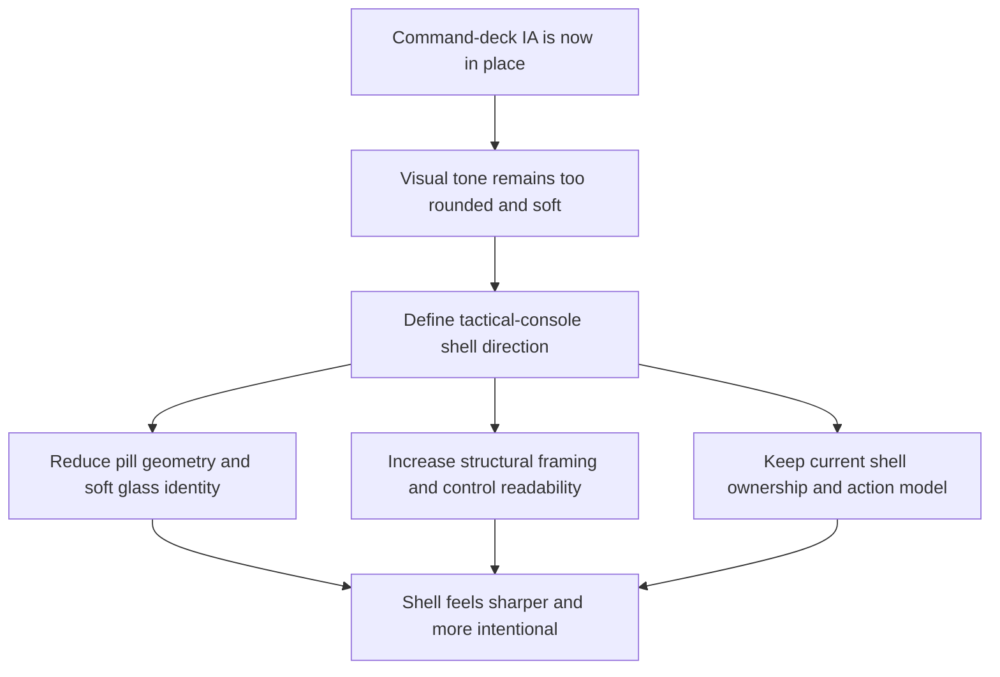

## req_026_define_a_tactical_console_visual_direction_for_shell_controls_and_menus - Define a tactical-console visual direction for shell controls and menus
> From version: 0.5.0
> Status: Done
> Understanding: 100%
> Confidence: 98%
> Complexity: Medium
> Theme: UX
> Reminder: Update status/understanding/confidence and references when you edit this doc.
> Schema version: 1.0

# Needs
- Refine the shell visual language after the command-deck wave because the current menu and button system still reads too rounded, soft, and capsule-driven for Emberwake.
- Replace the remaining “glass pill” posture with a more deliberate `tactical console` direction that feels sharper, more instrument-like, and more compatible with a runtime command surface.
- Improve visual hierarchy through structure rather than softness: lower corner radii, clearer borders, denser section framing, stronger control states, and more explicit separation between primary, secondary, and utility actions.
- Preserve the current shell architecture, action model, and responsive behavior while upgrading the visual tone of the control system.

# Context
The repository already completed an important shell UX step:
- the shell now exposes a stateful command-deck trigger
- the opened menu has context, grouped actions, and a primary CTA
- mobile uses a sheet posture rather than a cramped floating popover

That solved the information-architecture problem, but it did not fully solve the visual-language problem.

Today the shell is more usable, yet the control surfaces still inherit too much of the earlier rounded/glassy posture:
- buttons still read as soft pills
- panels still feel more “premium mobile UI” than “runtime console”
- the menu is organized, but not yet visually assertive enough
- the overall tone is still too smooth for a game shell that wants to feel like a tactical control deck

The recommended direction for Emberwake is not brutalist for its own sake and not a total rebrand. It is a more angular, structured `tactical console` posture:
- lower radii
- more deliberate edge treatment
- stronger section framing
- clearer state chips and badges
- reduced reliance on fully rounded pills
- less soft blur-as-identity
- more emphasis on control readability and instrument-panel feel

This request should therefore define the next shell polish wave not as a new IA change, but as a visual-direction refinement layered on top of the command-deck model already in place.

Recommended target posture:
1. The top-right trigger remains compact, but no longer reads as a soft capsule.
2. The opened command deck favors panel geometry and section rails over rounded-card softness.
3. The primary CTA feels like a control module, not a premium mobile button.
4. Secondary and utility actions become more obviously subordinate through shape, spacing, border treatment, and density.
5. Mobile keeps the sheet model, but the sheet itself adopts the same tactical-console identity rather than a softened bottom drawer aesthetic.

Scope includes:
- shell menu visual language
- shell button geometry
- border and radius posture
- panel framing
- state-chip treatment
- CTA visual hierarchy
- responsive adaptation of the same design language

Scope excludes:
- shell action model redesign
- gameplay HUD redesign
- diagnostics content redesign
- font-stack replacement across the whole app
- unrelated render/runtime or architecture work

# Acceptance criteria
- AC1: The request defines a visual-direction refinement layered on top of the current command-deck shell model rather than another interaction-architecture redesign.
- AC2: The request explicitly moves the shell away from an overly rounded pill-heavy visual language toward a sharper tactical-console posture.
- AC3: The request defines target changes for button geometry, panel geometry, and section framing, including lower radii and stronger structural edges.
- AC4: The request defines how primary, secondary, and utility controls should differ visually within the tactical-console direction.
- AC5: The request preserves the current shell-owned command deck, grouped action model, and mobile sheet posture while changing their visual treatment.
- AC6: The request remains focused on shell visual language and does not expand into global brand redesign, gameplay HUD redesign, or unrelated architecture work.

# Open questions
- How far should the shell move away from blur and glass?
  Recommended default: reduce blur as the primary identity signal, but keep a controlled amount of depth so the shell still sits above the runtime surface cleanly.
- Should every shell control become angular?
  Recommended default: no; use lower radii consistently, but reserve the strongest treatment for panels, CTAs, and key state chips.
- Should this wave also redefine typography?
  Recommended default: only lightly if needed for fit and emphasis; keep the main focus on geometry, framing, and state hierarchy.
- Should mobile use a different visual direction from desktop?
  Recommended default: no; mobile should inherit the same tactical-console identity with touch-appropriate spacing.

# Definition of Ready (DoR)
- [x] Problem statement is explicit and user impact is clear.
- [x] Scope boundaries (in/out) are explicit.
- [x] Acceptance criteria are testable.
- [x] Dependencies and known risks are listed.

# Companion docs
- Product brief(s): `prod_001_minimal_overlay_and_feedback_for_early_runtime`
- Architecture decision(s): `adr_002_separate_react_shell_from_pixi_runtime_ownership`, `adr_016_define_shell_scene_state_and_meta_surface_ownership`, `adr_025_keep_shell_chrome_event_driven_and_sample_diagnostics_off_the_runtime_hot_path`
- Request(s): `req_017_redesign_runtime_overlay_into_a_single_floating_menu`, `req_025_define_a_command_deck_shell_menu_and_button_hierarchy_for_runtime_option_b`
- Task(s): `task_025_orchestrate_runtime_overlay_simplification_around_a_floating_menu`, `task_032_orchestrate_command_deck_shell_menu_option_b_for_runtime_controls`
  `task_033_orchestrate_tactical_console_visual_direction_for_shell_controls_and_menus`

# AI Context
- Summary: Refine the shell visual language after the command-deck wave because the current menu and button system still reads...
- Keywords: tactical-console, visual, direction, for, shell, controls, and, menus
- Use when: Use when framing scope, context, and acceptance checks for Define a tactical-console visual direction for shell controls and menus.
- Skip when: Skip when the work targets another feature, repository, or workflow stage.

# Backlog
- `item_103_define_tactical_console_geometry_for_shell_buttons_panels_and_state_chips`
- `item_104_define_tactical_console_hierarchy_for_primary_secondary_and_utility_shell_controls`
- `item_105_define_responsive_tactical_console_treatment_for_mobile_sheet_and_desktop_command_deck`

# Delivery note
- Implemented through `task_033_orchestrate_tactical_console_visual_direction_for_shell_controls_and_menus`.
- The accepted shell posture now uses lower-radius tactical geometry, stronger framed sections, a more module-like primary CTA, explicit secondary vs utility action treatment, and a breakpoint-aware mobile sheet that preserves the same command-deck identity as desktop.
