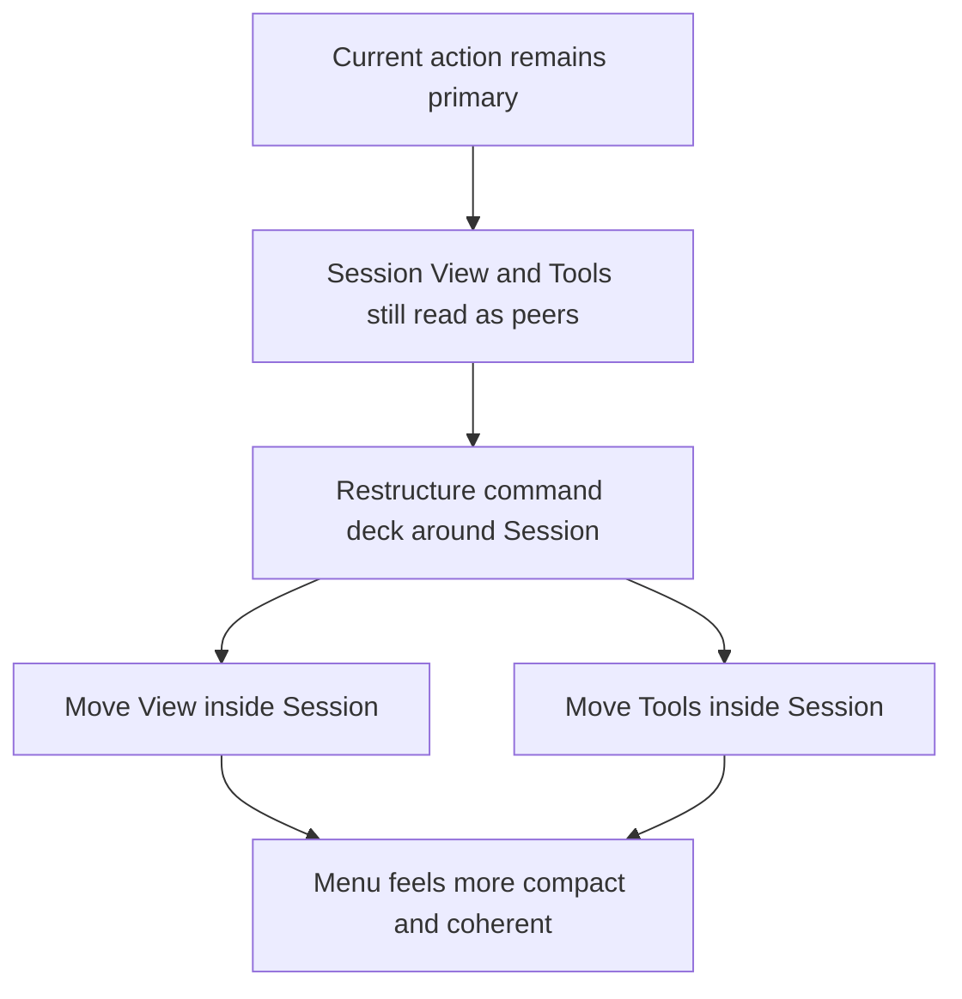
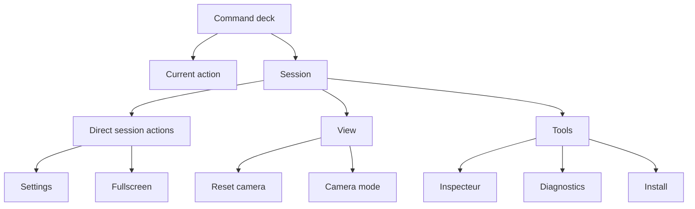

## req_027_restructure_the_shell_command_deck_around_a_primary_session_section - Restructure the shell command deck around a primary Session section
> From version: 0.2.1
> Status: Draft
> Understanding: 97%
> Confidence: 95%
> Complexity: Medium
> Theme: UX
> Reminder: Update status/understanding/confidence and references when you edit this doc.

# Needs
- Refine the shell command-deck information architecture again because `Session`, `View`, and `Tools` currently read as three peer sections even though they do not carry equal product weight.
- Promote `Session` as the single primary control block beneath the always-visible current action, then re-present `View` and `Tools` as subordinate subsections or nested control groups inside that session block.
- Make the opened shell menu feel more compact and intentional, especially on mobile, by reducing top-level section competition while preserving access to camera and utility controls.
- Preserve the current shell-owned menu model, tactical-console visual direction, and current action model while tightening menu hierarchy.

# Context
The repository now has a command deck that is both stateful and visually stronger:
- the trigger exposes current runtime or shell posture
- the opened deck includes a contextual header and a current-state primary CTA
- the shell uses a tactical-console language rather than the earlier pill-heavy overlay style

That work solved trigger posture, visual direction, and first-pass command hierarchy. The next UX question is structural:

Should `View` and `Tools` still exist as first-level peers next to `Session`?

The current answer is probably no.

In practice, the menu now has one clearly primary concern after the current action:
- managing the session

Everything else is subordinate to that:
- `View` is a session-adjacent adjustment space
- `Tools` is a session-adjacent utility space

Keeping all three as peer sections makes the command deck feel more segmented than necessary:
- top-level hierarchy remains visually busier than the actual product model
- `View` and `Tools` compete with `Session` even when they are not equal in importance
- mobile still pays for this peer structure with more vertical section framing than is probably needed

The recommended refinement is therefore:
1. Keep `Current action` outside the accordion or section structure and always visible.
2. Make `Session` the only first-level section beneath it.
3. Move `View` and `Tools` inside `Session` as subordinate groups, nested subsections, or nested accordions.
4. Keep the current actions intact:
- `Settings`
- `Fullscreen`
- `Reset camera`
- `Camera mode`
- `Inspecteur`
- `Diagnostics`
- `Install`
5. Re-present them under a model that reads like:
- `Current action`
- `Session`
  - direct session actions
  - `View`
  - `Tools`

This request is not asking for a new visual direction. It is an information-architecture refinement layered on top of the current tactical-console command deck.

Recommended target posture:
1. `Current action` remains visible and independent.
2. `Session` becomes the only first-level command family.
3. `View` becomes a nested, clearly subordinate control group inside `Session`.
4. `Tools` becomes a nested, clearly subordinate utility group inside `Session`.
5. The resulting menu reads more like one coherent session-control surface and less like three parallel mini-panels.

Scope includes:
- shell menu information hierarchy
- section nesting or nested grouping posture
- relative prominence of session vs view vs tools
- mobile compaction benefits from the new IA
- preservation of current action coverage under a new grouping model

Scope excludes:
- tactical-console visual-language redesign
- shell ownership redesign
- gameplay HUD redesign
- diagnostics content redesign
- unrelated runtime or architecture work

Target navigation:

# Acceptance criteria
- AC1: The request defines `Session` as the primary first-level section beneath the always-visible current action.
- AC2: The request defines `View` and `Tools` as subordinate groups inside `Session` rather than peer top-level sections.
- AC3: The request preserves the current action inventory while redefining only the command-deck grouping model.
- AC4: The request explains how nested `View` and `Tools` should remain readable and reachable without reintroducing clutter.
- AC5: The request preserves compatibility with the current shell-owned menu model, tactical-console visual direction, and mobile sheet posture.
- AC6: The request remains focused on shell menu IA refinement and does not reopen broader visual rebranding, gameplay HUD redesign, or architecture change.

# Open questions
- Should `View` and `Tools` be simple nested groups or nested collapsible sections?
  Recommended default: nested collapsible groups if density becomes a problem, otherwise nested framed groups are enough.
- Should `Session` itself become collapsible?
  Recommended default: not immediately; first simplify the top-level IA before adding deeper collapse behavior.
- Should `Tools` be hidden more aggressively than `View`?
  Recommended default: yes; `Tools` should remain the lowest-priority nested group.
- Should this change happen on desktop and mobile equally?
  Recommended default: yes, with the strongest benefit expected on mobile because the top-level menu will become shorter and easier to scan.

# Definition of Ready (DoR)
- [x] Problem statement is explicit and user impact is clear.
- [x] Scope boundaries (in/out) are explicit.
- [x] Acceptance criteria are testable.
- [x] Dependencies and known risks are listed.

# Companion docs
- Product brief(s): `prod_001_minimal_overlay_and_feedback_for_early_runtime`
- Architecture decision(s): `adr_002_separate_react_shell_from_pixi_runtime_ownership`, `adr_016_define_shell_scene_state_and_meta_surface_ownership`, `adr_025_keep_shell_chrome_event_driven_and_sample_diagnostics_off_the_runtime_hot_path`
- Request(s): `req_017_redesign_runtime_overlay_into_a_single_floating_menu`, `req_025_define_a_command_deck_shell_menu_and_button_hierarchy_for_runtime_option_b`, `req_026_define_a_tactical_console_visual_direction_for_shell_controls_and_menus`
- Task(s): `task_032_orchestrate_command_deck_shell_menu_option_b_for_runtime_controls`, `task_033_orchestrate_tactical_console_visual_direction_for_shell_controls_and_menus`

# Backlog
- `define_session_as_the_single_primary_shell_menu_section`
- `define_nested_view_controls_within_session_without_reopening_camera_ownership`
- `define_nested_tools_controls_within_session_without_reintroducing_menu_clutter`

# Delivery note
- Draft only. This request proposes a shell IA refinement where `Session` becomes the single first-level section below the current action and `View` / `Tools` become subordinate nested groups within it.
