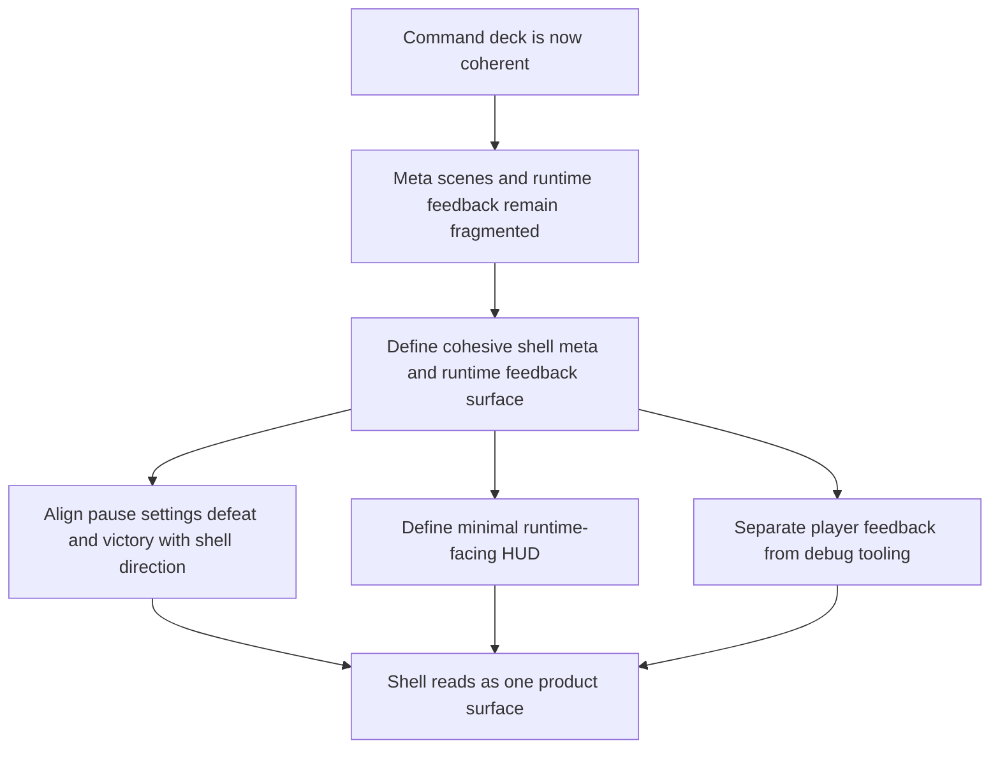

## req_028_define_a_cohesive_shell_meta_and_runtime_feedback_surface - Define a cohesive shell meta and runtime feedback surface
> From version: 0.2.2
> Status: Done
> Understanding: 100%
> Confidence: 97%
> Complexity: Medium
> Theme: UX
> Reminder: Update status/understanding/confidence and references when you edit this doc.

# Needs
- Carry the recent shell-menu improvements upward into a broader shell experience so the command deck is no longer the only surface with a strong tactical-console identity.
- Define how pause, settings, defeat, and victory scenes should visually and structurally align with the command deck without becoming four disconnected mini-products.
- Introduce a clearer player-facing runtime feedback posture so the user can understand essential session state without opening the shell menu for every minor read.
- Keep the boundary between player-facing HUD and debug tooling explicit, so the runtime surface gains useful feedback without regressing into debug clutter.

# Context
The repository has now completed several important shell iterations:
- the floating menu became a command deck rather than a loose pile of pills
- the shell adopted a tactical-console visual direction
- the menu hierarchy was simplified around `Session`
- `View` and `Tools` now open as dedicated submenus instead of competing on a single dense screen
- redundant runtime-context copy was removed from the opened menu

That leaves the next product-level question:

What should the rest of the shell experience look like now that the command deck has matured?

At the moment, the answer is still fragmented:
- the command deck is intentional and tactical
- pause/settings/defeat/victory can still drift visually or structurally from that posture
- the runtime itself has limited player-facing feedback outside the menu
- the distinction between always-visible HUD information and explicitly opened shell utilities is not yet strong enough

This means the menu improved, but the full shell experience is not yet operating as one coherent system.

The next wave should therefore not be another isolated menu refinement. It should define:
1. how shell-owned meta scenes align with the tactical-console command deck
2. what minimum runtime-facing session feedback should stay visible without opening the deck
3. what belongs to player-facing HUD versus optional shell/debug surfaces
4. how all of this stays compact on mobile and readable on desktop

Recommended target posture:
1. Pause, settings, defeat, and victory scenes read as members of one shell family, not separate ad hoc overlays.
2. The runtime exposes a minimal player-facing feedback band or HUD for essential session information only.
3. Debug-heavy utilities remain behind explicit shell entry points rather than migrating into the always-visible player HUD.
4. The command deck remains the control surface, while the HUD becomes the lightweight read surface.
5. Mobile and desktop share one product model even if spacing and composition differ.

Scope includes:
- shell-owned meta-scene UX alignment
- player-facing runtime feedback and minimal HUD expectations
- separation of HUD information from debug or utility controls
- tactical-console continuity across shell surfaces
- responsive behavior for compact and large layouts

Scope excludes:
- combat-system redesign
- progression-system redesign
- deep gameplay-loop redefinition
- diagnostics instrumentation redesign
- architecture or module-topology changes unrelated to shell/HUD experience

# Acceptance criteria
- AC1: The request defines a unified shell-family posture across pause, settings, defeat, and victory scenes rather than treating the command deck as a one-off surface.
- AC2: The request defines a minimal player-facing runtime feedback model that stays visible without requiring the command deck to be opened.
- AC3: The request explicitly separates player-facing HUD information from debug or utility controls that should remain behind shell entry points.
- AC4: The request preserves the current command-deck control model while positioning the HUD as a read surface rather than a second control deck.
- AC5: The request explains how the shell/HUD model should remain compact on mobile and readable on desktop without branching into two unrelated UX systems.
- AC6: The request remains focused on shell meta-scene and runtime-feedback coherence and does not reopen broader gameplay, architecture, or instrumentation redesign.

# Open questions
- What is the minimum player-facing information that deserves always-visible runtime feedback?
  Recommended default: session state, major meta status, and one or two moment-to-moment cues only; keep the always-visible HUD intentionally sparse.
- Should pause/settings/defeat/victory all share an identical layout?
  Recommended default: no; they should share visual language and structural rules, but each scene can keep its own emphasis and CTA hierarchy.
- Should diagnostics ever leak into the player HUD?
  Recommended default: no; diagnostics should stay behind explicit shell access unless a metric becomes a true player-facing product signal.
- Should this wave also redesign the in-runtime menu trigger?
  Recommended default: no; keep the current command-deck trigger stable and use this wave to harmonize the rest of the shell around it.

# Definition of Ready (DoR)
- [x] Problem statement is explicit and user impact is clear.
- [x] Scope boundaries (in/out) are explicit.
- [x] Acceptance criteria are testable.
- [x] Dependencies and known risks are listed.

# Companion docs
- Product brief(s): `prod_001_minimal_overlay_and_feedback_for_early_runtime`
- Architecture decision(s): `adr_002_separate_react_shell_from_pixi_runtime_ownership`, `adr_016_define_shell_scene_state_and_meta_surface_ownership`, `adr_025_keep_shell_chrome_event_driven_and_sample_diagnostics_off_the_runtime_hot_path`
- Request(s): `req_011_define_ui_hud_and_overlay_system`, `req_017_redesign_runtime_overlay_into_a_single_floating_menu`, `req_026_define_a_tactical_console_visual_direction_for_shell_controls_and_menus`, `req_027_restructure_the_shell_command_deck_around_a_primary_session_section`

# Backlog
- `define_a_shared_tactical_console_family_for_shell_owned_meta_scenes`
- `define_a_minimal_player_facing_runtime_feedback_band_outside_the_command_deck`
- `define_boundaries_between_player_hud_information_and_shell_debug_utilities`

# Implementation notes
- Delivered through a compacted `AppMetaScenePanel` and a runtime-only `PlayerHudCard`, so shell-owned scenes and the live runtime now read as one tactical-console family instead of separate overlay experiments.
- The always-visible HUD remains intentionally sparse: session identity plus movement guidance only, with diagnostics and inspecteur still gated behind the command deck.
- Runtime-only shell surfaces now lazy-load outside the initial `Main menu` boot path so coherence improved without regressing shell-startup budgets.
