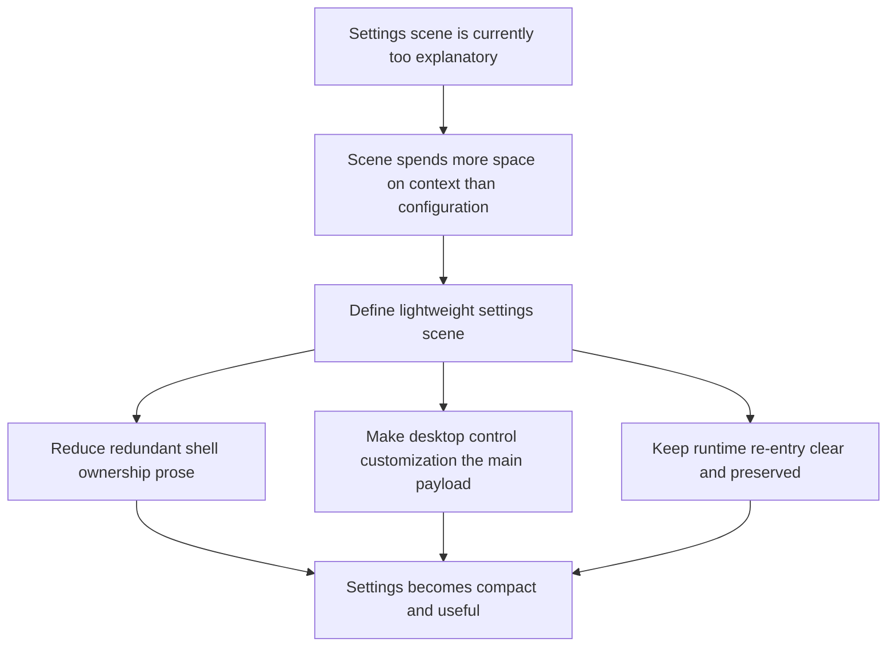

## req_029_define_a_lightweight_settings_scene_with_desktop_control_customization - Define a lightweight settings scene with desktop control customization
> From version: 0.2.2
> Status: Done
> Understanding: 100%
> Confidence: 98%
> Complexity: Medium
> Theme: UX
> Reminder: Update status/understanding/confidence and references when you edit this doc.

# Needs
- Reduce the current `Settings` shell scene because it still behaves like an oversized explanatory status card rather than a compact product surface.
- Replace redundant ownership and runtime-reentry prose with a lighter settings posture that gets the user to actual configuration choices faster.
- Add a dedicated desktop-controls customization surface so the settings scene becomes functionally useful instead of only describing shell/runtime state.
- Ensure the desktop-controls surface includes a clear reset-to-defaults path so users can always recover a sane baseline after remapping.
- Keep the settings scene shell-owned and compatible with runtime-state preservation while making it feel like a real control surface rather than a documentation panel.

# Context
The shell command deck has recently become much tighter:
- `Session` is the root command family
- `View` and `Tools` are real submenus instead of one dense stack
- redundant command-deck context prose was removed
- the shell now uses a tactical-console language rather than a soft rounded overlay style

That work exposed a new imbalance:

The opened command deck is now leaner than the `Settings` scene itself.

At the moment the settings scene still over-invests in context copy:
- it restates shell ownership
- it restates runtime re-entry behavior
- it restates state preservation
- it spends most of its surface on explanation rather than settings

This made sense when the shell model itself was still unclear, but it is now too expensive in height and attention for what it delivers.

At the same time, the settings scene is the most natural home for a missing capability:
- desktop control customization

That combination makes the next refinement straightforward:
1. aggressively lighten the settings scene structure
2. keep only the minimum shell-state reassurance needed
3. introduce desktop control editing as the main payload of the scene
4. preserve runtime-state continuity so returning to the live session remains immediate

Recommended target posture:
1. `Settings` opens as a compact shell-owned meta scene, not a large explanatory card.
2. The top of the scene uses a short scene label and one supporting line at most.
3. The primary body of the scene is actual settings content, with desktop controls as the first meaningful slice.
4. Runtime re-entry remains obvious through one strong CTA rather than several descriptive text blocks.
5. The resulting scene reads as `configure the session`, not `read how shell ownership works`.

Desktop-controls customization should initially focus on desktop only:
- show current movement/action mappings clearly
- allow remapping of supported desktop inputs
- surface conflicts or invalid assignments clearly
- expose a clear `Reset to defaults` action for the desktop mapping set
- keep mobile controls out of scope for this slice

Scope includes:
- settings-scene IA simplification
- removal or strong reduction of redundant settings explanatory copy
- desktop-control customization UX and setting ownership
- re-entry CTA posture for returning to runtime
- compatibility with shell-owned runtime-state preservation

Scope excludes:
- mobile control remapping
- gameplay rebalance driven by new controls
- command-deck information architecture redesign
- broader HUD redesign
- low-level input-system rearchitecture beyond what desktop remapping needs

# Acceptance criteria
- AC1: The request defines a much lighter settings-scene structure that removes or sharply reduces redundant shell/runtime explanatory text.
- AC2: The request defines desktop control customization as a primary settings-scene payload rather than a secondary afterthought.
- AC3: The request keeps runtime re-entry obvious through a clear primary action without requiring multiple descriptive state panels.
- AC4: The request remains compatible with the shell-owned meta-scene model and preserved runtime-state posture.
- AC5: The request defines the desktop-control customization slice in a way that can detect or communicate invalid or conflicting key assignments.
- AC6: The request defines a `Reset controls to defaults` path for the desktop-control set, with clear behavior relative to edited or persisted bindings.
- AC7: The request keeps mobile-control customization out of scope for this wave and remains focused on the desktop settings experience.

# Open questions
- How much explanatory copy should remain in `Settings`?
  Recommended default: one short supporting line maximum; let structure and CTA hierarchy carry the meaning.
- Which desktop controls should be customizable first?
  Recommended default: movement, core action, and a small set of session-adjacent bindings only, rather than every possible debug or shell shortcut.
- Should desktop remapping apply immediately or only after explicit confirmation?
  Recommended default: apply through an explicit save/apply action unless technical constraints prove immediate preview is safer and clearer.
- Should `Reset to defaults` be distinct from reverting unsaved edits?
  Recommended default: yes; `Revert` should restore the current persisted state, while `Reset to defaults` should restore the product-defined desktop baseline.
- Should debug-only controls be remappable from the same screen?
  Recommended default: no; keep player-facing desktop controls separate from debug/operator bindings.

# Definition of Ready (DoR)
- [x] Problem statement is explicit and user impact is clear.
- [x] Scope boundaries (in/out) are explicit.
- [x] Acceptance criteria are testable.
- [x] Dependencies and known risks are listed.

# Companion docs
- Product brief(s): `prod_001_minimal_overlay_and_feedback_for_early_runtime`
- Architecture decision(s): `adr_002_separate_react_shell_from_pixi_runtime_ownership`, `adr_007_isolate_runtime_input_from_browser_page_controls`, `adr_016_define_shell_scene_state_and_meta_surface_ownership`, `adr_025_keep_shell_chrome_event_driven_and_sample_diagnostics_off_the_runtime_hot_path`
- Request(s): `req_017_redesign_runtime_overlay_into_a_single_floating_menu`, `req_027_restructure_the_shell_command_deck_around_a_primary_session_section`, `req_028_define_a_cohesive_shell_meta_and_runtime_feedback_surface`

# Backlog
- `define_a_compact_settings_meta_scene_that_prioritizes_configuration_over_context_copy`
- `define_desktop_control_remapping_scope_and_interaction_model_for_settings`
- `define_validation_conflict_and_persistence_rules_for_desktop_control_customization`

# Implementation notes
- Delivered through a lighter `Settings` scene that now centers on desktop control configuration instead of shell-ownership prose.
- Desktop remapping is scoped to player-facing movement bindings only for this slice, with explicit capture, duplicate-key conflict feedback, `Revert`, and `Reset defaults`.
- Persisted desktop bindings now use a dedicated local-first storage domain and apply back into the runtime input hook without reopening debug/operator binding scope.
