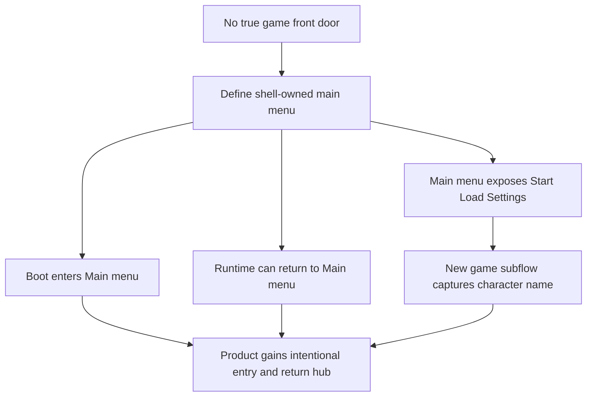

## req_030_define_a_shell_owned_main_menu_and_new_game_entry_flow - Define a shell-owned main menu and new-game entry flow
> From version: 0.2.2
> Status: Done
> Understanding: 100%
> Confidence: 98%
> Complexity: Medium
> Theme: UX
> Reminder: Update status/understanding/confidence and references when you edit this doc.

# Needs
- Introduce a real shell-owned main menu before runtime start so the product no longer boots straight into the live session without an intentional entry flow.
- Make `Start new game`, `Load game`, and `Settings` first-class entry points rather than forcing all session control to begin inside the runtime.
- Add a lightweight new-game creation step that captures the player character name before the runtime session starts.
- Ensure the main menu can also be reached again from an active game session so it becomes a durable hub, not a one-time pre-launch screen.
- Preserve shell/runtime ownership boundaries so starting, resuming, loading, or abandoning a session remains explicit and safe.

# Context
The repository has progressively strengthened the shell layer:
- the floating menu became a command deck
- the shell adopted a tactical-console direction
- session navigation gained stronger hierarchy and submenu structure
- settings is being repositioned as a lighter configuration surface

That leaves one major product gap:

There is still no true front door to the game.

Right now the experience behaves more like a runtime bootstrap than a game product:
- the user enters the runtime too quickly
- there is no dedicated start/load decision point
- there is no natural place to enter player identity such as a character name
- the shell has grown stronger, but the product still lacks a clear main menu hub

This gap also creates a second issue:

Even if a start screen were added only before boot, it would remain structurally weak unless the player could return to it from inside the game.

That means the target should not be a disposable splash screen. It should be:
1. a shell-owned main menu shown before runtime begins
2. a menu that can also be reopened from an active session
3. a stable hub for `Resume`, `New game`, `Load game`, and `Settings`
4. a lightweight new-game flow that captures character name before session creation

Recommended target posture:
1. The product opens into a shell-owned `Main menu` rather than dropping directly into runtime.
2. `Main menu` exposes the primary destinations: `Start new game`, `Load game`, and `Settings`.
3. When an active session exists, `Main menu` also exposes `Resume` and appropriate session-transition safeguards.
4. `Start new game` opens a short shell-owned creation step where the player enters a character name before beginning.
5. `Load game` behaves clearly when no save exists, rather than suggesting unavailable functionality.
6. Returning to the main menu from inside the game remains possible through explicit shell navigation.

Likely transition model:
- Boot with no active session -> `Main menu`
- `Start new game` -> `New game` subflow -> enter character name -> `Begin`
- `Load game` -> load existing save or show unavailable state
- `Settings` -> shell-owned settings scene
- Runtime session active -> command deck can route back to `Main menu`
- `Main menu` from active session -> `Resume`, `Load`, `New game`, `Settings`

Recommended safety posture:
- moving from an active session to `New game` or `Load game` should use explicit confirmation if unsaved progress could be lost
- `Resume` should return to the preserved active session without reconstructing it
- `Settings` should remain shell-owned and non-destructive relative to the active session

Recommended product defaults for this first slice:
- start with one save slot only
- expose both `Resume` and `Load game` when an active session exists
- require a character name before `Begin`, with a product-provided default name prefilled
- keep the character name fixed after session creation for now
- preserve the active session in memory when returning to `Main menu`
- keep `Load game` visible when no save exists, but present it as unavailable rather than hiding it
- use explicit confirmation before replacing an unsaved active session via `New game` or `Load game`
- keep the main menu visually aligned with the tactical-console shell family rather than turning it into a cinematic title screen
- implement `New game` as a short dedicated subflow rather than a tiny inline prompt
- on boot, land on `Main menu` even if a resumable session or save exists, with `Resume` emphasized when applicable

Scope includes:
- main-menu shell scene definition
- boot-time routing into a shell-owned main menu
- runtime-to-main-menu return path
- new-game entry flow with character-name capture
- load-game availability posture
- session-transition clarity around resume/new/load/settings

Scope excludes:
- full save-system redesign beyond what `Load game` entry-state clarity requires
- deep character-creation systems beyond naming
- progression-system redesign
- combat or world-generation redesign
- multiplayer or profile management

# Acceptance criteria
- AC1: The request defines a shell-owned `Main menu` that serves as the default product entry before the runtime session starts.
- AC2: The request defines `Start new game`, `Load game`, and `Settings` as primary main-menu destinations, with `Resume` available when an active session exists.
- AC3: The request defines a lightweight new-game flow that captures a character name before starting the runtime session.
- AC4: The request defines how the player can return to the main menu from an active runtime session without collapsing shell/runtime ownership boundaries.
- AC5: The request defines clear behavior for `Load game` when no saved game is available.
- AC6: The request defines safe transition behavior for `New game` or `Load game` when an active unsaved session exists.
- AC7: The request defines first-slice defaults for save-slot count, character-name handling, session preservation, and main-menu entry emphasis so implementation does not drift on core flow decisions.
- AC8: The request remains focused on main-menu, session-entry, and session-return flow and does not reopen broader save-system or character-creation redesign.

# Open questions
- Should the main menu always show `Resume`?
  Recommended default: only when an active session exists; otherwise prioritize `Start new game`, `Load game`, and `Settings`.
- How much character creation belongs in the first `New game` flow?
  Recommended default: player name only; keep the first slice intentionally lightweight.
- Should `Load game` be disabled or open an empty-state panel when no save exists?
  Recommended default: keep the entry visible but communicate `No save available yet` clearly.
- Should returning to the main menu from runtime pause the live session or fully unload it?
  Recommended default: preserve the session and treat `Resume` as the direct path back unless the player confirms replacing it.
- Should this request also define visual direction for the main menu?
  Recommended default: align it with the existing shell tactical-console family without reopening broad visual-redesign scope.

# Definition of Ready (DoR)
- [x] Problem statement is explicit and user impact is clear.
- [x] Scope boundaries (in/out) are explicit.
- [x] Acceptance criteria are testable.
- [x] Dependencies and known risks are listed.

# Companion docs
- Product brief(s): `prod_001_minimal_overlay_and_feedback_for_early_runtime`
- Architecture decision(s): `adr_002_separate_react_shell_from_pixi_runtime_ownership`, `adr_016_define_shell_scene_state_and_meta_surface_ownership`, `adr_025_keep_shell_chrome_event_driven_and_sample_diagnostics_off_the_runtime_hot_path`
- Request(s): `req_027_restructure_the_shell_command_deck_around_a_primary_session_section`, `req_028_define_a_cohesive_shell_meta_and_runtime_feedback_surface`, `req_029_define_a_lightweight_settings_scene_with_desktop_control_customization`

# Backlog
- `define_a_shell_owned_main_menu_as_the_primary_product_entry_and_return_hub`
- `define_a_new_game_flow_that_captures_character_name_before_runtime_start`
- `define_resume_load_and_session_replacement_rules_for_main_menu_navigation`

# Implementation notes
- Delivered through `AppShell`, `AppMetaScenePanel`, `useAppScene`, and runtime-session storage changes so the product now boots into `Main menu` instead of entering the live runtime immediately.
- Added a shell-owned `New game` subflow that captures character name before runtime start and routes back safely to `Main menu`.
- Preserved runtime sessions in memory and storage so `Resume` can return to the active session while `New game` uses explicit confirmation before replacing it.
- Kept `Load game` visible but unavailable for the first slice while the save-system redesign remains out of scope.
