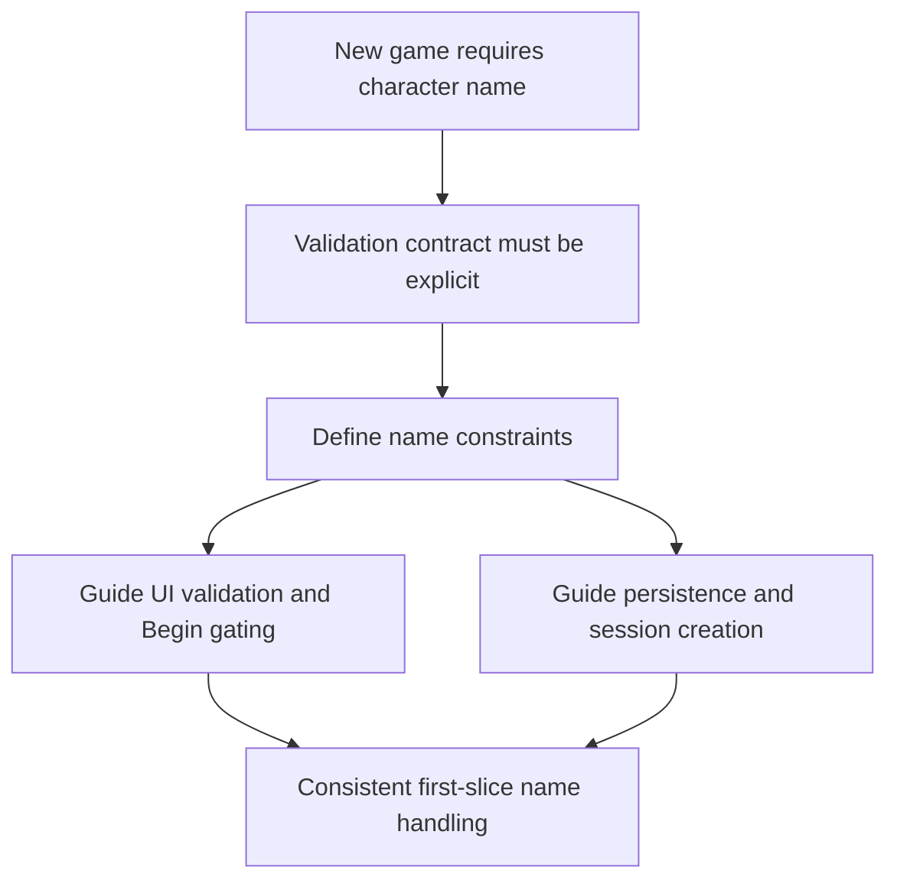

## req_031_define_character_name_validation_and_constraints_for_new_game_entry - Define character-name validation and constraints for new-game entry
> From version: 0.2.2
> Status: Draft
> Understanding: 98%
> Confidence: 96%
> Complexity: Low
> Theme: UX
> Reminder: Update status/understanding/confidence and references when you edit this doc.

# Needs
- Define a clear validation contract for the character-name field used by the `New game` entry flow so implementation does not drift between UI, persistence, and session creation.
- Keep the naming rules permissive enough for players while preventing obviously broken, empty, or layout-hostile values.
- Ensure the settings of the field remain simple for a first slice, without opening moderation, profile, or identity-system complexity.
- Make validation behavior explicit enough that the `Begin` action, error states, and persisted session name all follow the same rules.

# Context
`req_030_define_a_shell_owned_main_menu_and_new_game_entry_flow` establishes that:
- `New game` is a short shell-owned subflow
- the player enters a character name before runtime start
- the name is required, with a default value prefilled
- the name remains fixed after session creation for this first slice

That leaves one implementation-sensitive gap:

What exactly counts as a valid character name?

If this is left implicit, several problems appear quickly:
- UI and persistence may apply different trimming or normalization rules
- the `Begin` CTA may enable for values that later get rejected
- the game can end up storing empty, all-numeric, or visually broken names
- future shell and HUD surfaces can inherit bad names that were never properly constrained

The right first-step posture is not a complex identity system. It is a small, explicit validation contract.

Recommended target posture:
1. Character name is required for `New game`.
2. Input is trimmed before validation and persistence.
3. Valid names use a short, player-friendly length window.
4. Allowed characters stay simple and UI-safe for V1.
5. The field rejects obviously low-quality values such as empty or all-numeric names.
6. The same validation contract applies to UI state, CTA gating, and persisted session data.

Recommended V1 defaults:
- minimum length: `3`
- maximum length: `20`
- allowed characters: letters, digits, spaces, apostrophes, and hyphens
- collapse or reject repeated whitespace so names cannot be effectively blank through spacing tricks
- reject names composed only of digits
- keep uniqueness out of scope
- keep moderation and banned-word policy out of scope
- preserve user-chosen casing after validation

Scope includes:
- character-name validation rules for the `New game` flow
- character-name constraints for UI acceptance and session persistence
- error-state and CTA-gating expectations tied to validation
- default-name posture for first entry

Scope excludes:
- multiplayer identity
- account/profile systems
- profanity filtering and moderation policy
- post-start character renaming
- localization-heavy naming rules beyond the first simple contract

# Acceptance criteria
- AC1: The request defines a single validation contract for character names used by `New game` UI, CTA gating, and persisted session creation.
- AC2: The request defines a minimum and maximum length for the name field.
- AC3: The request defines an allowed-character set appropriate for the first slice.
- AC4: The request defines trim or whitespace-handling behavior clearly enough to prevent effectively empty names.
- AC5: The request defines whether all-numeric names are accepted or rejected.
- AC6: The request defines a default-name posture for first entry without requiring a full identity or naming system.
- AC7: The request stays focused on first-slice validation rules and does not reopen moderation, renaming, or profile-management scope.

# Open questions
- Should repeated internal whitespace be collapsed or simply rejected?
  Recommended default: collapse consecutive internal whitespace to one space after trim, so the UX stays forgiving.
- Should accented or broader Unicode letters be accepted in the first slice?
  Recommended default: yes if the current UI and persistence path already handle them safely; otherwise keep the contract ASCII-first until explicitly expanded.
- Should the field validate live or only on submit?
  Recommended default: validate live with a quiet inline message and disable `Begin` while invalid.
- Should the default name be static or generated?
  Recommended default: use one stable product default name first rather than procedural generation.

# Definition of Ready (DoR)
- [x] Problem statement is explicit and user impact is clear.
- [x] Scope boundaries (in/out) are explicit.
- [x] Acceptance criteria are testable.
- [x] Dependencies and known risks are listed.

# Companion docs
- Product brief(s): `prod_001_minimal_overlay_and_feedback_for_early_runtime`
- Architecture decision(s): `adr_002_separate_react_shell_from_pixi_runtime_ownership`, `adr_016_define_shell_scene_state_and_meta_surface_ownership`
- Request(s): `req_030_define_a_shell_owned_main_menu_and_new_game_entry_flow`

# Backlog
- `define_character_name_validation_rules_for_new_game_entry`
- `define_character_name_field_feedback_and_begin_gating_behavior`
- `define_character_name_persistence_contract_for_session_creation`
