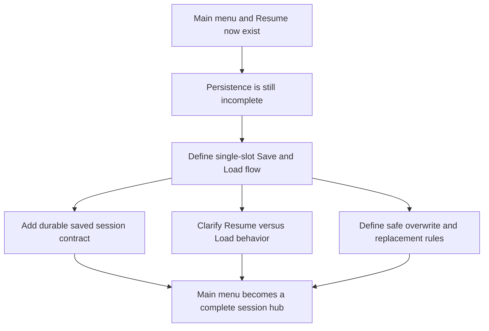

## req_032_define_a_single_slot_save_and_load_flow_for_shell_owned_session_entry - Define a single-slot save and load flow for shell-owned session entry
> From version: 0.5.0
> Status: Done
> Understanding: 100%
> Confidence: 98%
> Complexity: Medium
> Theme: UX
> Reminder: Update status/understanding/confidence and references when you edit this doc.
> Schema version: 1.0

# Needs
- Turn the current `Main menu` and `Resume` posture into a complete session-entry model by adding a real persisted `Save / Load` path.
- Keep the first slice intentionally small by using a single save slot rather than reopening multi-slot management too early.
- Make the relationship between in-memory active session, persisted saved session, and shell-owned menu transitions explicit and safe.
- Ensure `Load game` stops being a placeholder and becomes a trustworthy product action with clear availability and replacement behavior.
- Preserve the current shell/runtime ownership model while introducing durable persistence for player-facing progress.

# Context
The repository now has the right entry surfaces:
- a shell-owned `Main menu`
- a `New game` flow with character naming
- a resumable active session
- a lightweight `Settings` scene

That means the remaining product gap is no longer navigation. It is persistence.

Right now:
- `Resume` works against the active in-memory session
- `New game` can create and replace a session
- `Load game` is still visibly unavailable

This is a coherent staging state, but not a complete player-facing product loop.

Without save/load:
- returning to the game remains session-local rather than durable
- the `Main menu` exposes an incomplete action set
- session replacement rules are only half-real
- the product still lacks a proper long-lived play loop

The next slice should therefore formalize a minimal but real persistence contract:
1. one active session in memory
2. one persisted save slot on disk/browser storage
3. explicit `Save`, `Load`, and `Resume` rules
4. safe replacement and confirmation behavior
5. no multi-slot complexity yet

Recommended first-slice posture:
1. Support exactly one save slot.
2. `Save` writes the current active session into that slot.
3. `Load game` restores that slot into the active session after required confirmation.
4. `Resume` continues the current in-memory session without reading from persistence.
5. `New game` can still replace the active session, with confirmation when relevant.
6. `Load game` is disabled only when no persisted save exists.
7. The saved payload stays bounded to the current local-first storage posture.

Recommended transition model:
- Boot with no save and no active session -> `Main menu` with `Load game` unavailable
- Boot with save but no active session -> `Main menu` with `Load game` available
- Active session exists -> `Resume` available
- Active session + saved slot exist -> both `Resume` and `Load game` available
- `Load game` from active unsaved session -> explicit confirmation
- `New game` from active unsaved session -> explicit confirmation
- `Save` from active session -> overwrite the single slot explicitly

Recommended scope:
- single-slot save contract
- save/load actions and availability
- active-session versus saved-session behavior
- shell-owned menu/state transitions around save/load
- safe overwrite and replacement rules
- persistence-compatible session payload definition

Scope excludes:
- multi-slot save UI
- cloud sync
- profile/account systems
- save thumbnails, metadata history, or version browsing
- deep progression redesign beyond what current session persistence requires

# Acceptance criteria
- AC1: The request defines a real first-slice `Save / Load` model built around exactly one persisted save slot.
- AC2: The request defines the distinction between `Resume` and `Load game` clearly enough that active-session and saved-session behavior cannot drift.
- AC3: The request defines when `Save`, `Load game`, and `Resume` are available from shell-owned surfaces.
- AC4: The request defines confirmation and replacement rules when loading or starting a new game would overwrite or replace meaningful active state.
- AC5: The request defines the persistence posture for the saved session in a way that stays compatible with the current local-first browser storage model.
- AC6: The request keeps the wave focused on single-slot durability and does not reopen multi-slot or cloud-sync scope.

# Open questions
- Should `Save` live only in the main menu, or also in the command deck?
  Recommended default: expose it from the shell-owned main menu first; add command-deck access only if the interaction cost proves too high.
- Should saving require explicit confirmation every time?
  Recommended default: no; saving into the single slot can overwrite directly, but the UI should communicate the target clearly.
- Should `Load game` replace the current active session immediately after confirmation?
  Recommended default: yes; keep the first slice simple and deterministic.
- Should save metadata include player name and a short timestamp?
  Recommended default: yes; minimal metadata helps the single slot feel real without reopening multi-slot UX.
- Should `Resume` ever fall back to loading the saved slot when there is no active session?
  Recommended default: no; `Resume` should remain in-memory only, and `Load game` should stay the persisted-entry action.

# Definition of Ready (DoR)
- [x] Problem statement is explicit and user impact is clear.
- [x] Scope boundaries (in/out) are explicit.
- [x] Acceptance criteria are testable.
- [x] Dependencies and known risks are listed.

# Companion docs
- Product brief(s): `prod_001_minimal_overlay_and_feedback_for_early_runtime`
- Architecture decision(s): `adr_002_separate_react_shell_from_pixi_runtime_ownership`, `adr_009_limit_persistence_to_local_versioned_frontend_storage`, `adr_016_define_shell_scene_state_and_meta_surface_ownership`
- Request(s): `req_030_define_a_shell_owned_main_menu_and_new_game_entry_flow`, `req_031_define_character_name_validation_and_constraints_for_new_game_entry`

# AI Context
- Summary: Turn the current Main menu and Resume posture into a complete session-entry model by adding a real persisted...
- Keywords: single-slot, save, and, load, flow, for, shell-owned, session
- Use when: Use when framing scope, context, and acceptance checks for Define a single-slot save and load flow for shell-owned session entry.
- Skip when: Skip when the work targets another feature, repository, or workflow stage.

# Backlog
- `item_121_define_a_single_slot_saved_session_contract_for_local_first_persistence`
- `item_122_define_save_resume_and_load_availability_across_shell_owned_surfaces`
- `item_123_define_active_session_replacement_and_overwrite_rules_for_single_slot_save_load`

# Implementation notes
- Delivered through `savedRuntimeSessionStorage`, `storageDomainCatalog`, `useRuntimeSession`, `AppShell`, and `AppMetaScenePanel` so the product now has one persisted saved-session slot alongside the in-memory active session.
- `Save game` writes the current runtime session plus minimal metadata (`playerName`, `savedAtIso`, `sessionRevision`, `worldSeed`) into the single slot without reopening multi-slot scope.
- `Load game` restores the saved slot into the active session and increments `sessionRevision`, keeping `Resume` distinct as the in-memory-only re-entry path.
- The main menu now exposes real save/load affordances and a saved-slot summary while keeping the whole flow local-first and browser-storage compatible.
