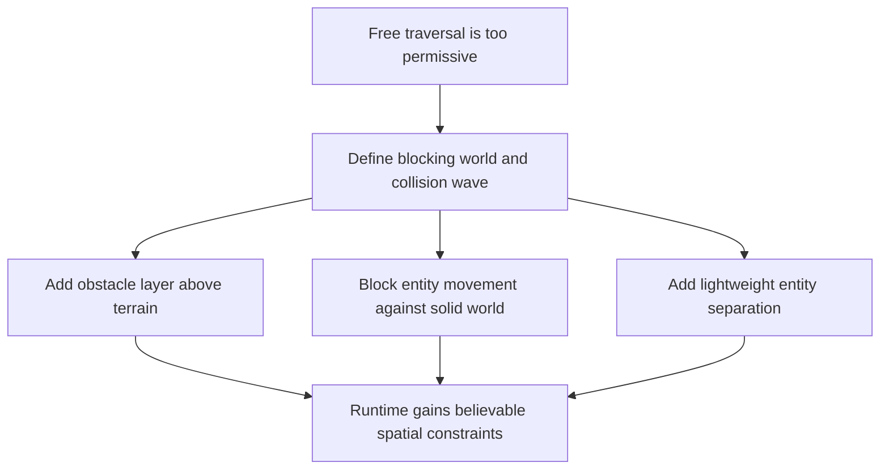

## req_033_define_a_first_collision_and_blocking_world_wave_for_runtime_gameplay - Define a first collision and blocking-world wave for runtime gameplay
> From version: 0.5.0
> Status: Done
> Understanding: 100%
> Confidence: 98%
> Complexity: Medium
> Theme: Gameplay
> Reminder: Update status/understanding/confidence and references when you edit this doc.
> Schema version: 1.0

# Needs
- Introduce a first real notion of physical constraint into the runtime so movement is no longer purely free traversal across the world.
- Define non-traversable world zones or surfaces that can block movement in a deterministic and testable way.
- Keep terrain presentation and blocking gameplay rules decoupled by introducing a dedicated obstacle layer rather than making terrain itself directly responsible for solidity.
- Add a first entity-collision posture so entities stop overlapping in obviously broken ways.
- Keep the first slice intentionally lightweight by focusing on movement blocking and separation rather than a full physics engine.
- Preserve the current runtime performance and deterministic simulation posture while adding collision rules.

# Context
The project has recently improved shell flow, menu structure, settings, and session entry. That makes the next useful product step a gameplay-facing one.

Right now, the runtime still behaves like a mostly unconstrained movement sandbox:
- traversal is too permissive
- terrain does not yet create meaningful blocked space
- entities can pass through or overlap in ways that reduce world credibility

The current world generation posture is still terrain-first:
- chunks and tiles determine biome/terrain identity
- terrain currently serves visual/debug identity rather than traversability rules
- there is not yet a separate obstacle contract that can express “this tile remains terrain X, but also contains blocking geometry”

This means the runtime lacks one of the first signals players expect from a world:
- some places should be solid
- some movement attempts should fail
- entities should not collapse into the same space without consequence

The next wave should therefore not jump directly to a heavy “physics engine” framing.

Recommended first-slice posture:
1. Start with movement collision and blocking zones, not rigid-body simulation.
2. Keep a visual terrain layer and add a separate obstacle layer that carries blocking semantics.
3. Give entities simple collision shapes suitable for deterministic separation.
4. Resolve movement conservatively and predictably rather than physically “realistically”.
5. Keep the implementation compatible with the current fixed-step simulation model.

Recommended first-slice scope:
- non-traversable world cells/zones/surfaces expressed through a dedicated obstacle layer
- player/entity movement blocked by world solidity
- first entity/entity overlap prevention or separation
- deterministic collision resolution
- tests for blocked movement and simple collision cases

Recommended out-of-scope posture:
- no external physics engine
- no forces, impulses, mass, restitution, or ragdoll behavior
- no full navmesh/pathfinding redesign in the same wave
- no continuous collision system beyond what current movement needs

Suggested delivery order:
1. Define obstacle-layer representation above terrain generation
2. Apply world collision to movement
3. Add lightweight entity/entity collision or separation
4. Validate determinism, readability, and performance impact

# Acceptance criteria
- AC1: The request defines a first-slice collision wave centered on blocking world traversal and lightweight entity collision rather than full rigid-body physics.
- AC2: The request defines how non-traversable world space is represented strongly enough to guide implementation, with terrain and obstacle concerns kept distinct.
- AC3: The request defines how entity movement should be blocked or resolved against solid world surfaces.
- AC4: The request defines a first entity/entity collision or separation posture that prevents obviously broken overlap.
- AC5: The request preserves the current deterministic runtime/simulation posture and does not reopen full physics-engine scope.
- AC6: The request stays focused on first-slice collision credibility and does not merge in broader combat, pathfinding, or full physical-simulation redesign.

# Open questions
- Should blocking be tile-based, zone-based, or both in the first slice?
  Recommended default: start tile- or cell-based if that matches current world generation most directly, then layer richer zones later only if needed.
- Should collisions cause full stop or sliding along surfaces?
  Recommended default: allow simple axis-aware sliding only if it stays deterministic and easy to reason about; otherwise prefer full blocking first.
- Should all entities collide with each other in the first slice?
  Recommended default: start with player-relevant or major world entities only, not every possible debug/support entity.
- Should obstacle data be authored, generated, or inferred from terrain?
  Recommended default: generate it through the existing world generation path, but keep it as a separate obstacle layer rather than inferring blocking directly from terrain kind.

# Definition of Ready (DoR)
- [x] Problem statement is explicit and user impact is clear.
- [x] Scope boundaries (in/out) are explicit.
- [x] Acceptance criteria are testable.
- [x] Dependencies and known risks are listed.

# Companion docs
- Product brief(s): `prod_001_minimal_overlay_and_feedback_for_early_runtime`
- Architecture decision(s): `adr_002_separate_react_shell_from_pixi_runtime_ownership`, `adr_025_keep_shell_chrome_event_driven_and_sample_diagnostics_off_the_runtime_hot_path`, `adr_032_separate_visual_terrain_blocking_obstacles_and_movement_surface_modifiers`, `adr_033_adopt_deterministic_movement_oriented_pseudo_physics_instead_of_a_full_physics_engine`, `adr_035_resolve_entity_collisions_as_lightweight_deterministic_separation`
- Request(s): `req_028_define_a_cohesive_shell_meta_and_runtime_feedback_surface`

# AI Context
- Summary: Introduce a first real notion of physical constraint into the runtime so movement is no longer purely free...
- Keywords: first, collision, and, blocking-world, wave, for, runtime, gameplay
- Use when: Use when framing scope, context, and acceptance checks for Define a first collision and blocking-world wave for runtime gameplay.
- Skip when: Skip when the work targets another feature, repository, or workflow stage.

# Backlog
- `item_124_define_a_first_obstacle_layer_representation_for_runtime_traversal`
- `item_125_define_movement_resolution_against_non_traversable_world_space`
- `item_126_define_a_lightweight_entity_separation_posture_for_runtime_collisions`

# Implementation notes
- Delivered through `worldData`, `worldGeneration`, `chunkDebugData`, `pseudoPhysics`, and `entitySimulation`, with terrain, obstacle, and movement-surface semantics now represented as separate layers.
- Added a deterministic obstacle layer with a protected bootstrap zone so blocked world space is no longer inferred from terrain kind alone.
- Runtime movement now resolves against non-traversable world space through bounded axis-aware blocking instead of free traversal.
- Lightweight static-entity separation now prevents obvious overlap for the first relevant collidable entity set without introducing rigid-body response.
