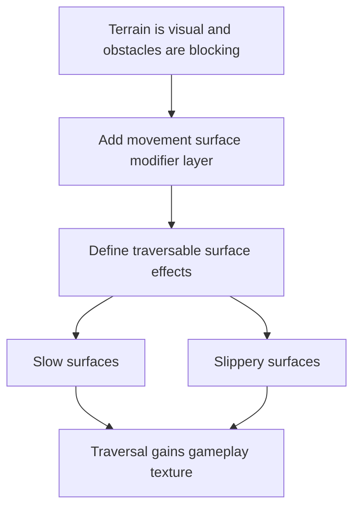

## req_034_define_a_first_movement_surface_modifiers_wave_for_runtime_gameplay - Define a first movement surface modifiers wave for runtime gameplay
> From version: 0.2.2
> Status: Done
> Understanding: 100%
> Confidence: 97%
> Complexity: Medium
> Theme: Gameplay
> Reminder: Update status/understanding/confidence and references when you edit this doc.

# Needs
- Introduce a first player-facing notion of movement-affecting surfaces without conflating them with blocking collision or raw terrain identity.
- Define a dedicated surface-modifier posture that can express effects such as `slow` and `slippery` while keeping the runtime deterministic and readable.
- Preserve the architectural separation between visual terrain, blocking obstacles, and movement behavior modifiers.
- Improve world feel by making traversal meaningfully different across some world areas even when those areas remain traversable.
- Keep the first slice intentionally lightweight by limiting the modifier set and avoiding a full material/physics system.

# Context
The runtime is now ready to move beyond purely visual terrain and into gameplay-significant world rules.

One wave is already being framed around:
- a dedicated obstacle layer for non-traversable space
- lightweight blocking-world collision
- simple entity separation

That should remain the place where solidity and collision live.

However, not all world differentiation should be binary:
- some areas should remain walkable but feel slower
- some areas should preserve movement while reducing control or increasing inertia
- some terrain should communicate “be careful here” without becoming a hard wall

This means the runtime would benefit from a second gameplay layer distinct from both terrain and obstacles:
- terrain layer = visual identity and biome expression
- obstacle layer = blocking / collision
- surface-modifier layer = movement-affecting traversal rules

Recommended first-slice posture:
1. Keep surface modifiers separate from obstacle collision rules.
2. Start with a minimal set of effects: `normal`, `slow`, and optionally `slippery`.
3. Make modifier behavior deterministic and easy to reason about in tests.
4. Prefer clear player readability over heavy physical realism.
5. Keep movement modifiers compatible with the current fixed-step runtime simulation.

Recommended first-slice scope:
- define a first movement-surface modifier contract
- apply modifiers only to traversable space
- support a first slow-surface behavior
- optionally support a first slippery-surface behavior if the runtime movement model stays understandable
- ensure the modifier layer can be generated deterministically from world generation inputs
- test movement behavior differences across modifier types

Recommended out-of-scope posture:
- no full material system
- no friction/restitution/mass simulation language
- no combining many modifiers per tile in the first slice
- no combat/status-effect redesign in the same wave
- no obstacle replacement or merging of blocking and movement modifiers into one contract

Suggested delivery order:
1. Define the movement-surface modifier layer contract
2. Implement `slow` traversal semantics
3. Evaluate whether `slippery` is readable enough for the first slice
4. Connect modifier generation to deterministic world generation
5. Validate player readability, runtime determinism, and movement feel

# Acceptance criteria
- AC1: The request defines a dedicated movement-surface modifier wave distinct from both terrain identity and obstacle blocking.
- AC2: The request defines at least one first-slice traversable movement modifier strongly enough to guide implementation.
- AC3: The request preserves the posture that blocking collision belongs to an obstacle layer rather than to movement-surface modifiers.
- AC4: The request defines how modifier behavior should remain deterministic and compatible with the current fixed-step runtime model.
- AC5: The request keeps the first slice intentionally narrow and does not reopen a full physics/material system.
- AC6: The request frames player readability and movement feel as first-class constraints alongside correctness.

# Open questions
- Should the first slice ship only `slow`, or both `slow` and `slippery`?
  Recommended default: guarantee `slow` first; add `slippery` only if its behavior is still easy to read and test.
- Should surface modifiers be represented as their own generated layer or as metadata attached to traversable tiles?
  Recommended default: treat them as a logically separate layer even if the initial implementation stores them close to tile data.
- Should modifiers affect only player-controlled movement or all entities?
  Recommended default: start with player-controlled movement first, then expand if NPC/runtime movement also benefits.
- Should modifier generation follow terrain families closely, or be generated independently?
  Recommended default: allow terrain-informed generation, but do not make terrain kind alone fully determine the modifier.
- Should slippery behavior reduce acceleration, reduce braking, or force directional carry?
  Recommended default: prefer reduced braking / mild inertia over highly chaotic control loss.

# Definition of Ready (DoR)
- [x] Problem statement is explicit and user impact is clear.
- [x] Scope boundaries (in/out) are explicit.
- [x] Acceptance criteria are testable.
- [x] Dependencies and known risks are listed.

# Companion docs
- Product brief(s): `prod_001_minimal_overlay_and_feedback_for_early_runtime`
- Architecture decision(s): `adr_002_separate_react_shell_from_pixi_runtime_ownership`, `adr_032_separate_visual_terrain_blocking_obstacles_and_movement_surface_modifiers`, `adr_033_adopt_deterministic_movement_oriented_pseudo_physics_instead_of_a_full_physics_engine`, `adr_034_model_traversable_surface_effects_as_bounded_movement_modifiers`
- Request(s): `req_033_define_a_first_collision_and_blocking_world_wave_for_runtime_gameplay`

# Backlog
- `define_a_first_movement_surface_modifier_contract_for_traversable_world_space`
- `define_slow_surface_behavior_for_fixed_step_runtime_movement`
- `define_optional_slippery_surface_behavior_without_reopening_full_physics_scope`

# Implementation notes
- Delivered through `worldData`, `worldGeneration`, `pseudoPhysics`, and runtime movement tests so traversable movement modifiers are now explicit and separate from both terrain identity and blocking obstacles.
- Shipped the first bounded modifier contract with `normal`, `slow`, and `slippery`, all sampled deterministically from the generated world only on traversable space.
- `Slow` reduces traversal speed without changing collision semantics, giving the first safe gameplay-facing movement modifier.
- `Slippery` shipped with a bounded inertia profile that preserves deterministic fixed-step behavior and avoids reopening full physics scope.
