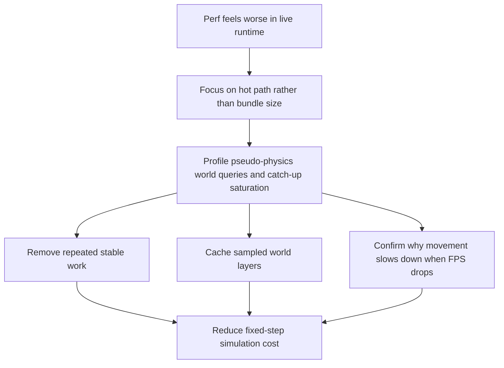

## req_035_define_a_runtime_hot_path_optimization_wave_for_pseudo_physics_and_world_queries - Define a runtime hot-path optimization wave for pseudo-physics and world queries
> From version: 0.2.3
> Status: Draft
> Understanding: 100%
> Confidence: 97%
> Complexity: Medium
> Theme: Performance
> Reminder: Update status/understanding/confidence and references when you edit this doc.

# Needs
- Investigate and reduce the runtime cost introduced by the first pseudo-physics and world-layer waves without rolling back their gameplay value.
- Distinguish loading/bundle performance from live simulation performance so the next perf work targets the real regression surface.
- Address the specific symptom where lower FPS appears to reduce real movement distance per second instead of only reducing visual smoothness.
- Remove avoidable work from the fixed-step hot path, especially repeated deterministic world sampling and repeated reconstruction of static collision inputs.
- Keep the runtime deterministic while introducing caching or memoization layers for obstacle and surface queries.
- Preserve the current terrain / obstacle / surface-modifier architecture instead of “fixing” performance by collapsing those layers back together.

# Context
The repository now has:
- single-slot save/load
- obstacle-based world blocking
- lightweight entity separation
- movement surface modifiers (`slow`, `slippery`)

The build and delivery budgets are still green:
- initial shell CSS remains within budget
- initial shell JS remains within budget
- lazy runtime JS remains within budget
- browser smoke still passes

That makes the likely regression surface different from shell or bundle cost.

The more credible hotspot is the runtime simulation loop itself:
- world layers are sampled during movement resolution
- blocked-space checks can sample multiple nearby tiles per step
- deterministic signatures are recomputed repeatedly for the same local world area
- static support colliders are rebuilt inside the hot path even though they are stable

There is also one product-facing symptom that makes this wave more urgent:
- when framerate drops, entity movement appears to slow down in world distance per second
- this suggests the runtime is not merely rendering less smoothly
- it suggests the fixed-step simulation is failing to keep up with real time often enough that movement throughput is reduced
- the likely interaction point is the catch-up posture around `maxCatchUpStepsPerFrame`, combined with a heavier hot path

This means the next useful wave should not be “another gameplay feature”.
It should be a bounded optimization wave focused on the fixed-step runtime path.

Recommended target posture:
1. Keep the current gameplay semantics intact.
2. Measure and optimize runtime simulation cost rather than bundle size first.
3. Eliminate obviously repeated work in movement/collision evaluation.
4. Introduce bounded caching for world-layer sampling.
5. Preserve determinism, readability, and testability.

Likely optimization actions:
- memoize deterministic support colliders rather than recreating them each step
- add a bounded cache for sampled world tile layers keyed by world seed and tile coordinate
- reduce duplicate tile sampling within a single blocked-movement evaluation
- ensure obstacle and surface queries share the same sampled tile data when possible
- measure whether simulation catch-up is saturating under load and confirm whether movement slowdown is caused by missed real-time throughput rather than only by visual jitter
- verify that the resulting runtime still respects existing smoke and performance budgets

Scope includes:
- profiling-oriented review of the runtime hot path
- optimization of repeated world-layer queries
- optimization of repeated stable collider creation
- validation of simulation throughput under lower-FPS conditions, especially for player movement speed over real time
- bounded caching compatible with deterministic simulation
- validation of runtime perf after the optimizations

Scope excludes:
- changing gameplay semantics for blocking or surface behavior
- removing obstacle or surface-modifier layers
- introducing a full spatial partitioning or physics-engine rewrite
- broad render-pipeline redesign
- speculative optimization outside the measured hot path

# Acceptance criteria
- AC1: The request defines the likely regression surface as runtime hot-path cost rather than generic bundle growth, strongly enough to guide implementation.
- AC2: The request defines a bounded optimization wave for repeated pseudo-physics and world-query work without changing the shipped gameplay semantics.
- AC3: The request defines at least one optimization action for stable collider inputs and at least one optimization action for repeated world-layer sampling.
- AC4: The request explicitly covers the lower-FPS movement-slowdown symptom and frames it as a simulation-throughput problem to confirm or reject during the wave.
- AC5: The request preserves deterministic simulation posture and does not reopen a full physics rewrite or architecture rollback.
- AC6: The request defines validation expectations that cover both repository performance budgets and live runtime behavior after the optimization wave.
- AC7: The request stays focused on measured or credible hot-path costs and does not turn into an unbounded general cleanup wave.

# Open questions
- Should the first optimization step begin with measurement or with obviously safe hot-path cleanup?
  Recommended default: begin with one quick profiling/inspection pass, then implement the highest-confidence hot-path wins first.
- Should world-layer caching live per frame, per runner, or globally per seed?
  Recommended default: prefer a runner-local bounded cache keyed by seed and tile coordinate.
- Should the cache store full terrain/obstacle/surface samples together or separate query results?
  Recommended default: store the combined sampled tile layers together so obstacle and surface checks reuse one lookup.
- Should static runtime support colliders become a module-level constant or a memoized getter?
  Recommended default: use one stable memoized/runtime-constant representation rather than reconstructing them in the simulation loop.
- Should this wave also verify whether `maxCatchUpStepsPerFrame` is now too low for the heavier hot path?
  Recommended default: yes; confirm whether the symptom comes from hot-path cost alone, catch-up saturation alone, or their combination before changing the clamp.
- Should this wave also optimize rendering if runtime simulation improves only marginally?
  Recommended default: no; keep the first wave focused on simulation hot-path costs, then reassess.

# Definition of Ready (DoR)
- [x] Problem statement is explicit and user impact is clear.
- [x] Scope boundaries (in/out) are explicit.
- [x] Acceptance criteria are testable.
- [x] Dependencies and known risks are listed.

# Companion docs
- Product brief(s): `prod_001_minimal_overlay_and_feedback_for_early_runtime`
- Architecture decision(s): `adr_032_separate_visual_terrain_blocking_obstacles_and_movement_surface_modifiers`, `adr_033_adopt_deterministic_movement_oriented_pseudo_physics_instead_of_a_full_physics_engine`, `adr_034_model_traversable_surface_effects_as_bounded_movement_modifiers`, `adr_035_resolve_entity_collisions_as_lightweight_deterministic_separation`
- Request(s): `req_033_define_a_first_collision_and_blocking_world_wave_for_runtime_gameplay`, `req_034_define_a_first_movement_surface_modifiers_wave_for_runtime_gameplay`

# Backlog
- `profile_and_confirm_runtime_hot_path_regression_sources_after_pseudo_physics_wave`
- `cache_sampled_world_layers_for_deterministic_obstacle_and_surface_queries`
- `remove_repeated_stable_collider_work_from_the_fixed_step_runtime_loop`
