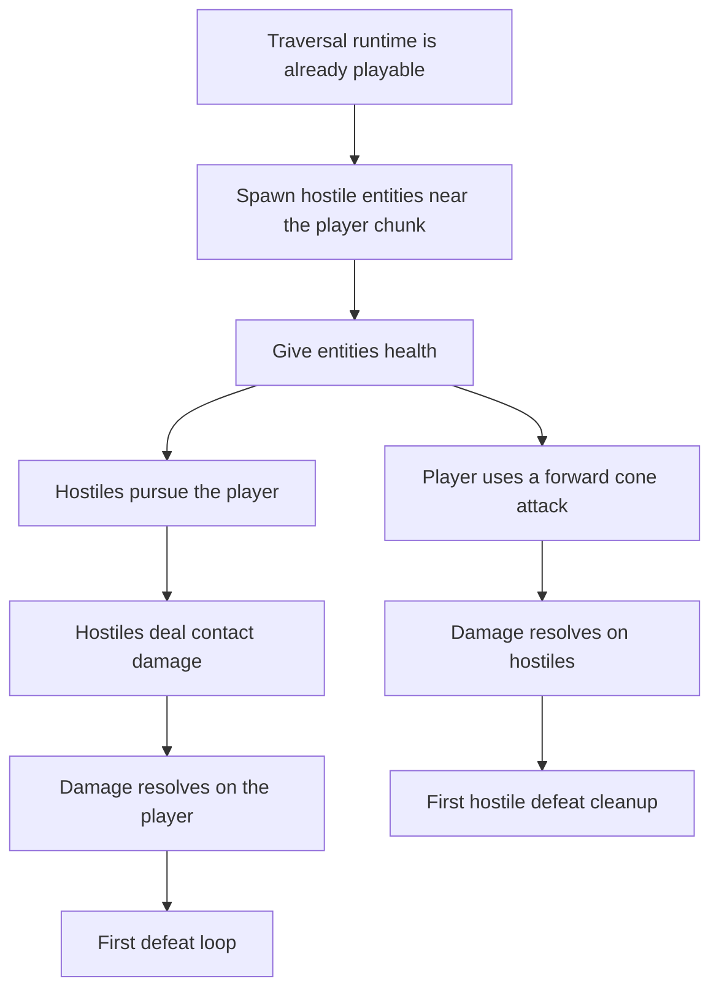

## req_036_define_a_first_hostile_combat_loop_with_spawns_contact_damage_and_player_cone_attack - Define a first hostile combat loop with spawns, contact damage, and a player cone attack
> From version: 0.5.0
> Status: Done
> Understanding: 100%
> Confidence: 98%
> Complexity: High
> Theme: Gameplay
> Reminder: Update status/understanding/confidence and references when you edit this doc.
> Schema version: 1.0

# Needs
- Introduce a first hostile gameplay loop so the runtime moves beyond traversal and into readable combat pressure.
- Spawn hostile entities near the player’s current chunk without flooding the world or requiring a full encounter director.
- Add a shared health model for entities so both player and hostile interactions can deal real damage.
- Define the first player attack as a forward-facing cone attack with enough arc and range to reward orientation and movement.
- Define the first hostile attack as contact damage through collision overlap rather than a separate attack animation system.
- Introduce a minimal hostile pursuit behavior so focused enemies move toward the player when they have the player in focus.
- Keep the first combat slice deterministic, bounded, and compatible with the current pseudo-physics / obstacle / surface systems.

# Context
The runtime now has:
- shell-owned main menu and settings
- single-slot save/load
- obstacle-based world blocking
- lightweight entity separation
- movement surface modifiers
- runtime hot-path optimizations for pseudo-physics and world queries

This means the project is now ready for a first real combat loop.

The requested loop is coherent as a V1 if it stays intentionally narrow:
- hostile entities spawn around the player’s vicinity
- all relevant entities expose health
- the player can damage hostiles through a simple forward cone attack
- hostiles can damage the player by contacting them
- hostiles move toward the player when they have player focus

Recommended first-slice posture:
1. Keep a single hostile archetype first.
2. Use chunk-local or near-chunk spawning instead of a global wave director.
3. Add a shared health/damage contract before layering multiple attack types.
4. Treat hostile contact as the first enemy attack instead of building animation-heavy combat upfront.
5. Give the player one readable melee-style cone attack rather than a projectile or omni attack.
6. Keep the first hostile pursuit logic direct and readable, without pathfinding or threat systems.
7. Prefer fast defaults over tunable breadth: one automatic player attack behavior, one hostile archetype, one local population cap.

Recommended first-slice scope:
- hostile spawn rules around the player chunk with a local population cap
- entity health for player and hostiles
- player cone attack with bounded arc/range/cooldown
- hostile contact damage with bounded damage cadence
- hostile pursuit AI when the player is focused
- defeat trigger when player health reaches zero
- hostile removal or defeat handling when hostile health reaches zero

Recommended defaults for V1:
- keep a local hostile cap of `5`
- spawn hostiles near the player chunk, but not directly on top of the player
- make the first player attack automatic instead of input-triggered
- make the first player attack a `120°` forward cone with medium reach and multi-hit behavior
- give the player attack a short cooldown so the attack cannot be spammed every frame
- give hostile contact damage its own cooldown so overlap is dangerous but not instantly fatal
- treat the player as the only initial hostile focus target
- remove defeated hostiles immediately or after a minimal cleanup pass
- route player defeat directly into the shell-owned `defeat` scene

Recommended out-of-scope posture:
- no multiple hostile factions
- no ranged attacks
- no pathfinding system
- no loot/progression drop system
- no advanced aggro memory or perception model
- no complex target-selection UX beyond the current controlled player focus assumption
- no animation-heavy combo/combat-state machine in the first slice

Suggested delivery order:
1. Define shared health/combatant data needed by all entities.
2. Add hostile spawning near the player’s active chunk.
3. Add hostile pursuit and contact damage.
4. Add the player’s forward cone attack and hostile damage resolution.
5. Wire first defeat handling and cleanup.

# Acceptance criteria
- AC1: The request defines a bounded first hostile combat loop strongly enough to guide implementation.
- AC2: The request defines hostile spawning near the player’s chunk or immediate vicinity without requiring a global encounter system.
- AC3: The request defines a shared health/damage posture for the relevant entities.
- AC4: The request defines the first player attack as an automatic forward-facing cone-style attack with enough specificity to guide implementation.
- AC5: The request defines the first hostile attack as contact/collision damage rather than a separate complex attack system.
- AC6: The request defines a first pursuit behavior for hostiles when the player is in focus.
- AC7: The request keeps the slice intentionally narrow and does not reopen pathfinding, ranged combat, or advanced encounter design.

# Outcome
- Done in `4c60012`.
- The runtime now spawns a bounded local hostile population near the player instead of remaining traversal-only.
- Player and hostiles now share real health state, damage application, and zero-health resolution.
- Hostiles now acquire the player inside a bounded radius, pursue directly, and deal contact damage on a cooldown.
- The player now uses an automatic `120°` forward cone attack with a bounded reach, cooldown, and multi-hit posture.
- Player defeat now resolves into the shell-owned `defeat` scene through the gameplay outcome layer.

# Validation
- `npx vitest run src/game/entities/model/entitySimulation.test.ts games/emberwake/src/runtime/emberwakeRuntimeIntegration.test.ts`
- `npx vitest run src/game/entities/hooks/useEntityWorld.test.tsx src/game/entities/model/entitySpatialIndex.test.ts games/emberwake/src/systems/gameplaySystems.test.ts`
- `npx vitest run src/app/components/PlayerHudCard.test.tsx`
- `npm run typecheck`
- `npm run ci`
- `npm run test:browser:smoke`
- `python3 logics/skills/logics-doc-linter/scripts/logics_lint.py`

# Open questions
- Should the first cone attack hit every hostile inside the cone or only one target?
  Recommended default: hit every hostile inside the cone for the first slice.
- Should hostile contact damage happen every frame of overlap?
  Recommended default: no; add a short damage cooldown or invulnerability window so contact does not melt the player instantly.
- Should hostiles always focus the player, or only when within a small acquisition radius?
  Recommended default: begin with a bounded acquisition radius around the player chunk or current vicinity.
- Should hostiles spawn continuously or up to a local cap?
  Recommended default: maintain a local hostile cap of `5` near the player rather than infinite continuous spawn.
- Should defeat immediately hand control back to the shell-owned defeat scene?
  Recommended default: yes; keep defeat handling explicit and shell-owned.
- Should the player attack require a dedicated input or happen automatically when hostiles are in reach?
  Recommended default: automatic attack with a short cooldown when valid hostiles are inside the forward cone.

# Definition of Ready (DoR)
- [x] Problem statement is explicit and user impact is clear.
- [x] Scope boundaries (in/out) are explicit.
- [x] Acceptance criteria are testable.
- [x] Dependencies and known risks are listed.

# Companion docs
- Product brief(s): `prod_001_minimal_overlay_and_feedback_for_early_runtime`
- Architecture decision(s): `adr_032_separate_visual_terrain_blocking_obstacles_and_movement_surface_modifiers`, `adr_033_adopt_deterministic_movement_oriented_pseudo_physics_instead_of_a_full_physics_engine`, `adr_035_resolve_entity_collisions_as_lightweight_deterministic_separation`
- Request(s): `req_033_define_a_first_collision_and_blocking_world_wave_for_runtime_gameplay`, `req_034_define_a_first_movement_surface_modifiers_wave_for_runtime_gameplay`

# AI Context
- Summary: Introduce a first hostile gameplay loop so the runtime moves beyond traversal and into readable combat pressure.
- Keywords: first, hostile, combat, loop, spawns, contact, damage, and
- Use when: Use when framing scope, context, and acceptance checks for Define a first hostile combat loop with spawns, contact damage, and a player cone attack.
- Skip when: Skip when the work targets another feature, repository, or workflow stage.

# Backlog
- `item_133_define_hostile_spawning_near_the_player_chunk_with_a_local_population_cap`
- `item_134_define_shared_entity_health_and_damage_resolution_for_first_combatants`
- `item_135_define_hostile_focus_pursuit_and_contact_damage_for_the_first_combat_loop`
- `item_136_define_an_automatic_forward_player_cone_attack_for_first_hostile_combat`
