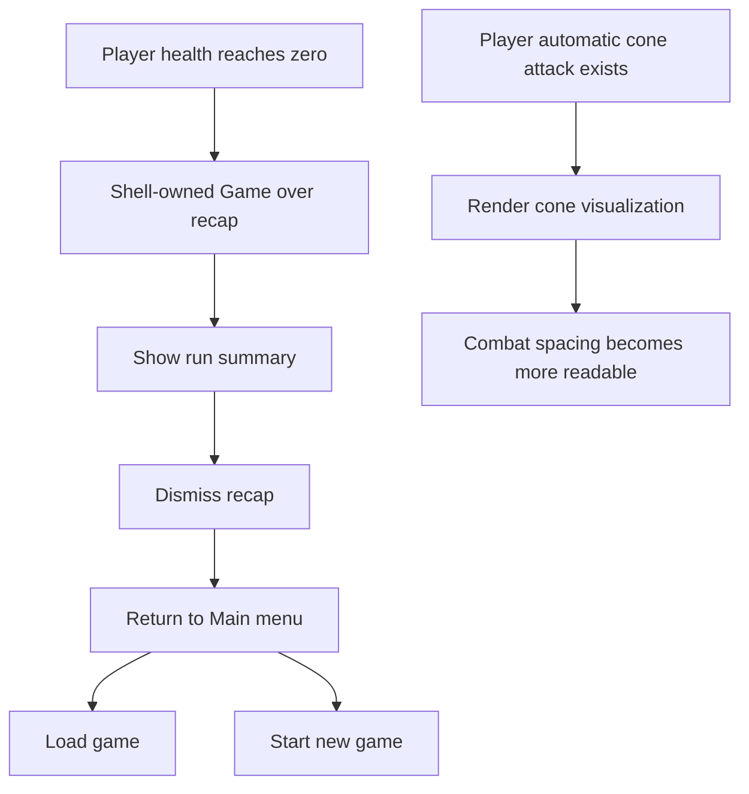

## req_037_define_a_game_over_recap_flow_and_player_attack_cone_visualization - Define a game-over recap flow and player attack-cone visualization
> From version: 0.2.3
> Status: Draft
> Understanding: 100%
> Confidence: 98%
> Complexity: Medium
> Theme: Gameplay
> Reminder: Update status/understanding/confidence and references when you edit this doc.

# Needs
- Introduce a real `game over` posture so player defeat resolves into a readable product flow rather than a thin shell interruption.
- Show a recap of the just-finished run when the player has no life left and the live game stops.
- Return the player to the shell-owned `Main menu` after dismissing the recap so the next action is naturally `Load game` or `Start new game`.
- Keep the last save and new-game flow visible after defeat without suggesting that a dead run can simply resume.
- Make the player’s automatic cone attack readable in moment-to-moment play by rendering its effective area visually.

# Context
The repository now has:
- a shell-owned main menu and new-game flow
- single-slot save/load
- a first hostile combat loop with shared health
- automatic player cone attack
- hostile pursuit and contact damage
- shell-owned defeat routing when player health reaches zero

That means the project now has the first real failure state, but its product handling is still too thin.

Right now the player can lose, yet the failure surface is not fully carrying its weight:
- defeat is technically routed to a shell scene
- the player does not yet receive a proper run recap
- the post-defeat next step is not framed around the main menu as the durable hub
- the player’s automatic cone attack exists mechanically, but its spatial reach is still too implicit

This creates two product gaps:
1. failure lacks a satisfying and informative endpoint
2. combat lacks enough spatial readability for the player-facing attack

Recommended target posture:
1. Defeat should resolve into a shell-owned `Game over` recap surface rather than a generic interruption panel.
2. The recap should summarize the most relevant first-slice run signals without reopening a full stats-history system.
3. Closing or acknowledging the recap should route back to `Main menu`.
4. `Main menu` should then expose the natural next actions: `Load game`, `Start new game`, and `Settings`, with `Resume` no longer emphasized for the dead run.
5. The player’s automatic cone attack should render a bounded visual telegraph that matches the real combat geometry closely enough to teach placement.

Recommended first-slice recap contents:
- player name
- defeat reason or short defeat copy
- runtime ticks survived or elapsed survival time
- traversal distance
- hostile defeats or combat hits if available cheaply
- current world seed or run label only if it helps re-entry clarity

Recommended first-slice flow:
- player health reaches zero
- live runtime stops and emits shell-owned defeat/game-over outcome
- shell shows `Game over` recap scene
- recap acknowledgment returns to `Main menu`
- player chooses `Load game` or `Start new game`

Recommended attack-cone visualization posture:
- show the cone only when it is relevant and readable
- keep it bounded and non-debug in presentation
- align the visualized angle and range with the actual combat contract
- avoid turning it into a permanent noisy overlay if it harms scene clarity

Recommended defaults for the first slice:
- treat the existing defeat scene as the structural base, but reposition it product-wise as `Game over`
- do not offer `Resume runtime` for the defeated run as the primary next action
- after recap dismissal, return to `Main menu`
- keep `Load game` available if a save exists and `Start new game` always available
- render the cone with a clear but lightweight world-space telegraph using the live orientation and the real attack range/arc
- prefer a short visible pulse or bounded active-state display over a constantly opaque wedge

Scope includes:
- game-over recap surface definition
- defeat-to-main-menu transition posture
- recap dismissal behavior
- post-defeat main-menu expectation
- first player attack-cone visualization in runtime
- alignment between combat geometry and rendered cone

Scope excludes:
- long-form run history
- multi-page end-of-run stats
- reward/loot summary systems
- save-slot redesign
- manual attack input redesign
- broad combat FX/animation system

# Acceptance criteria
- AC1: The request defines a shell-owned `Game over` recap posture strongly enough to guide implementation after player defeat.
- AC2: The request defines a bounded first-slice recap content set for the finished run without reopening a large run-history system.
- AC3: The request defines that dismissing or closing the recap returns the player to `Main menu`.
- AC4: The request defines the post-defeat next-step posture around `Load game` and `Start new game`, rather than emphasizing runtime resume for the dead run.
- AC5: The request defines a first visual treatment for the player attack cone that is clearly tied to the actual combat geometry.
- AC6: The request keeps the slice intentionally narrow and does not reopen broad combat-FX, reward-summary, or save-system redesign work.

# Open questions
- Should the recap auto-return to `Main menu` after a short delay or only on explicit acknowledgment?
  Recommended default: explicit acknowledgment first; avoid surprise routing.
- Should the recap live as its own dedicated scene or as a stronger version of the existing defeat scene?
  Recommended default: evolve the current defeat scene into a real `Game over` recap surface.
- Which recap stats are essential in the first slice?
  Recommended default: player name, defeat copy, survival ticks/time, traversal distance, and hostile defeats if cheap to compute.
- Should the attack cone be visible permanently or only during the active attack window?
  Recommended default: only during a bounded active attack window or pulse to preserve readability.
- Should `Load game` be immediately highlighted after defeat if a save exists?
  Recommended default: keep `Load game` available, but let `Main menu` remain the neutral hub rather than forcing one CTA.

# Definition of Ready (DoR)
- [x] Problem statement is explicit and user impact is clear.
- [x] Scope boundaries (in/out) are explicit.
- [x] Acceptance criteria are testable.
- [x] Dependencies and known risks are listed.

# Companion docs
- Product brief(s): `prod_001_minimal_overlay_and_feedback_for_early_runtime`
- Architecture decision(s): `adr_002_separate_react_shell_from_pixi_runtime_ownership`, `adr_016_define_shell_scene_state_and_meta_surface_ownership`, `adr_035_resolve_entity_collisions_as_lightweight_deterministic_separation`
- Request(s): `req_030_define_a_shell_owned_main_menu_and_new_game_entry_flow`, `req_032_define_a_single_slot_save_and_load_flow_for_shell_owned_session_entry`, `req_036_define_a_first_hostile_combat_loop_with_spawns_contact_damage_and_player_cone_attack`

# Backlog
- `define_a_game_over_recap_surface_for_defeated_runs`
- `define_post_recap_return_to_main_menu_and_reentry_options`
- `define_a_player_attack_cone_visualization_aligned_with_runtime_combat_geometry`
