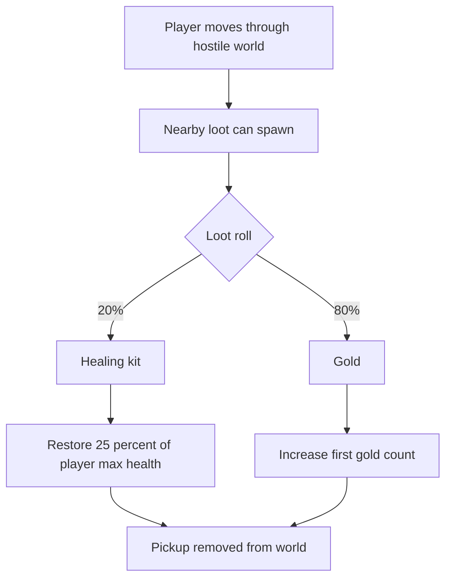

## req_038_define_a_first_proximity_loot_spawn_wave_with_healing_kits_and_gold - Define a first proximity loot-spawn wave with healing kits and gold
> From version: 0.2.3
> Status: Done
> Understanding: 100%
> Confidence: 100%
> Complexity: Medium
> Theme: Gameplay
> Reminder: Update status/understanding/confidence and references when you edit this doc.

# Needs
- Introduce a first layer of nearby collectible objects so traversal and combat start producing tangible world pickups.
- Spawn simple loot near the player with deterministic or bounded random rules instead of requiring authored placement everywhere.
- Define a first healing pickup that restores a percentage of player health without opening a full consumables system.
- Define a default fallback collectible for non-healing outcomes so the world does not feel empty when a healing kit does not appear.
- Keep the first loot slice narrow enough to land before inventory, shops, or economy systems exist.

# Context
The runtime now has:
- shell-owned main menu and save/load entry flow
- first hostile combat loop
- player health and defeat
- local hostile spawning and first combat pressure

That means the game now has:
- risk
- damage
- survival pressure

But it still lacks a first reward surface around the player.

Without nearby pickups:
- damage has no immediate recovery opportunity inside the live run
- traversal feels more sterile than it should
- combat victory does not yet hint at a broader resource loop

Recommended first-slice posture:
1. Keep pickup generation close to the player rather than global.
2. Start with only two pickup kinds:
   - `healing kit`
   - `gold`
3. Make the loot table intentionally simple:
   - `20%` chance: healing kit
   - otherwise: gold
4. Keep healing behavior simple and bounded:
   - restore `25%` of player max health
   - clamp at max health
5. Avoid opening inventory, stacking rules, vendors, or item rarity systems in this slice.

Recommended first-slice spawning posture:
- spawn loot in the player’s nearby world space or chunk vicinity
- do not spawn directly on top of the player
- keep local population bounded
- prefer deterministic or seed-friendly random generation where possible
- ensure pickups respect world blocking and do not appear inside non-traversable space

Recommended first-slice collection posture:
- pickup is collected automatically on proximity/contact
- healing kit applies immediately on collection
- gold increments a simple runtime count or first currency counter
- collected pickup is removed from the world immediately

Recommended defaults for this first slice:
- healing kit chance: `20%`
- healing amount: `25%` of max player health
- fallback pickup: `gold`
- auto-pickup on contact
- bounded nearby spawn count instead of unbounded clutter
- no inventory screen
- no item drop FX dependency for V1

Scope includes:
- first nearby pickup spawn rules
- bounded loot-table definition for healing kit vs gold
- healing kit effect on player health
- gold pickup definition and first collection behavior
- pickup placement rules relative to the player and traversable world

Scope excludes:
- inventory management
- shops or spending loops
- rarity tiers
- crafting
- authored treasure placement systems
- multi-item economy balancing

# Acceptance criteria
- AC1: The request defines a bounded first nearby-loot spawn slice strongly enough to guide implementation.
- AC2: The request defines a first loot-table posture with `20%` chance for a healing kit and `gold` as the default fallback.
- AC3: The request defines the healing kit effect as restoring `25%` of player max health with a max-health clamp.
- AC4: The request defines how pickups appear near the player without spawning directly on top of them or inside blocked world space.
- AC5: The request defines a first pickup collection posture without reopening full inventory or economy systems.
- AC6: The request remains intentionally narrow and does not drift into item rarity, vendors, or authored treasure design.

# Outcome
- Done in `13db4e2`.
- The runtime now maintains a bounded nearby pickup population around the player instead of remaining reward-empty between encounters.
- The first loot table is now live with deterministic local spawns:
  - `20%` healing kit
  - `80%` gold
- Healing kits now restore `25%` of player max health with a max-health clamp on contact.
- Gold now acts as the default fallback pickup and increments a first runtime currency counter that is visible in the HUD and recap.

# Validation
- `npx vitest run src/game/entities/model/entitySimulation.test.ts games/emberwake/src/runtime/emberwakeRuntimeIntegration.test.ts`
- `npx vitest run games/emberwake/src/systems/gameplaySystems.test.ts src/app/components/PlayerHudCard.test.tsx`
- `npm run ci`
- `npm run test:browser:smoke`
- `python3 logics/skills/logics-doc-linter/scripts/logics_lint.py`

# Open questions
- Should nearby loot spawn continuously or only maintain a bounded local cap?
  Recommended default: maintain a bounded local cap near the player.
- Should healing kits spawn even when the player is already at full health?
  Recommended default: yes for now, unless the spawn loop becomes wasteful enough to justify health-aware filtering.
- Should gold be tracked only for the current run at first?
  Recommended default: yes; keep it as a simple runtime count before introducing persistence or spending.
- Should pickups appear because of time/traversal alone, or only after enemy defeat?
  Recommended default: begin with proximity-based nearby spawns; enemy-drop logic can come later.
- Should pickup collection require an explicit interaction button?
  Recommended default: no; auto-pickup on contact keeps the first slice lightweight.

# Definition of Ready (DoR)
- [x] Problem statement is explicit and user impact is clear.
- [x] Scope boundaries (in/out) are explicit.
- [x] Acceptance criteria are testable.
- [x] Dependencies and known risks are listed.

# Companion docs
- Product brief(s): `prod_001_minimal_overlay_and_feedback_for_early_runtime`
- Architecture decision(s): `adr_032_separate_visual_terrain_blocking_obstacles_and_movement_surface_modifiers`, `adr_033_adopt_deterministic_movement_oriented_pseudo_physics_instead_of_a_full_physics_engine`
- Request(s): `req_033_define_a_first_collision_and_blocking_world_wave_for_runtime_gameplay`, `req_036_define_a_first_hostile_combat_loop_with_spawns_contact_damage_and_player_cone_attack`, `req_037_define_a_game_over_recap_flow_and_player_attack_cone_visualization`

# Backlog
- `define_nearby_pickup_spawn_rules_around_the_player`
- `define_a_first_healing_kit_pickup_that_restores_25_percent_health`
- `define_gold_as_the_default_fallback_pickup_and_first_runtime_currency_counter`
