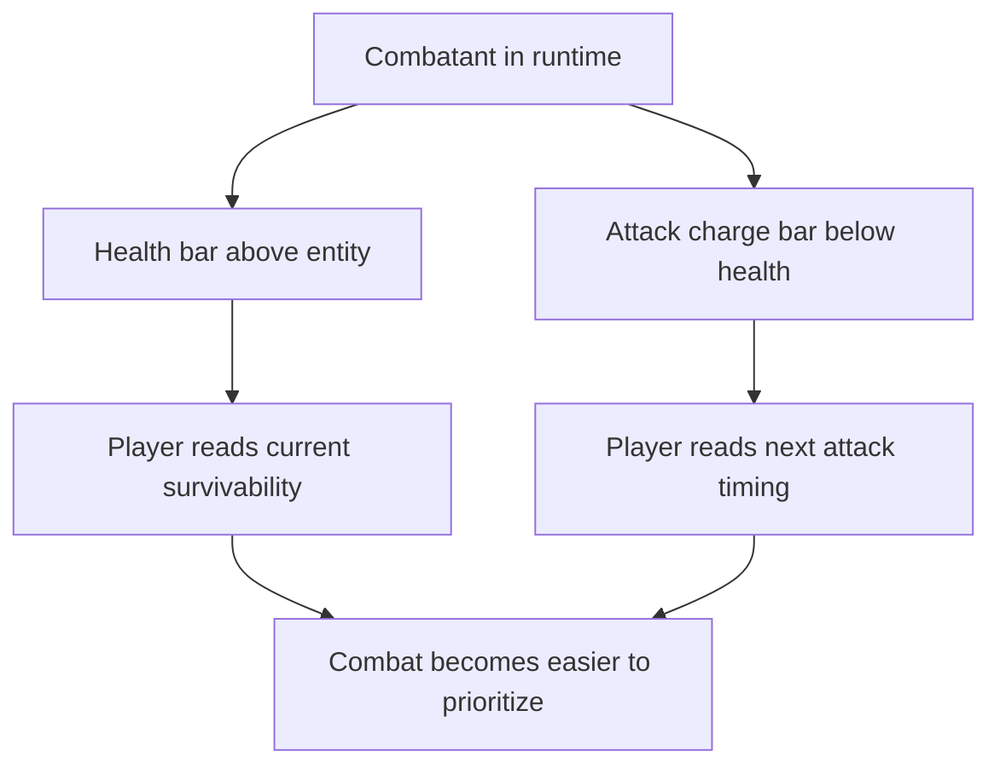

## req_039_define_overhead_health_and_attack_charge_bars_for_runtime_combatants - Define overhead health and attack-charge bars for runtime combatants
> From version: 0.5.0
> Status: Done
> Understanding: 100%
> Confidence: 98%
> Complexity: Medium
> Theme: Gameplay
> Reminder: Update status/understanding/confidence and references when you edit this doc.
> Schema version: 1.0

# Needs
- Make combat readability stronger by exposing entity health directly in world space.
- Show the attack cadence of combatants instead of leaving attack timing implicit.
- Render a health bar above combat entities and an attack-charge bar just below it.
- Keep the first slice bounded and product-facing rather than turning the runtime into a debug overlay.

# Context
The runtime now has:
- a first hostile combat loop
- shared health and damage
- automatic player cone attacks
- hostile contact damage with cooldowns
- a visible attack cone pulse for the player

That means combat now exists mechanically, but the player still lacks enough immediate readability on:
- who is close to death
- when a target is about to attack again
- when the player’s own automatic attack is close to firing

Without overhead combat bars:
- combat feedback remains too implicit
- target prioritization is harder than it should be
- attack rhythm is felt indirectly instead of being legible

Recommended first-slice posture:
1. Show overhead health bars for combatants that can take damage.
2. Place the health bar directly above the entity footprint.
3. Render an attack-charge bar directly below the health bar, still above the entity.
4. Treat the charge bar as the time remaining until the next available attack window.
5. Keep the treatment lightweight, readable, and aligned with the tactical-console language without looking like a debug HUD.

Recommended first-slice scope:
- player overhead health bar
- hostile overhead health bars
- overhead attack-charge bar for player automatic attack
- overhead attack-charge bar for hostile contact attack cooldown
- bounded world-space placement above each eligible entity
- visual states for empty/full/charging posture

Recommended defaults:
- bars only for entities that participate in combat
- health bar above, attack-charge bar immediately below
- bars track normalized values from live runtime combat state
- bars remain compact and do not replace the existing shell HUD
- charge bars read as “next attack readiness”, not damage-over-time or stamina
- gold pickups, support entities, and non-combat helpers do not render these bars
- bars stay visible for the player and visible hostiles in the first slice instead of only appearing under special combat conditions
- the player uses the same overhead structure as hostiles so readability is consistent immediately
- the charge bar fills toward readiness, with a full bar meaning “attack ready”

Scope includes:
- world-space health bar posture for combatants
- world-space attack-charge bar posture for combatants
- placement rules above entities
- first readability rules for player vs hostile combat bars
- alignment with existing automatic-attack/contact-cooldown timing

Scope excludes:
- floating damage numbers
- critical-hit indicators
- status-effect icons
- buff/debuff rows
- shield/armor layers
- long-form inspection overlays

# Acceptance criteria
- AC1: The request defines overhead health bars for combatants strongly enough to guide implementation.
- AC2: The request defines the attack-charge bar as a bounded readiness indicator tied to the combatant’s next available attack.
- AC3: The request defines the vertical ordering as health bar above and attack-charge bar directly below it.
- AC4: The request defines the slice for player and hostile combatants without widening to non-combat entities.
- AC5: The request keeps the presentation lightweight and readable rather than drifting into debug-only combat overlays.
- AC6: The request remains intentionally narrow and does not reopen floating text, status icons, or full combat-VFX work.

# Outcome
- Done in `a27102c`.
- Player and hostile combatants now render overhead health bars in world space.
- Attack-charge bars now sit directly below health bars and fill toward readiness for both the player automatic attack and hostile contact attacks.
- The stacked layout now stays compact and consistent above combatant footprints without extending to pickups or support entities.

# Validation
- `npx vitest run src/game/entities/model/entitySimulation.test.ts games/emberwake/src/runtime/emberwakeRuntimeIntegration.test.ts`
- `npx vitest run src/game/world/model/worldGeneration.test.ts games/emberwake/src/systems/gameplaySystems.test.ts`
- `npm run ci`
- `npm run test:browser:smoke`
- `python3 logics/skills/logics-doc-linter/scripts/logics_lint.py`

# Open questions
- Should the bars be permanently visible or only under certain combat conditions?
  Recommended default: visible for the player and visible hostile combatants in the first slice so readability is immediate and consistent.
- Should the player use the same overhead treatment as hostiles?
  Recommended default: yes, with the same structure and only minor contrast tuning if needed.
- Should the charge bar fill toward readiness or drain toward the next attack?
  Recommended default: fill toward readiness so “full” means “attack is ready”.
- Should dead combatants keep the bars briefly after death?
  Recommended default: no; remove them with entity cleanup in the first slice.

# Definition of Ready (DoR)
- [x] Problem statement is explicit and user impact is clear.
- [x] Scope boundaries (in/out) are explicit.
- [x] Acceptance criteria are testable.
- [x] Dependencies and known risks are listed.

# Companion docs
- Product brief(s): `prod_001_minimal_overlay_and_feedback_for_early_runtime`
- Architecture decision(s): `adr_002_separate_react_shell_from_pixi_runtime_ownership`, `adr_033_adopt_deterministic_movement_oriented_pseudo_physics_instead_of_a_full_physics_engine`
- Request(s): `req_036_define_a_first_hostile_combat_loop_with_spawns_contact_damage_and_player_cone_attack`, `req_037_define_a_game_over_recap_flow_and_player_attack_cone_visualization`

# AI Context
- Summary: Make combat readability stronger by exposing entity health directly in world space.
- Keywords: overhead, health, and, attack-charge, bars, for, runtime, combatants
- Use when: Use when framing scope, context, and acceptance checks for Define overhead health and attack-charge bars for runtime combatants.
- Skip when: Skip when the work targets another feature, repository, or workflow stage.

# Backlog
- `item_143_define_overhead_health_bars_for_runtime_combatants`
- `item_144_define_overhead_attack_charge_bars_for_runtime_combatants`
- `item_145_define_world_space_layout_rules_for_stacked_combat_bars_above_entities`
