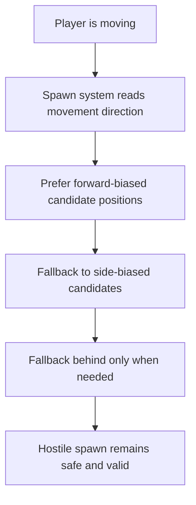

## req_040_define_directionally_biased_hostile_spawns_ahead_of_player_movement - Define directionally biased hostile spawns ahead of player movement
> From version: 0.2.3
> Status: Done
> Understanding: 100%
> Confidence: 100%
> Complexity: Medium
> Theme: Gameplay
> Reminder: Update status/understanding/confidence and references when you edit this doc.

# Needs
- Make hostile spawns feel more intentional relative to player movement instead of equally likely around the player.
- Prefer spawning new hostile entities in the movement direction of the player when the player is actively moving.
- Reduce the frequency of hostile spawns behind the player when a forward or side-biased spawn is possible.
- Keep the spawn system deterministic, bounded, and compatible with current safe-distance and blocked-space checks.

# Context
The runtime now has:
- bounded local hostile spawning near the player
- safe spawn distance and blocked-space checks
- hostile pursuit and first combat pressure

That means hostile spawns already work mechanically, but their spatial feeling can still be improved.

If spawns are fully radial around the player:
- new hostiles can appear too often behind the player
- the movement direction of the player is ignored
- combat pressure feels less authored than it should

The desired posture is not “always spawn in front no matter what.”  
It is:
- prefer front-biased spawns when the player is moving
- keep side/front options valid
- avoid behind-the-player spawns when a better forward candidate is available
- still fall back safely when the preferred space is blocked or invalid

Recommended first-slice posture:
1. Detect whether the player currently has a meaningful movement direction.
2. Bias hostile spawn sampling toward the player’s current movement heading.
3. Treat rear spawns as fallback rather than equal-probability choices.
4. Preserve safe spawn distance, local cap, and traversable-space constraints.
5. Keep the solution deterministic and lightweight; do not introduce a full encounter director.

Recommended first-slice behavior:
- if the player is moving:
  - prefer spawn candidates within a forward-biased angular sector centered on the movement vector
  - allow side-biased candidates as secondary options
  - use behind-the-player candidates only when forward/side candidates fail
- if the player is not moving:
  - keep the existing neutral spawn posture

Recommended defaults:
- use player movement intent or current travel vector as the primary forward reference
- treat “front” as a bounded cone or arc rather than a single exact angle
- allow deterministic retries across preferred sectors before falling back behind the player
- never violate safe spawn distance or blocked-space rejection just to satisfy forward bias
- use movement intent first and live velocity second when deriving the preferred forward heading
- keep a short memory of recent forward heading so brief movement release does not instantly collapse the directional bias
- treat side sectors as acceptable fallback, but keep the front sector as the preferred outcome
- allow rear spawns only rarely and mainly as a fallback when forward/side candidates fail

Scope includes:
- directional spawn bias relative to player motion
- reduced rear-spawn frequency when valid forward placements exist
- deterministic fallback rules when preferred candidates fail
- compatibility with current hostile local-cap and spawn cooldown rules

Scope excludes:
- full encounter-direction systems
- biome- or objective-aware spawn orchestration
- off-screen cinematic spawn staging
- squad coordination or multi-wave spawn logic
- guaranteed always-in-front spawn rules

# Acceptance criteria
- AC1: The request defines a forward-biased hostile spawn posture strongly enough to guide implementation.
- AC2: The request defines that active player movement should influence hostile spawn direction.
- AC3: The request defines that behind-the-player spawns should be reduced when valid forward or side candidates exist.
- AC4: The request preserves existing safety constraints such as safe distance, blocked-space rejection, and local hostile cap.
- AC5: The request keeps the slice deterministic and lightweight without reopening a full encounter-director system.
- AC6: The request defines a neutral fallback when the player is not moving or when forward-biased candidates fail.

# Outcome
- Done in `a27102c`.
- Hostile spawns now prefer the player’s movement intent first, then recent heading memory and live velocity as fallback.
- Preferred spawn sectors now bias front first, then sides, with rear sectors used only as late deterministic fallback.
- Neutral radial spawning still applies when player motion is not meaningful or no preferred heading is available.

# Validation
- `npx vitest run src/game/entities/model/entitySimulation.test.ts games/emberwake/src/runtime/emberwakeRuntimeIntegration.test.ts`
- `npm run ci`
- `npm run test:browser:smoke`
- `python3 logics/skills/logics-doc-linter/scripts/logics_lint.py`

# Open questions
- Should “forward” be derived from movement intent, actual velocity, or facing/orientation?
  Recommended default: movement intent first, then live velocity as fallback, without relying on facing alone.
- How strong should the bias be?
  Recommended default: strong preference for front, side as acceptable fallback, and rear sectors used only as fallback.
- Should side spawns be considered equivalent to front spawns?
  Recommended default: no; side is acceptable fallback, but front remains the preferred sector.
- What happens when all preferred candidates are blocked?
  Recommended default: fall back to the current safe deterministic spawn behavior rather than forcing a bad placement.

# Definition of Ready (DoR)
- [x] Problem statement is explicit and user impact is clear.
- [x] Scope boundaries (in/out) are explicit.
- [x] Acceptance criteria are testable.
- [x] Dependencies and known risks are listed.

# Companion docs
- Product brief(s): `prod_001_minimal_overlay_and_feedback_for_early_runtime`
- Architecture decision(s): `adr_033_adopt_deterministic_movement_oriented_pseudo_physics_instead_of_a_full_physics_engine`, `adr_035_resolve_entity_collisions_as_lightweight_deterministic_separation`
- Request(s): `req_036_define_a_first_hostile_combat_loop_with_spawns_contact_damage_and_player_cone_attack`

# Backlog
- `define_forward_biased_spawn_sampling_for_moving_player_states`
- `define_fallback_spawn_sector_rules_when_preferred_forward_positions_fail`
- `define_neutral_spawn_behavior_when_player_motion_is_not_meaningful`
