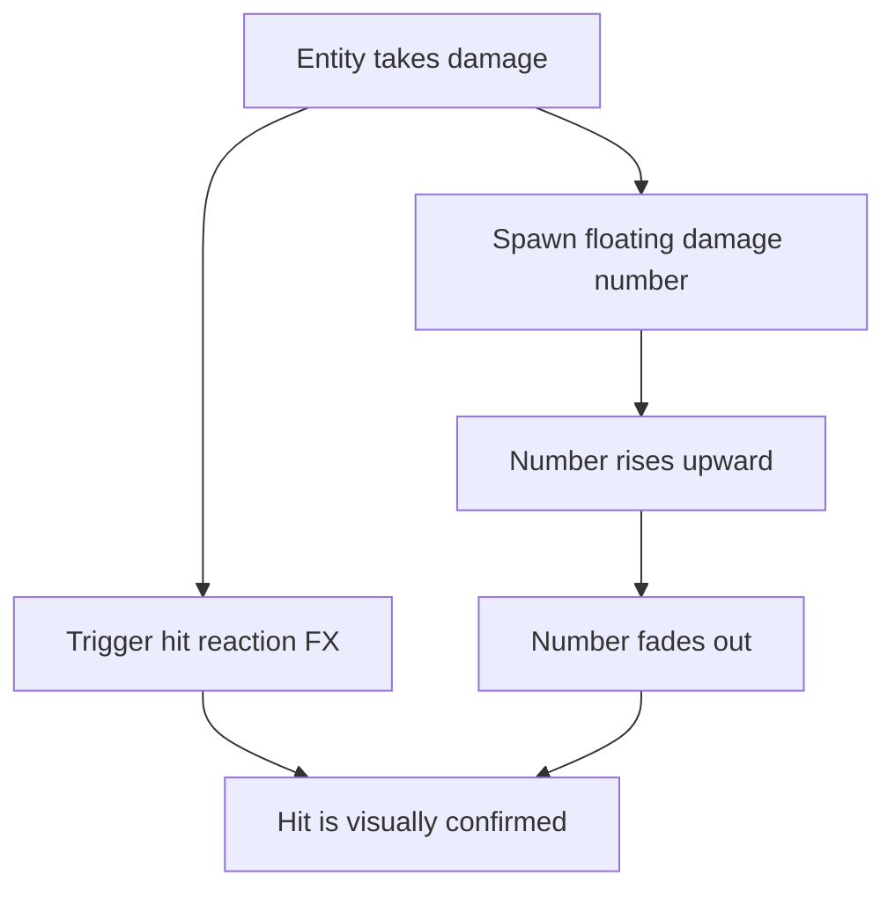

## req_041_define_damage_reaction_fx_and_floating_damage_numbers_for_runtime_combat - Define damage-reaction FX and floating damage numbers for runtime combat
> From version: 0.5.0
> Status: Done
> Understanding: 100%
> Confidence: 98%
> Complexity: Medium
> Theme: Gameplay
> Reminder: Update status/understanding/confidence and references when you edit this doc.
> Schema version: 1.0

# Needs
- Make received damage visually readable at the moment it happens.
- Add a clear graphic hit reaction on entities that take damage.
- Display the damage amount above damaged entities as floating text.
- Make floating damage numbers drift upward and disappear cleanly instead of behaving like permanent labels.
- Keep the first slice lightweight and aligned with the current tactical runtime presentation.

# Context
The runtime now has:
- shared health and damage resolution
- automatic player attacks
- hostile contact damage
- overhead combat readability work being prepared

Combat works mechanically, but hit confirmation is still too muted.

Without explicit damage feedback:
- attacks can feel soft or ambiguous
- it is harder to tell whether a hit connected
- damage pacing is readable only through health loss, which is too indirect

Recommended first-slice posture:
1. Add a short-lived graphic reaction on any entity that takes damage.
2. Spawn a floating damage number at the hit location or just above the entity.
3. Animate the number upward over a short lifetime.
4. Fade or dissolve the number out before removal.
5. Keep the effect readable and bounded rather than turning combat into noisy arcade spam.

Recommended first-slice behavior:
- when an entity takes damage:
  - trigger a short hit-reaction visual treatment on the entity
  - spawn one floating damage number carrying the dealt value
- the damage number:
  - appears above the entity
  - rises upward over time
  - fades/disappears automatically
- the hit reaction:
  - can be a tint flash, pulse, outline spike, or other lightweight reaction
  - should be brief and readable

Recommended defaults:
- apply to player and hostile combatants
- use world-space placement so the effect tracks the damaged entity naturally
- keep duration short and deterministic
- prefer one lightweight hit reaction rather than multiple layered VFX
- do not persist damage numbers after the animation completes
- damage numbers display as integers only
- multiple simultaneous hits may spawn multiple numbers, but with short lifetime and small offset variation to avoid visual sludge
- the first hit reaction should be tint/pulse driven rather than a heavier geometry effect

Scope includes:
- first hit-reaction FX for damaged combat entities
- first floating damage-number presentation
- upward drift and disappearance behavior
- alignment with live runtime damage events

Scope excludes:
- critical-hit variants
- healing numbers
- combo counters
- knockback VFX systems
- screen shake redesign
- audio hit feedback

# Acceptance criteria
- AC1: The request defines a bounded hit-reaction FX posture strongly enough to guide implementation.
- AC2: The request defines floating damage numbers above damaged entities with upward motion.
- AC3: The request defines that floating damage numbers disappear automatically after a short lifetime.
- AC4: The request keeps the slice applicable to runtime combatants without reopening a full combat-VFX system.
- AC5: The request keeps the presentation readable and lightweight rather than noisy or debug-like.
- AC6: The request remains intentionally narrow and does not drift into healing numbers, crit systems, or audio work.

# Outcome
- Done in `a27102c`.
- Damaged combatants now receive a brief hit pulse driven by the live damage tick.
- Integer floating damage numbers now spawn above damaged combatants, drift upward, fade out, and clean themselves up automatically.
- The first slice stays lightweight and shared across player and hostile combatants without widening into a heavier VFX stack.

# Validation
- `npx vitest run src/game/entities/model/entitySimulation.test.ts games/emberwake/src/runtime/emberwakeRuntimeIntegration.test.ts`
- `npm run ci`
- `npm run test:browser:smoke`
- `python3 logics/skills/logics-doc-linter/scripts/logics_lint.py`

# Open questions
- Should the player and hostiles use the same hit-reaction treatment?
  Recommended default: yes for the first slice, with room to differentiate later.
- Should multiple hits stack multiple numbers simultaneously?
  Recommended default: yes, but keep lifetimes short, offsets light, and visuals lightweight.
- Should the floating numbers be screen-space or world-space?
  Recommended default: world-space so they stay anchored to the damaged entity naturally.
- Should the first hit reaction be tint-based or geometry-based?
  Recommended default: tint/pulse first; it is cheaper and easier to keep readable.

# Definition of Ready (DoR)
- [x] Problem statement is explicit and user impact is clear.
- [x] Scope boundaries (in/out) are explicit.
- [x] Acceptance criteria are testable.
- [x] Dependencies and known risks are listed.

# Companion docs
- Product brief(s): `prod_001_minimal_overlay_and_feedback_for_early_runtime`
- Architecture decision(s): `adr_002_separate_react_shell_from_pixi_runtime_ownership`, `adr_033_adopt_deterministic_movement_oriented_pseudo_physics_instead_of_a_full_physics_engine`
- Request(s): `req_036_define_a_first_hostile_combat_loop_with_spawns_contact_damage_and_player_cone_attack`, `req_039_define_overhead_health_and_attack_charge_bars_for_runtime_combatants`

# AI Context
- Summary: Make received damage visually readable at the moment it happens.
- Keywords: damage-reaction, and, floating, damage, numbers, for, runtime, combat
- Use when: Use when framing scope, context, and acceptance checks for Define damage-reaction FX and floating damage numbers for runtime combat.
- Skip when: Skip when the work targets another feature, repository, or workflow stage.

# Backlog
- `item_149_define_a_first_hit_reaction_fx_posture_for_damaged_runtime_combatants`
- `item_150_define_floating_damage_numbers_above_damaged_entities`
- `item_151_define_upward_fade_and_cleanup_rules_for_damage_number_lifetimes`
