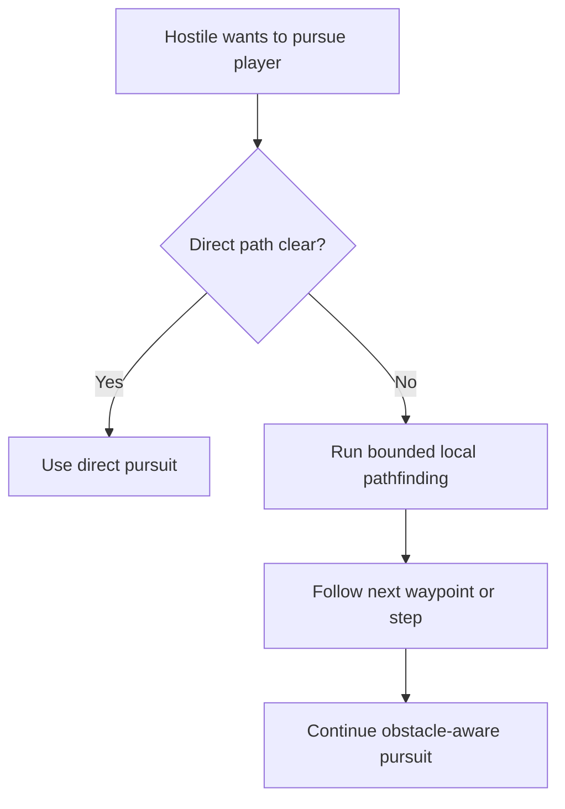

## req_042_define_a_low_cost_first_pathfinding_slice_for_runtime_entities - Define a low-cost first pathfinding slice for runtime entities
> From version: 0.2.3
> Status: Draft
> Understanding: 100%
> Confidence: 98%
> Complexity: Medium
> Theme: Gameplay
> Reminder: Update status/understanding/confidence and references when you edit this doc.

# Needs
- Introduce a simple pathfinding notion for runtime entities so pursuit does not rely only on direct-line steering.
- Keep the first pathfinding slice intentionally cheap in CPU and memory usage.
- Improve hostile navigation around blocked world space without reopening a full navigation-stack rewrite.
- Preserve determinism and compatibility with the current pseudo-physics, obstacle layer, and local hostile AI.

# Context
The runtime now has:
- obstacle-based world blocking
- lightweight pseudo-physics
- hostile pursuit based on direct movement toward the player
- bounded local hostile populations

That means hostiles can move and collide correctly, but they still behave too simply when terrain blocks the straight path.

Without pathfinding:
- hostiles can stall or slide awkwardly against obstacles
- pursuit looks less intelligent than the surrounding systems deserve
- world blocking reduces readability when enemies cannot meaningfully route around it

The goal is not a full navigation system.  
The goal is:
- a first bounded navigation aid
- low-cost enough to fit the runtime hot-path constraints
- good enough for local hostile pursuit

Recommended first-slice posture:
1. Keep pathfinding local and cheap.
2. Operate on existing traversability information rather than introducing a second heavy world representation.
3. Use bounded search depth or short-horizon routing rather than large-map global planning.
4. Recompute sparingly instead of every frame.
5. Prefer behavior that is “good enough and stable” over ideal shortest-path quality.

Recommended first-slice behavior:
- when a hostile has the player in focus:
  - try direct pursuit first if the path is effectively clear
  - if direct pursuit is blocked, request a short local route around obstacles
  - follow the next step or waypoint rather than solving the whole world continuously
- pathfinding should:
  - respect obstacle blocking
  - remain deterministic
  - avoid per-frame expensive broad searches

Recommended defaults:
- use tile- or cell-based traversal derived from the obstacle layer
- limit search radius or node budget tightly
- cache or reuse recent route results when possible
- allow fallback to direct pursuit if no bounded route is found
- optimize for nearby hostile-to-player routing rather than arbitrary world navigation
- use pathfinding only for hostile pursuit in the first slice
- keep direct pursuit as the default branch whenever the path is effectively clear
- prefer a bounded grid/tile A* style search over a heavier navmesh or broad global planner
- refresh routes only on obstruction, meaningful target drift, or a bounded periodic cadence

Scope includes:
- first low-cost route-finding posture for runtime entities
- obstacle-aware navigation around blocked spaces
- bounded search/caching rules
- integration posture for hostile pursuit

Scope excludes:
- full navmesh systems
- long-distance global route planning
- multi-agent coordination
- advanced flocking
- expensive dynamic replanning every frame
- authored path graphs

# Acceptance criteria
- AC1: The request defines a bounded first pathfinding slice strongly enough to guide implementation.
- AC2: The request defines that the first solution should stay low-cost and avoid heavy per-frame planning.
- AC3: The request defines obstacle-aware fallback routing for focused hostile pursuit.
- AC4: The request defines a deterministic and bounded search posture rather than an open-ended navigation system.
- AC5: The request preserves compatibility with existing pseudo-physics and obstacle-layer contracts.
- AC6: The request remains intentionally narrow and does not drift into navmesh, flocking, or large-scale encounter-AI design.

# Open questions
- Should the first route-finding operate on tiles, coarse cells, or another lightweight abstraction?
  Recommended default: tiles or a coarse tile-derived grid, because traversability already exists there.
- Should direct pursuit remain the default when unobstructed?
  Recommended default: yes; pathfinding should be a fallback, not the first branch.
- How often should a hostile recompute its route?
  Recommended default: only on obstruction, target drift beyond a threshold, or bounded periodic refresh.
- What happens when the bounded search fails?
  Recommended default: fall back to current direct pursuit / local steering instead of stalling the whole AI.

# Definition of Ready (DoR)
- [x] Problem statement is explicit and user impact is clear.
- [x] Scope boundaries (in/out) are explicit.
- [x] Acceptance criteria are testable.
- [x] Dependencies and known risks are listed.

# Companion docs
- Product brief(s): `prod_001_minimal_overlay_and_feedback_for_early_runtime`
- Architecture decision(s): `adr_032_separate_visual_terrain_blocking_obstacles_and_movement_surface_modifiers`, `adr_033_adopt_deterministic_movement_oriented_pseudo_physics_instead_of_a_full_physics_engine`, `adr_035_resolve_entity_collisions_as_lightweight_deterministic_separation`
- Request(s): `req_033_define_a_first_collision_and_blocking_world_wave_for_runtime_gameplay`, `req_036_define_a_first_hostile_combat_loop_with_spawns_contact_damage_and_player_cone_attack`, `req_040_define_directionally_biased_hostile_spawns_ahead_of_player_movement`

# Backlog
- `define_a_bounded_obstacle_aware_route_finding_posture_for_hostile_pursuit`
- `define_low_cost_search_and_refresh_rules_for_runtime_entity_pathfinding`
- `define_direct_pursuit_fallback_and_waypoint_following_integration_for_hostiles`
