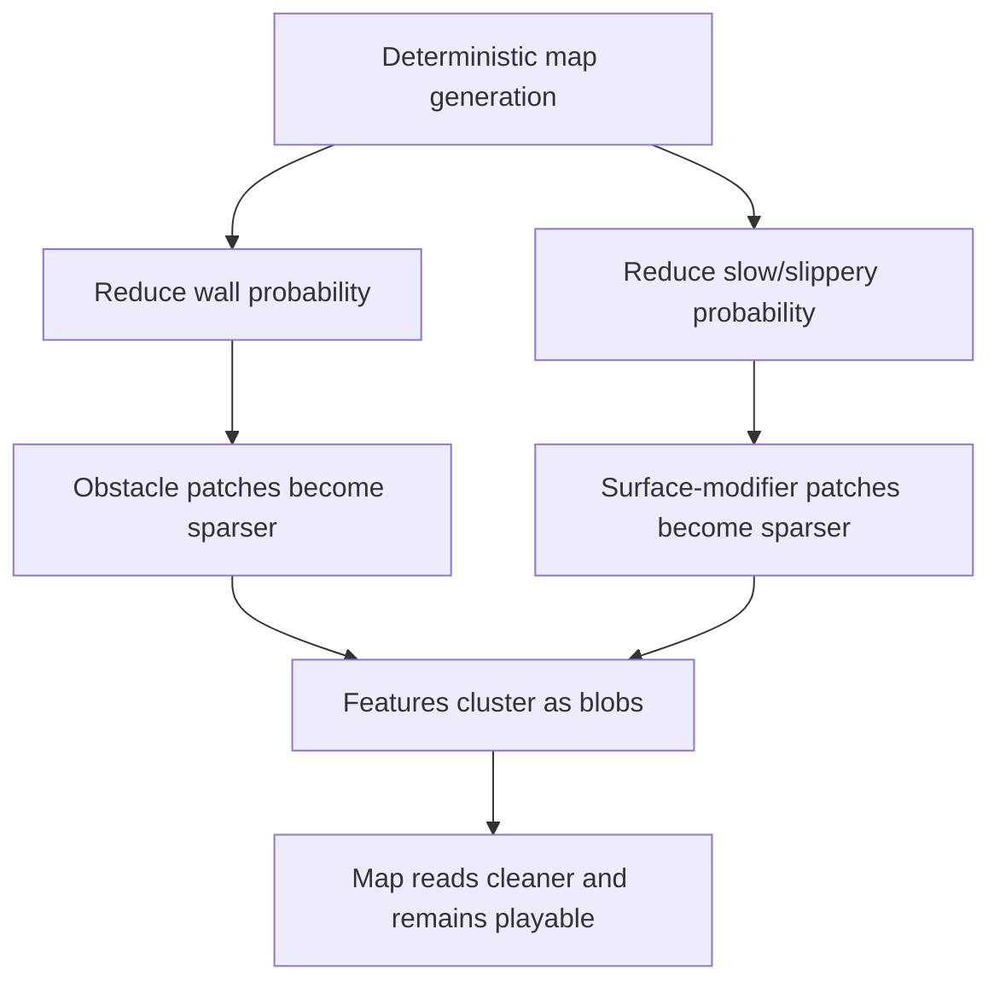

## req_043_define_a_softer_and_more_clustered_blocking_and_surface_generation_posture - Define a softer and more clustered blocking and surface-generation posture
> From version: 0.2.3
> Status: Done
> Understanding: 100%
> Confidence: 100%
> Complexity: Medium
> Theme: World generation
> Reminder: Update status/understanding/confidence and references when you edit this doc.

# Needs
- Reduce the density of non-traversable walls and mobility-slowing zones in generated space.
- Make blocking zones and movement-modifier zones read as grouped patches rather than noisy scattered tiles.
- Preserve deterministic generation while improving navigability and visual readability.
- Keep obstacle clusters and slippery/slow surface clusters independently grouped instead of blending into the same random scatter pattern.

# Context
The runtime now has:
- obstacle-layer world blocking
- movement-surface modifiers including slow/slippery behavior
- hostile pursuit and first combat pressure

That means map generation is no longer purely visual; it now directly shapes movement, pursuit, and combat readability.

If blocking and slowing tiles are too frequent or too fragmented:
- traversal becomes busier than intended
- pursuit/pathing readability degrades
- generated space feels noisy rather than intentional

The target posture is:
- fewer walls
- fewer slowing/friction-modifier zones
- stronger local grouping
- more “patch” / “blot” shapes
- fewer isolated points and skinny line-like artifacts

Recommended first-slice posture:
1. Reduce wall-generation probability by about half.
2. Reduce slow/slippery surface-generation probability by about half.
3. Bias both obstacle and movement-modifier generation toward local clustering.
4. Keep obstacle clustering and modifier clustering as separate generation concerns.
5. Preserve deterministic seed-based generation and current content ownership boundaries.

Recommended first-slice behavior:
- blocking tiles should appear less often overall
- slow/slippery tiles should appear less often overall
- when either appears, nearby tiles should have a stronger chance of matching that local feature
- resulting shapes should read more like compact blobs or patches than sparse speckles or stretched lines

Recommended defaults:
- halve current effective spawn/posture probability for:
  - non-traversable wall-like obstacle presence
  - slowing / gliding surface-modifier presence
- use neighborhood-aware deterministic clustering rather than pure isolated tile rolls
- prefer compact local groupings over long thin streaks
- do not remove these features entirely; just soften and organize them
- interpret the requested “half probability” as a target on effective final density, not merely one raw intermediate roll value
- keep the relative balance between slow and slippery surfaces stable for now while reducing overall modifier density
- prioritize removing isolated noise first, then reduce thin line-like artifacts
- bias clustered regions toward compact organic blobs rather than narrow streaks

Scope includes:
- reducing wall frequency
- reducing slow/slippery zone frequency
- clustering posture for obstacles
- clustering posture for movement modifiers
- preserving deterministic generation

Scope excludes:
- biome redesign
- handcrafted map authoring
- large-scale terrain taxonomy changes
- full procedural-noise system replacement
- encounter-aware generation

# Acceptance criteria
- AC1: The request defines a reduced wall-generation posture, targeting about half the current effective frequency.
- AC2: The request defines a reduced slow/slippery-generation posture, targeting about half the current effective frequency.
- AC3: The request defines that walls and movement-modifier zones should generate in more compact grouped patches.
- AC4: The request defines that clustered patches should read more like blobs/taches than isolated points or long thin lines.
- AC5: The request keeps obstacle clustering and modifier clustering as distinct generation concerns.
- AC6: The request preserves deterministic seed-driven generation and does not reopen full world-generation redesign.

# Outcome
- Done in `a27102c`.
- Obstacle density and movement-surface density now target roughly half of the prior effective posture.
- Obstacle and modifier generation now sample smoother local cluster fields so features form compact blobs more often than isolated speckles or thin streaks.
- Deterministic seed-based generation remains intact while traversal space reads cleaner and less noisy.

# Validation
- `npx vitest run src/game/world/model/worldGeneration.test.ts`
- `npm run ci`
- `npm run test:browser:smoke`
- `python3 logics/skills/logics-doc-linter/scripts/logics_lint.py`

# Open questions
- Should “half probability” be applied directly to raw tile rolls or to the effective post-cluster density?
  Recommended default: target the effective post-cluster density, not just a single isolated roll constant.
- Should slow and slippery zones remain equally likely?
  Recommended default: keep their relative balance unchanged for now; only reduce the overall modifier density.
- Should obstacle patches and modifier patches be allowed to touch each other frequently?
  Recommended default: not by design; let them remain independent so the map stays legible, even if occasional adjacency still happens.
- What matters more: fewer isolated tiles or fewer long line artifacts?
  Recommended default: solve both, but prioritize removing isolated noise first and thin streaks second.

# Definition of Ready (DoR)
- [x] Problem statement is explicit and user impact is clear.
- [x] Scope boundaries (in/out) are explicit.
- [x] Acceptance criteria are testable.
- [x] Dependencies and known risks are listed.

# Companion docs
- Product brief(s): `prod_001_minimal_overlay_and_feedback_for_early_runtime`
- Architecture decision(s): `adr_032_separate_visual_terrain_blocking_obstacles_and_movement_surface_modifiers`, `adr_034_model_traversable_surface_effects_as_bounded_movement_modifiers`
- Request(s): `req_033_define_a_first_collision_and_blocking_world_wave_for_runtime_gameplay`, `req_034_define_a_first_movement_surface_modifiers_wave_for_runtime_gameplay`

# Backlog
- `define_a_reduced_wall_generation_density_for_runtime_world_chunks`
- `define_a_reduced_surface_modifier_generation_density_for_runtime_world_chunks`
- `define_blob_like_clustering_rules_for_obstacles_and_surface_modifier_patches`
