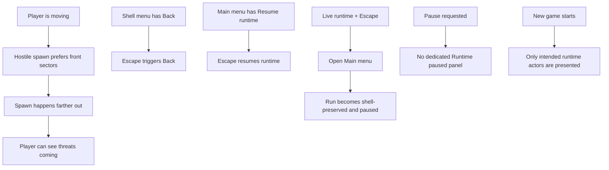

## req_044_refine_spawn_bootstrap_pause_surface_and_escape_navigation_behaviors - Refine spawn, bootstrap, pause surface, and escape-navigation behaviors
> From version: 0.2.4
> Status: Done
> Understanding: 99%
> Confidence: 100%
> Complexity: Medium
> Theme: Gameplay
> Reminder: Update status/understanding/confidence and references when you edit this doc.

# Needs
- Correct hostile spawn behavior so movement-biased spawns feel properly forward-facing instead of reading as rear-biased.
- Remove non-player bootstrap entities that should not appear as fake runtime actors when a new run starts.
- Stop showing a dedicated `Runtime paused` panel when the shell enters pause.
- Make `Escape` trigger the same behavior as visible `Back` actions in shell-owned menus and submenus.
- Make `Escape` from `Main menu` resume the active runtime when `Resume runtime` is available.
- Make `Escape` during live runtime open `Main menu`, which therefore pauses/preserves the current run through shell ownership.
- Push hostile spawn distance farther out so the player has a better chance to see incoming threats before contact.

# Context
The repository now has:
- a shell-owned main menu and session-first command deck
- first hostile combat with movement-biased spawning
- pause and settings shell scenes
- low-cost hostile pathfinding and combat readability overlays

That means the first survival loop is now playable, but several product-facing interaction details still feel off:
- hostile spawns still read as too close or too often behind the player when moving
- a new run still shows bootstrap/support entities that should not present as real actors
- pause currently surfaces more shell chrome than needed
- `Escape` does not yet mirror obvious `Back` and `Resume` actions consistently

The result is a runtime that is mechanically richer, but still rough in moment-to-moment feel and shell navigation polish.

Recommended target posture:
1. Treat forward-biased hostile spawning as a product-facing behavior that should clearly favor front and side sectors over rear sectors while the player is moving.
2. Increase hostile spawn distance enough that incoming threats are more often seen before immediate collision pressure.
3. Treat non-player bootstrap/support entities as implementation scaffolding rather than player-facing runtime actors at new-game start.
4. Treat pause as a lightweight shell state instead of a separate explanatory panel.
5. Treat `Escape` as a first-class shell navigation affordance:
   - in nested shell menus, it should invoke the active `Back` action
   - in `Main menu`, it should invoke `Resume runtime` when that action exists
   - during live runtime, it should open `Main menu`, which implicitly pauses the run by returning to a shell-owned scene

Recommended first-slice posture:
- hostile spawning:
  - verify and correct directional bias so movement-facing spawns are genuinely forward-weighted
  - expand safe/preferred spawn distance
  - keep safety, local cap, and traversability constraints intact
- runtime bootstrap:
  - hide or remove startup-only support entities that are not intended to be perceived as gameplay actors
- pause:
  - keep the shell-owned pause state, but remove the dedicated `Runtime paused` panel
- `Escape` navigation:
  - route `Escape` through visible `Back` affordances in shell-owned surfaces
  - route `Escape` on `Main menu` to `Resume runtime` when available
  - route `Escape` during live runtime to `Main menu`

Recommended defaults:
- treat “forward-biased” as a strong front-first preference, with side sectors as fallback and rear sectors as last resort
- increase hostile spawn distance beyond the current first-combat posture so the player can read incoming pressure earlier
- treat “farther out” as both a higher minimum distance and a slightly shifted overall distance band
- prefer front plus front-side sectors over a narrow straight-ahead-only posture
- keep deterministic side-then-rear fallback sectors when forward-biased candidates fail
- remove fake/support bootstrap entities from normal runtime presentation, selection, and targeting unless explicitly requested by diagnostics/debug tooling
- when pause is active, keep the runtime preserved without rendering a standalone explanatory pause panel
- when pause is active, keep only the useful shell/menu controls without a dedicated explanatory pause card
- `Escape` should not invent new navigation rules; it should mirror the currently visible/backed action hierarchy
- if a text field or rebinding capture is actively focused, `Escape` should resolve that local interaction first before triggering shell back-navigation
- if the command deck itself is open, `Escape` should close or step back inside the deck before triggering broader scene-level resume behavior
- in `Main menu`, `Escape` should only resume when `Resume runtime` is actually available; otherwise it should do nothing
- in live runtime, `Escape` should open `Main menu` rather than only opening or closing the command deck
- opening `Main menu` from live runtime through `Escape` should preserve the current session and therefore pause the run through normal shell ownership

Scope includes:
- correcting forward-biased hostile spawn behavior
- increasing hostile spawn distance
- removing fake bootstrap/runtime support entities from normal player-facing startup presentation
- suppressing the dedicated pause panel
- `Escape` handling for shell back-navigation
- `Escape` handling for main-menu runtime resume
- `Escape` handling for runtime-to-main-menu pause handoff

Scope excludes:
- combat redesign
- encounter-director systems
- debug-surface removal
- menu hierarchy redesign
- save/load redesign
- new pause-scene content

# Acceptance criteria
- AC1: The request defines a correction posture for forward-biased hostile spawns strongly enough to guide implementation.
- AC2: The request defines that hostile spawns should appear farther from the player than the current posture while preserving spawn safety.
- AC3: The request defines that fake/bootstrap runtime entities should be removed from player-facing startup presentation.
- AC4: The request defines that the dedicated `Runtime paused` panel should no longer render during pause.
- AC5: The request defines that `Escape` should invoke visible `Back` actions in menus where such actions exist.
- AC6: The request defines that `Escape` should invoke `Resume runtime` from `Main menu` when that action is available.
- AC7: The request defines that `Escape` during live runtime should open `Main menu` and preserve/pause the current run.
- AC8: The request stays intentionally narrow and does not reopen menu redesign, combat redesign, or debug-tool ownership.

# Open questions
- Should rear-biased hostile spawns remain technically possible?
  Recommended default: yes, but only as late deterministic fallback after forward and side candidates fail.
- How much farther out should hostile spawns move?
  Recommended default: enough to clearly improve reaction time, by raising both minimum spawn distance and the broader distance band while staying inside the local hostile pressure envelope.
- Should `Escape` close shell surfaces that do not expose a visible `Back` action?
  Recommended default: no new rule in this slice; only mirror visible `Back` or `Resume runtime` actions.
- Should fake runtime support entities remain available in diagnostics mode?
  Recommended default: yes; remove them from normal player-facing presentation, not from debug ownership entirely.
- Should invisible fake/bootstrap entities still be interactable?
  Recommended default: no; if they are removed from normal presentation, they should also disappear from normal selection and targeting.
- Should `Escape` on a focused input immediately navigate away?
  Recommended default: no; clear the local focus/capture first, then allow a subsequent `Escape` to trigger the visible `Back` or `Resume` action.
- Should runtime `Escape` still step through the command deck first if the deck is already open?
  Recommended default: yes; the open deck keeps first claim on `Escape`, and only a subsequent `Escape` from live runtime with no open deck should open `Main menu`.

# Definition of Ready (DoR)
- [x] Problem statement is explicit and user impact is clear.
- [x] Scope boundaries (in/out) are explicit.
- [x] Acceptance criteria are testable.
- [x] Dependencies and known risks are listed.

# Companion docs
- Product brief(s): `prod_001_minimal_overlay_and_feedback_for_early_runtime`
- Architecture decision(s): `adr_002_separate_react_shell_from_pixi_runtime_ownership`, `adr_016_define_shell_scene_state_and_meta_surface_ownership`, `adr_033_adopt_deterministic_movement_oriented_pseudo_physics_instead_of_a_full_physics_engine`
- Request(s): `req_040_define_directionally_biased_hostile_spawns_ahead_of_player_movement`, `req_042_define_a_low_cost_first_pathfinding_slice_for_runtime_entities`

# Backlog
- `refine_forward_biased_hostile_spawn_behavior_during_player_motion`
- `remove_fake_bootstrap_entities_from_player_facing_runtime_start`
- `remove_runtime_paused_panel_and_align_escape_navigation_with_visible_back_or_resume_actions`

# Implementation note
- The previously delivered slice already covers:
  - forward-biased and farther hostile spawns
  - removal of fake/bootstrap entities from player-facing runtime presentation
  - removal of the dedicated `Runtime paused` card
  - `Escape` mirroring visible `Back` actions and `Resume runtime` on `Main menu`
- This request is now reopened to additionally cover:
  - `Escape` from live runtime opening `Main menu` and thereby pausing/preserving the run

# Outcome
- `Escape` from live runtime now opens `Main menu` while preserving the active session through shell ownership.
- The runtime still gives priority to local capture and command-deck handling before broader scene navigation.
