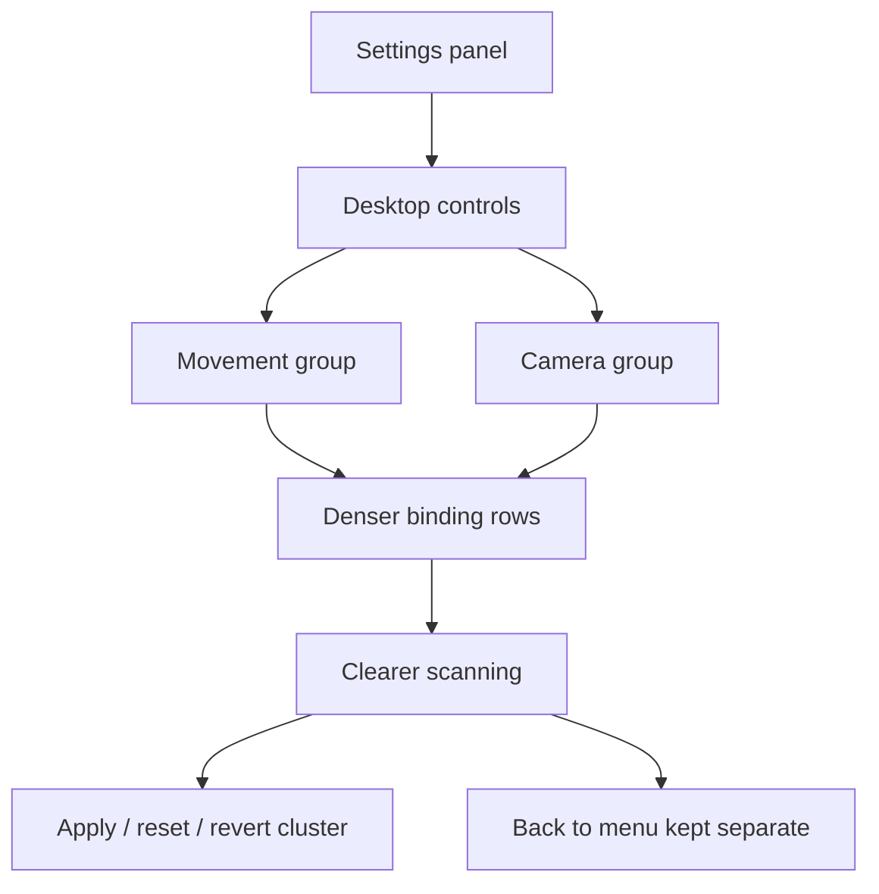

## req_045_define_a_clearer_and_more_compact_desktop_controls_settings_surface - Define a clearer and more compact desktop-controls settings surface
> From version: 0.5.0
> Status: Done
> Understanding: 100%
> Confidence: 98%
> Complexity: Medium
> Theme: UX
> Reminder: Update status/understanding/confidence and references when you edit this doc.
> Schema version: 1.0

# Needs
- Make the `Settings` surface feel less like an administrative grid and more like a usable player-facing control screen.
- Improve the hierarchy of the desktop-controls panel so movement and camera bindings are easier to scan.
- Reduce the vertical cost of each binding row without losing readability.
- Clarify the difference between content actions (`Apply controls`, `Reset defaults`, `Revert`) and navigation (`Back to menu`).

# Context
The repository now has:
- a compact shell-owned `Settings` scene
- editable desktop movement bindings
- editable desktop rotation bindings
- capture, conflict, revert, reset, and apply flows

That means the settings feature is functionally present, but the current panel still reads as:
- one long undifferentiated list
- overly tall rows
- a status message that competes too much with the section title
- bottom actions that do not read clearly as primary action vs secondary action vs navigation

The current result is usable, but visually too flat and too heavy for a player-facing shell surface.

Recommended target posture:
1. Treat `Desktop controls` as one coherent settings section with clearer internal hierarchy.
2. Split the bindings into at least two visual groups:
   - `Movement`
   - `Camera`
3. Make each binding row denser so the panel reads faster and occupies less height.
4. Treat the binding chips as grouped alternatives for one action rather than as large isolated blocks.
5. Reduce the visual weight of the status/help copy so the title and bindings remain primary.
6. Separate content-editing actions from navigation so `Apply controls` clearly reads as the primary CTA and `Back to menu` clearly reads as navigation.

Recommended defaults:
- keep `Desktop controls` as the main section title inside `Settings`
- introduce a second-level grouping for `Movement` and `Camera`
- reduce vertical spacing between rows and between section groups
- visually group alternate keys belonging to the same action
- keep the status line, but move it to a quieter supportive role under or beside the section title
- keep `Apply controls` as the strongest CTA in the panel
- keep `Revert` and `Reset defaults` as secondary actions grouped near each other
- keep `Back to menu` visually separated from the editing CTA cluster
- preserve the current rebinding behavior and validation rules; this request is about presentation and interaction clarity, not binding logic redesign

Scope includes:
- visual hierarchy of the desktop-controls settings section
- grouping of movement vs camera bindings
- row density and spacing adjustments
- status-copy emphasis reduction
- action-layout clarification for `Apply controls`, `Revert`, `Reset defaults`, and `Back to menu`

Scope excludes:
- new control categories beyond the current movement and camera bindings
- gamepad or mobile-control settings
- rebinding contract redesign
- persistence changes
- shell-wide visual redesign outside the settings surface

# Acceptance criteria
- AC1: The request defines a clearer hierarchy for the desktop-controls surface strongly enough to guide implementation.
- AC2: The request defines at least a `Movement` group and a `Camera` group inside the desktop-controls surface.
- AC3: The request defines a denser row posture that reduces vertical weight while keeping bindings readable.
- AC4: The request defines that status/help copy should be visually subordinate to the section title and bindings.
- AC5: The request defines that `Apply controls` should read as the primary CTA, while `Revert` and `Reset defaults` remain secondary and `Back to menu` remains clearly navigational.
- AC6: The request stays intentionally narrow and does not reopen binding logic, persistence, or shell-wide redesign.

# Open questions
- Should the status copy sit inline with the title or below it?
  Recommended default: keep it near the title but visually quieter, whichever layout yields better mobile wrapping.
- Should the grouped bindings stay as button chips or become a more compact token row?
  Recommended default: keep the chips, but reduce their visual and spatial weight.
- Should `Movement` and `Camera` use explicit subheadings or lighter separators only?
  Recommended default: explicit subheadings so scanning improves immediately.
- Should `Back to menu` remain full-width?
  Recommended default: yes, but separated from the editing action cluster so it reads as navigation instead of as a competing primary action.

# Definition of Ready (DoR)
- [x] Problem statement is explicit and user impact is clear.
- [x] Scope boundaries (in/out) are explicit.
- [x] Acceptance criteria are testable.
- [x] Dependencies and known risks are listed.

# Companion docs
- Product brief(s): `prod_001_minimal_overlay_and_feedback_for_early_runtime`
- Architecture decision(s): `adr_016_define_shell_scene_state_and_meta_surface_ownership`
- Request(s): `req_029_define_a_lightweight_settings_scene_with_desktop_control_customization`

# AI Context
- Summary: Make the Settings surface feel less like an administrative grid and more like a usable player-facing control screen.
- Keywords: clearer, and, more, compact, desktop-controls, settings, surface, make
- Use when: Use when framing scope, context, and acceptance checks for Define a clearer and more compact desktop-controls settings surface.
- Skip when: Skip when the work targets another feature, repository, or workflow stage.

# Backlog
- `item_162_define_clearer_movement_and_camera_grouping_inside_desktop_controls_settings`
- `item_163_define_a_denser_binding_row_posture_for_desktop_controls_settings`
- `item_164_define_a_clearer_action_hierarchy_between_apply_reset_revert_and_back_navigation`

# Outcome
- `Settings > Desktop controls` now separates bindings into clearer `Movement` and `Camera` groups.
- Binding rows are denser, easier to scan, and the bottom actions now read more cleanly as primary CTA vs secondary edits vs navigation.
