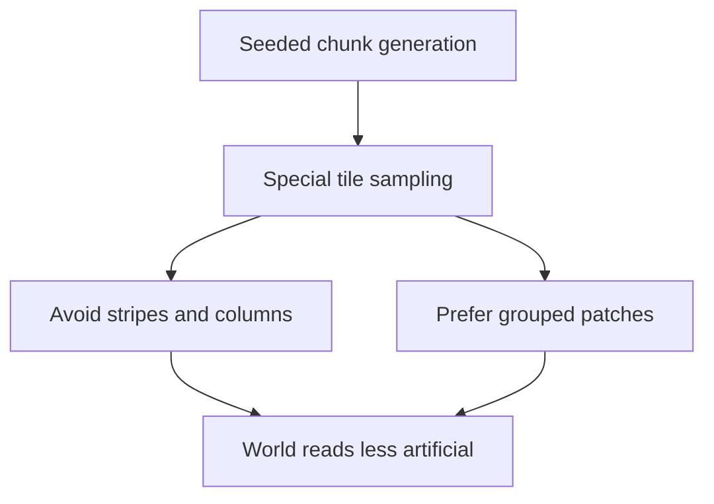

## req_046_define_a_non_linear_tile_generation_posture_that_avoids_stripes_and_columns - Define a non-linear tile-generation posture that avoids stripes and columns
> From version: 0.2.4
> Status: Done
> Understanding: 99%
> Confidence: 100%
> Complexity: Medium
> Theme: Gameplay
> Reminder: Update status/understanding/confidence and references when you edit this doc.

# Needs
- Fix the current world-generation posture where some tile families still read as vertical or linear stripes instead of grouped areas.
- Push the map toward clustered zones, blobs, and patches rather than repeated columns, rails, or isolated line patterns.
- Make obstacle and surface-modifier generation feel more organic and spatially coherent at the player-facing scale.

# Context
The repository already moved toward:
- lower obstacle density
- lower movement-modifier density
- more grouped obstacle and modifier patches

But the player-facing result still shows a visible failure mode:
- certain generated tiles align into long lines or columns
- the world reads as patterned sampling rather than as organic patches
- obstacle/surface readability becomes artificial instead of terrain-like

That means the generation posture improved in density, but not yet enough in spatial shape language.

Recommended target posture:
1. Treat stripe-like columns and line runs as a generation defect, not as acceptable biome texture.
2. Bias generation toward 2D clustered masses rather than 1D directional runs.
3. Prefer local blobs, patch growth, or neighborhood-influenced grouping over independent per-tile thresholds that visually align into rails.
4. Keep deterministic generation, but change the sampling posture so repeated columns become rare edge cases rather than a common outcome.

Recommended defaults:
- avoid long uninterrupted vertical or horizontal runs for the same non-base tile family
- prefer grouped patches with thickness in both axes
- keep some irregular edges so clusters do not become perfect circles or rectangles
- preserve deterministic seed-driven generation
- apply the correction to both blocking tiles and movement-modifier tiles where relevant
- optimize for player-facing visual coherence first, not mathematical simplicity of the sampling rule

Scope includes:
- tile-generation posture for obstacle-like and modifier-like special tiles
- reduction of linear stripe/column artifacts
- stronger clustered patch behavior in visible chunk output
- deterministic generation rules that still remain cheap enough for runtime use

Scope excludes:
- full biome redesign
- new tile families
- decorative prop generation
- runtime collision redesign
- combat or spawn tuning

# Acceptance criteria
- AC1: The request defines stripe-like tile runs and repeated columns as an explicit generation problem to solve.
- AC2: The request defines a target posture that favors grouped patches/blobs over line-like arrangements.
- AC3: The request keeps deterministic generation and does not reopen unrelated gameplay systems.
- AC4: The request applies to the player-facing visible result, not just to internal generation terminology.
- AC5: The request stays intentionally narrow and does not widen into a full biome or rendering redesign.

# Open questions
- Should some short runs remain acceptable when they occur at patch edges?
  Recommended default: yes, short and irregular runs are acceptable; long clean columns are not.
- Should the same anti-stripe posture apply equally to walls and to movement-modifier tiles?
  Recommended default: yes, with room for separate tuning, but both should avoid player-visible rail patterns.
- Should denser patching be preferred even if it slightly reduces raw per-tile randomness?
  Recommended default: yes; player-facing spatial coherence matters more than noisy independence.

# Definition of Ready (DoR)
- [x] Problem statement is explicit and user impact is clear.
- [x] Scope boundaries (in/out) are explicit.
- [x] Acceptance criteria are testable.
- [x] Dependencies and known risks are listed.

# Companion docs
- Product brief(s): `prod_001_minimal_overlay_and_feedback_for_early_runtime`
- Architecture decision(s): `adr_032_separate_visual_terrain_blocking_obstacles_and_movement_surface_modifiers`, `adr_033_adopt_deterministic_movement_oriented_pseudo_physics_instead_of_a_full_physics_engine`
- Request(s): `req_043_define_a_softer_and_more_clustered_blocking_and_surface_generation_posture`

# Backlog
- `define_an_anti_stripe_generation_posture_for_special_tiles`
- `define_blob_first_sampling_rules_for_non_base_tile_clusters`
- `define_runtime_safe_deterministic_sampling_that_reduces_visible_column_artifacts`

# Outcome
- Special-tile generation now favors thicker clustered patches over thin stripe-like runs.
- Deterministic runtime sampling is preserved while visible column artifacts are materially reduced in player-facing chunk output.
