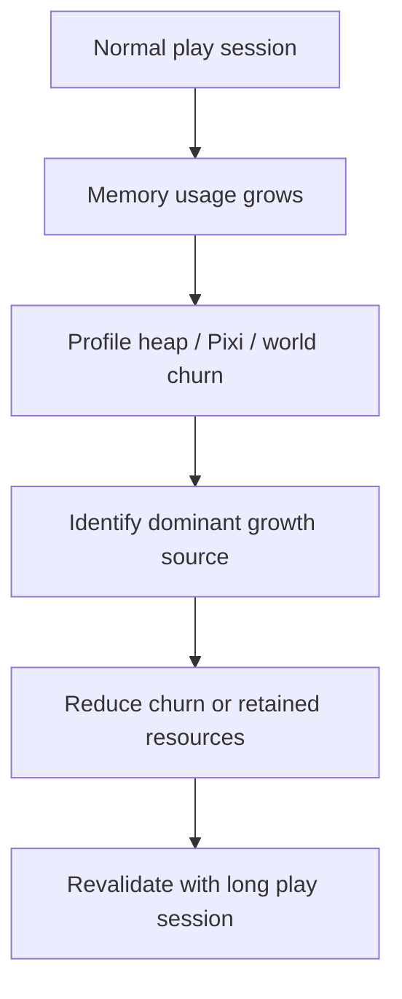

## req_047_define_a_runtime_memory_growth_investigation_and_reduction_wave - Define a runtime memory-growth investigation and reduction wave
> From version: 0.2.3
> Status: Draft
> Understanding: 100%
> Confidence: 97%
> Complexity: High
> Theme: Performance
> Reminder: Update status/understanding/confidence and references when you edit this doc.

# Needs
- Investigate the apparent runtime memory growth observed during normal play sessions.
- Determine whether the issue is a true leak, excessive allocation churn, retained Pixi/canvas resources, or a combination of those factors.
- Reduce memory growth enough that prolonged play no longer drives the browser tab toward multi-gigabyte usage under normal conditions.

# Context
Recent runtime waves added:
- combat readability overlays
- floating damage numbers
- overhead bars
- directionally biased hostile spawning
- pathfinding
- clustered world generation

The codebase already bounds several obvious data structures:
- sampled world-tile layer cache
- visible chunk cache
- floating damage number lifetime
- recent runtime telemetry samples

That means the current memory concern is less likely to come from one obvious unbounded gameplay list and more likely to come from one or more of:
- repeated world debug-data reconstruction
- repeated Pixi draw-object churn
- world/chunk visual data recreated too often
- retained canvas/GPU resources
- presentation-layer allocations that grow session after session

Recommended target posture:
1. Treat the reported multi-gigabyte tab growth as a real performance risk even before the exact source is fully proven.
2. Start by profiling and isolating the growth category:
   - JS heap retention
   - repeated allocation churn
   - Pixi/display-object retention
   - canvas/GPU backing-store growth
3. Prioritize fixes in the highest-churn player-facing runtime layers first:
   - world rendering
   - chunk debug/tile presentation data
   - entity overlay rendering
4. Prefer bounded caches and stable render inputs over repeated reconstruction of large per-frame structures.
5. Validate with repeatable play-session measurements instead of relying only on static code inspection.

Recommended defaults:
- treat the issue as runtime-session memory growth, not just bundle size or startup cost
- inspect world/chunk render preparation first
- inspect Pixi `Graphics`/`Text` churn second
- keep deterministic generation behavior unchanged unless memory reduction requires generation-output caching changes
- prefer reducing allocation churn before introducing large new caches
- if caching is introduced, keep it explicitly bounded
- validate with browser-side measurements over a multi-minute play session

Scope includes:
- investigation of runtime memory growth during play
- profiling likely hotspots in world and entity presentation
- reduction of high-frequency allocation churn
- bounded caching or memoization where justified
- browser validation of memory behavior after fixes

Scope excludes:
- unrelated gameplay redesign
- generic startup bundle optimization
- non-runtime shell polish
- speculative engine rewrites without evidence

# Acceptance criteria
- AC1: The request defines runtime memory growth during play as an explicit problem to investigate and reduce.
- AC2: The request defines a profiling-first posture that distinguishes heap retention from render/resource churn.
- AC3: The request defines world rendering and entity overlay rendering as first-class investigation targets.
- AC4: The request defines that any caching or memoization introduced for mitigation should stay bounded.
- AC5: The request requires browser-side validation over an actual play session after fixes.
- AC6: The request stays intentionally narrow and does not widen into unrelated gameplay or shell redesign.

# Open questions
- Is the main issue true JS retention or Pixi/canvas resource growth?
  Recommended default: do not assume; profile both and fix the dominant path first.
- Should world debug/tile presentation data be cached per chunk?
  Recommended default: yes if profiling shows repeated reconstruction dominates allocation churn, but keep the cache bounded.
- Should entity overlay rendering be simplified if it contributes materially to growth?
  Recommended default: yes, if profiling shows overhead bars, floating numbers, or dynamic graphics are creating disproportionate churn.
- Should this wave include browser heap snapshots as part of validation evidence?
  Recommended default: yes, at least one browser-side memory check should be part of the proof.

# Definition of Ready (DoR)
- [x] Problem statement is explicit and user impact is clear.
- [x] Scope boundaries (in/out) are explicit.
- [x] Acceptance criteria are testable.
- [x] Dependencies and known risks are listed.

# Companion docs
- Product brief(s): `prod_001_minimal_overlay_and_feedback_for_early_runtime`
- Architecture decision(s): `adr_002_separate_react_shell_from_pixi_runtime_ownership`, `adr_033_adopt_deterministic_movement_oriented_pseudo_physics_instead_of_a_full_physics_engine`
- Request(s): `req_035_define_a_runtime_hot_path_optimization_wave_for_pseudo_physics_and_world_queries`, `req_039_define_overhead_health_and_attack_charge_bars_for_runtime_combatants`, `req_041_define_damage_reaction_fx_and_floating_damage_numbers_for_runtime_combat.md`

# Backlog
- `profile_runtime_memory_growth_during_normal_play_sessions`
- `reduce_world_render_preparation_churn_and_retained_chunk_data`
- `reduce_entity_overlay_and_pixi_render_allocation_pressure`
