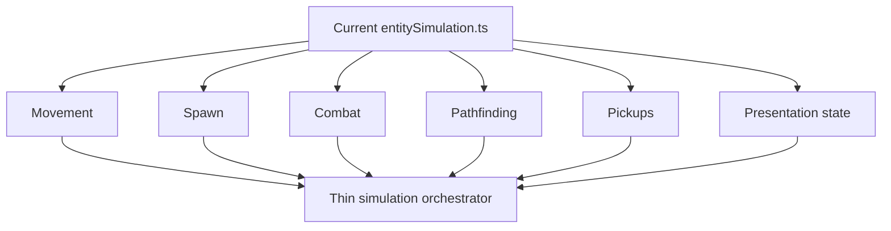

## req_048_define_a_structural_runtime_refactor_wave_to_split_the_entity_simulation_monolith - Define a structural runtime refactor wave to split the entity-simulation monolith
> From version: 0.2.4
> Status: Done
> Understanding: 99%
> Confidence: 100%
> Complexity: High
> Theme: Architecture
> Reminder: Update status/understanding/confidence and references when you edit this doc.

# Needs
- Reduce the structural risk concentrated in the current runtime simulation monolith.
- Split `entitySimulation.ts` into smaller runtime-owned modules with narrower responsibilities.
- Preserve current gameplay behavior while making future combat, spawn, collision, and progression changes less fragile.

# Context
The runtime now carries:
- player movement and pseudo-physics
- obstacle and surface sampling
- hostile spawning
- pursuit and pathfinding
- automatic player attacks
- hostile contact damage
- pickups and progression stats
- floating damage numbers and combat presentation state

Most of that logic currently sits inside a single file:
- [entitySimulation.ts](/Users/alexandreagostini/Documents/emberwake/games/emberwake/src/runtime/entitySimulation.ts)

That concentration creates a clear architecture problem:
- unrelated gameplay changes collide in one file
- hot-path performance work, gameplay changes, and presentation-state changes are tightly coupled
- review cost is too high
- regression risk rises with every new combat/system feature

Recommended target posture:
1. Treat the current `entitySimulation.ts` size and scope as a structural defect, not just an aesthetic issue.
2. Split the simulation into runtime-owned modules aligned with responsibilities rather than by arbitrary file slices.
3. Preserve the current simulation contract and tests while refactoring internally.
4. Keep the refactor behavior-preserving in its first wave, unless a small corrective fix is required to stabilize extraction.

Recommended first-slice module posture:
- `entityMovement`
- `entitySpawn`
- `entityCombat`
- `entityPathfinding`
- `entityPickup`
- `entityPresentationState`
- keep one thin orchestration layer that still exports the current public simulation API

Recommended defaults:
- preserve the current public exports consumed by the rest of the runtime
- avoid widening the refactor into new gameplay features
- preserve deterministic behavior and current save-state normalization rules
- keep tests green before and after the split
- prefer extraction of pure helpers and domain functions before introducing new abstractions
- keep runtime-owned modules under `games/emberwake/src/runtime/`

Scope includes:
- structural decomposition of `entitySimulation.ts`
- extraction of cohesive runtime modules
- preservation of public simulation behavior and tests
- local cleanup that directly supports the split

Scope excludes:
- gameplay redesign
- shell UX redesign
- unrelated render changes
- save/load redesign
- speculative engine-package extraction beyond what is needed for the split

# Acceptance criteria
- AC1: The request defines the current runtime monolith as a structural refactor target strongly enough to guide implementation.
- AC2: The request defines a first-slice split into smaller runtime-owned modules with coherent responsibilities.
- AC3: The request defines a behavior-preserving posture for the first refactor wave.
- AC4: The request defines preservation of current public simulation contracts as an explicit constraint.
- AC5: The request stays intentionally narrow and does not reopen gameplay redesign or shell redesign.

# Open questions
- Should every concern become its own file immediately?
  Recommended default: no; split by clear responsibility boundaries first, not by forcing maximum fragmentation.
- Should some extracted helpers move into `@engine` now?
  Recommended default: only if they are clearly game-agnostic and the extraction materially improves boundaries; otherwise keep this wave runtime-local.
- Should test files be split in parallel with the runtime modules?
  Recommended default: yes where it improves clarity, but preserve existing coverage first.

# Definition of Ready (DoR)
- [x] Problem statement is explicit and user impact is clear.
- [x] Scope boundaries (in/out) are explicit.
- [x] Acceptance criteria are testable.
- [x] Dependencies and known risks are listed.

# Companion docs
- Product brief(s): `prod_001_minimal_overlay_and_feedback_for_early_runtime`
- Architecture decision(s): `adr_014_adopt_a_modular_app_engine_game_topology_with_one_way_dependencies`, `adr_015_define_engine_to_game_runtime_contract_boundaries`
- Request(s): `req_047_define_a_runtime_memory_growth_investigation_and_reduction_wave`

# Backlog
- `extract_runtime_spawn_logic_out_of_entity_simulation`
- `extract_runtime_combat_and_damage_resolution_out_of_entity_simulation`
- `extract_runtime_pathfinding_pickups_and_presentation_state_out_of_entity_simulation`

# Outcome
- `entitySimulation.ts` no longer carries the same monolithic responsibility footprint.
- Spawn, combat, and intent/pathfinding-oriented responsibilities now live in dedicated runtime-local modules while the public simulation contract remains stable.
