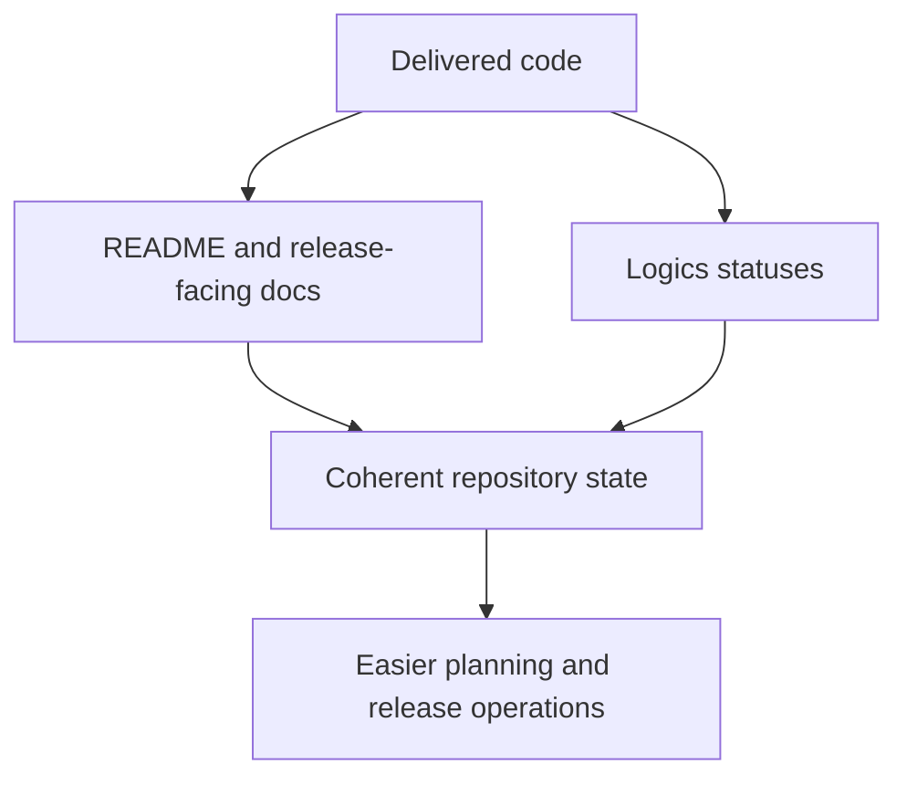

## req_049_define_a_documentation_release_and_logics_hygiene_wave_for_repository_coherence - Define a documentation, release, and logics-hygiene wave for repository coherence
> From version: 0.2.3
> Status: Draft
> Understanding: 100%
> Confidence: 98%
> Complexity: Medium
> Theme: Delivery
> Reminder: Update status/understanding/confidence and references when you edit this doc.

# Needs
- Restore coherence between repository state, release-facing docs, and the `logics/` planning surface.
- Reduce drift between delivered code, README/release messaging, and open planning docs.
- Keep the growing `logics/` operating model usable as the project accumulates more completed waves.

# Context
The repository already has:
- a strong `logics/` workflow
- curated release helpers
- CI and release validation scripts
- many completed requests, backlog items, tasks, and ADRs

That is a strength, but it creates a maintenance pressure:
- release-facing docs can drift from the true current state
- requests can remain open or be reopened without a clear hygiene pass
- the `logics/` surface keeps growing and will become harder to navigate without explicit upkeep

Recommended target posture:
1. Treat doc/release/logics coherence as an operational quality concern, not as optional cleanup.
2. Reconcile README, release-facing status, and current tagged/project state.
3. Reconcile open drafts and recently reopened requests so their status matches reality.
4. Define a lightweight hygiene posture for the growing `logics/` corpus so navigation does not degrade over time.

Recommended defaults:
- update README when release status or core project posture has materially changed
- keep requests honest about `Draft`, `Ready`, and `Done`
- avoid leaving reopened requests looking fully closed
- add lightweight indexing or hygiene notes if the `logics/` corpus is becoming harder to navigate
- keep this wave documentation-focused; do not mix it with gameplay implementation

Scope includes:
- README/release-facing status coherence
- request/task/backlog status hygiene where drift exists
- logics navigation/operational hygiene notes if justified
- repository cleanliness around planning docs

Scope excludes:
- gameplay implementation
- architectural rewrites
- visual redesign
- new release cut unless explicitly requested afterward

# Acceptance criteria
- AC1: The request defines repository doc/release/logics coherence as an explicit maintenance target.
- AC2: The request defines a README/release-facing synchronization pass strongly enough to guide implementation.
- AC3: The request defines a status-hygiene pass for requests/tasks/backlog where drift exists.
- AC4: The request defines a narrow hygiene posture and does not widen into unrelated gameplay or architecture work.
- AC5: The request considers the navigability of the growing `logics/` corpus as part of repository coherence.

# Open questions
- Should this wave archive or reorganize completed `logics/` docs?
  Recommended default: no large archival move yet; start with coherence and lightweight navigability improvements first.
- Should reopened requests always lose `Done` status immediately?
  Recommended default: yes; status should reflect the current truth even if part of the earlier slice remains delivered.
- Should this wave include a release bump?
  Recommended default: no; keep it hygiene-only unless a release prep is explicitly requested later.

# Definition of Ready (DoR)
- [x] Problem statement is explicit and user impact is clear.
- [x] Scope boundaries (in/out) are explicit.
- [x] Acceptance criteria are testable.
- [x] Dependencies and known risks are listed.

# Companion docs
- Product brief(s): `prod_001_minimal_overlay_and_feedback_for_early_runtime`
- Architecture decision(s): `adr_012_require_curated_versioned_changelogs_for_releases`, `adr_013_use_a_dedicated_release_branch_for_deployable_static_releases`
- Request(s): `req_044_refine_spawn_bootstrap_pause_surface_and_escape_navigation_behaviors`

# Backlog
- `synchronize_readme_and_release_facing_repository_status`
- `clean_up_request_and_task_status_drift_in_recent_waves`
- `define_lightweight_logics_navigation_and_hygiene_rules_for_the_growing_corpus`
