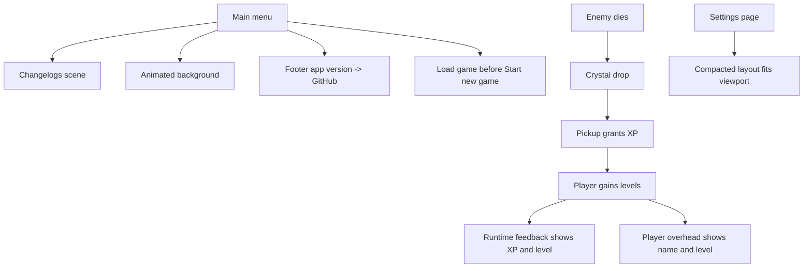

## req_050_define_a_main_menu_polish_and_first_crystal_xp_progression_wave - Define a main-menu polish and first crystal-XP progression wave
> From version: 0.3.0
> Status: Draft
> Understanding: 100%
> Confidence: 98%
> Complexity: High
> Theme: UI
> Reminder: Update status/understanding/confidence and references when you edit this doc.

# Needs
- Improve the player-facing quality of the `Main menu` with better ordering, richer presentation, and direct access to recent changelogs.
- Add a first lightweight progression loop where defeated enemies drop crystals that grant player experience and levels.
- Make runtime progression legible in both the HUD and overhead entity presentation.
- Compact the `Settings` surface so desktop-control editing fits comfortably inside the available shell page height.
- Reduce the visual weight of the mobile virtual-stick background so it obstructs less of the runtime view through progressive fade-out behavior.

# Context
The repository now has:
- a shell-owned `Main menu`, `Load game`, `New game`, `Settings`, and `Game over` flow
- a first hostile combat loop with health, damage, pickups, and gold
- runtime feedback, overhead combat bars, and player-facing shell polish
- curated versioned changelogs and a published `0.3.0` release

That means the game has crossed the line into a playable slice, but several product-facing gaps remain:
- the `Main menu` is still functionally plain and does not showcase release history or a stronger visual identity
- `Load game` is not yet prioritized ahead of `Start new game`
- the shell does not currently expose app name/version as a compact footer entry point to the project GitHub page
- defeated hostiles do not yet feed into a persistent-feeling progression reward loop
- runtime feedback does not yet expose XP progression or player level
- the player overhead label does not yet show character name plus current level
- the `Settings` page still overflows or feels too tall in practical viewport conditions

Recommended target posture:
1. Treat the `Main menu` as the primary product-facing showcase surface, not just as a neutral menu list.
2. Add a shell-owned changelog-reading surface reachable from the `Main menu`.
3. Treat the menu background as a stylized animated atmosphere layer that reinforces the product identity without harming legibility or shell budgets.
4. Reorder `Load game` ahead of `Start new game` so session continuation is prioritized when available.
5. Treat enemy-death crystal drops as the first direct combat-to-progression reward loop.
6. Treat XP and level as first-class player progression indicators visible in runtime feedback and overhead identity.
7. Compact the `Settings` surface aggressively enough that it fits inside common laptop and desktop view heights without feeling truncated.
8. Soften the mobile virtual-stick base so touch controls remain available without dominating the screen, then let it fade progressively over time.

Recommended defaults:
- add a `Changelogs` entry in `Main menu` that opens a dedicated shell-owned scene showing the latest curated release notes in reverse chronological order
- keep changelog reading local-first by sourcing from the curated changelog corpus already present in the repository
- animate the `Main menu` background with a tasteful low-frequency ambient treatment rather than a loud decorative effect
- place a compact footer line in `Main menu` such as `Emberwake v0.3.0`; clicking it opens the GitHub project page
- treat that footer as a bottom-anchored shell/Pixi overlay inside the current viewport rather than as a DOM footer that changes page height
- keep the footer non-layout-shifting: no added document flow, no extra scroll, no canvas/page resize side effect
- order main-menu actions as `Load game`, `Start new game`, then other primary product actions
- have defeated hostile entities drop crystals rather than direct XP
- make crystals grant XP on pickup
- define a simple first XP curve and level-up posture without reopening a full RPG/stat system
- show `XP current / XP needed` and `Level` in `Runtime feedback`
- show the player character name and current level above the player entity
- compact `Settings` mostly through denser spacing, tighter group layout, and better vertical packing instead of cutting the feature set
- on mobile, let the joystick background/base disc fade progressively after interaction so it becomes close to invisible after a short delay while still reappearing clearly on fresh touch input

Scope includes:
- `Main menu` action ordering changes
- a shell-owned changelog-reading scene
- animated main-menu background styling
- main-menu footer version/GitHub affordance rendered as a bottom-anchored in-surface overlay
- hostile crystal drops on death
- player XP and level progression from crystal pickups
- runtime feedback updates for XP and level
- overhead player name + level presentation
- settings-surface compaction
- mobile virtual-stick background progressive fade-out

Scope excludes:
- online changelog fetching
- account progression or cloud profiles
- class trees, perks, or stat-allocation systems
- enemy-loot tables beyond first crystal drops
- full settings IA redesign beyond compaction

# Acceptance criteria
- AC1: The request defines a shell-owned `Main menu` entry that opens a changelog-reading surface.
- AC2: The request defines an animated `Main menu` background posture that improves atmosphere without reopening a full shell redesign.
- AC3: The request defines a compact footer showing app name and version that links to the project GitHub page.
- AC4: The request defines that the footer must stay anchored inside the current shell/canvas viewport without changing page height or introducing layout shift.
- AC5: The request defines that `Load game` should appear before `Start new game` in the `Main menu`.
- AC6: The request defines that defeated hostiles drop crystals.
- AC7: The request defines that crystal pickups grant player XP, enabling level progression.
- AC8: The request defines that runtime feedback should show both current level and XP progress toward the next level.
- AC9: The request defines that the player overhead presentation should include the character name and current level.
- AC10: The request defines a compaction posture for `Settings` strong enough to solve the current vertical-fit problem.
- AC11: The request defines that the mobile virtual-stick background should fade progressively over time until it becomes close to invisible.
- AC12: The request stays intentionally narrow and does not widen into a full RPG progression system or large shell-architecture rewrite.

# Open questions
- Should the changelog scene render the full curated markdown or a lighter summary list?
  Recommended default: a readable shell-owned summary view sourced from curated release notes, with the latest entries first.
- Should the main-menu animated background be interactive or purely ambient?
  Recommended default: purely ambient, low-frequency, and subordinate to menu readability.
- Should the footer participate in normal page layout?
  Recommended default: no; keep it as an in-surface overlay anchored to the bottom of the active shell/canvas viewport.
- Should crystals be the only XP source in the first slice?
  Recommended default: yes; keep the first progression loop simple and combat-linked.
- Should all hostiles drop crystals or only some of them?
  Recommended default: all first-wave hostiles drop crystals so the reward loop is obvious immediately.
- Should level-ups immediately change combat stats?
  Recommended default: not in this first slice unless a tiny health or damage bump is needed for readability; prioritize progression visibility first.
- Should XP/level be shown for enemies too?
  Recommended default: no; keep the new overhead identity line player-only for now.
- How should the settings compaction be achieved?
  Recommended default: denser vertical rhythm, tighter button chips, more efficient group packing, and clearer action placement rather than removing controls.
- How should the mobile joystick base fade?
  Recommended default: keep it visible during active touch confirmation, then fade it progressively until it becomes barely visible after a short idle delay.

# Definition of Ready (DoR)
- [x] Problem statement is explicit and user impact is clear.
- [x] Scope boundaries (in/out) are explicit.
- [x] Acceptance criteria are testable.
- [x] Dependencies and known risks are listed.

# Companion docs
- Product brief(s): `prod_001_minimal_overlay_and_feedback_for_early_runtime`
- Architecture decision(s): `adr_016_define_shell_scene_state_and_meta_surface_ownership`, `adr_033_adopt_deterministic_movement_oriented_pseudo_physics_instead_of_a_full_physics_engine`
- Request(s): `req_037_define_a_game_over_recap_flow_and_player_attack_cone_visualization`, `req_038_define_a_first_proximity_loot_spawn_wave_with_healing_kits_and_gold`, `req_039_define_overhead_health_and_attack_charge_bars_for_runtime_combatants`, `req_045_define_a_clearer_and_more_compact_desktop_controls_settings_surface`

# Backlog
- `define_a_main_menu_changelog_surface_and_release_history_entry`
- `define_a_more_atmospheric_main_menu_presentation_with_footer_version_linking`
- `define_first_crystal_xp_and_level_progression_feedback_for_the_player`
- `define_player_identity_overhead_and_settings_compaction_for_the_next_shell_polish_slice`
