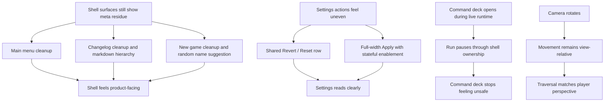

## req_051_define_a_shell_surface_cleanup_and_view_relative_movement_polish_wave - Define a shell-surface cleanup and view-relative movement polish wave
> From version: 0.5.0
> Status: Done
> Understanding: 100%
> Confidence: 98%
> Complexity: High
> Theme: UX
> Reminder: Update status/understanding/confidence and references when you edit this doc.
> Schema version: 1.0

# Needs
- Remove leftover shell copy and status chrome that still make `Main menu`, `Changelogs`, and `New game` read like meta tooling instead of product-facing surfaces.
- Tighten the `Settings` action layout so `Revert`, `Reset defaults`, and `Apply controls` communicate a clearer hierarchy and activation state.
- Improve changelog readability by rendering curated markdown as structured content instead of flattening headings into undifferentiated text blocks.
- Stop `New game` from always defaulting to `Wanderer` by providing a randomized initial character name suggestion.
- Ensure opening the `Command deck` pauses the live runtime instead of leaving simulation running underneath an opened shell control surface.
- Make directional movement relative to the player view so moving right always means screen-right from the player perspective regardless of current camera rotation.

# Context
The repository now has:
- a shell-owned `Main menu`, `New game`, `Settings`, and `Changelogs` flow
- a command deck that acts as the primary in-runtime shell control surface
- desktop control remapping with `Revert`, `Reset defaults`, and `Apply controls`
- a local curated changelog reader sourced from repository markdown
- runtime camera rotation controls and preserved shell-owned pause behavior

That means the product already has the right surfaces, but several interaction details still feel transitional or mechanically off:
- `Main menu`, `Changelogs`, and `New game` still show leftover tactical/meta copy such as `META FLOW` that no longer earns space
- `Main menu` still exposes session-oriented text and footer button chrome that add noise without helping the player
- `Settings` actions do not yet read cleanly as paired secondary edits plus one full-width primary apply action
- `Revert` and `Apply controls` can appear active even when there is no in-progress settings change
- the changelog reader still treats markdown too much like raw text, so headings such as `##` do not become useful visual structure
- `New game` still opens with the same default character suggestion every time
- opening the command deck does not yet guarantee a paused runtime posture
- movement input still appears tied too directly to world axes or scene rotation instead of the player's current view orientation

The result is a product that is close to coherent, but still exposes implementation-era seams across shell polish, menu-state behavior, and runtime control feel.

Recommended target posture:
1. Treat `Main menu`, `Changelogs`, and `New game` as player-facing surfaces first, so leftover meta/status copy is removed wherever it is not materially useful.
2. Treat the `Main menu` footer brand line as a lightweight link affordance, not as a framed button with its own panel weight.
3. Treat `Settings` actions as one clear cluster:
   - `Revert` and `Reset defaults` share one row and one visual tier
   - `Apply controls` occupies the full available width as the primary action
4. Treat edit actions as stateful:
   - `Revert` is enabled only when draft bindings differ from the persisted bindings
   - `Apply controls` is enabled only when there is an unapplied draft change and the draft is valid
5. Treat changelog markdown as structured shell content rather than as preformatted raw text, with subheadings such as `##` rendered as actual hierarchy.
6. Treat `New game` character naming as a guided suggestion flow, with a randomized initial name proposal on scene entry rather than a single static placeholder.
7. Treat the opened `Command deck` as a shell-owned interruption that pauses the run while it is open.
8. Treat desktop movement directions as camera-relative or view-relative:
   - `right` moves toward the right side of the current player view
   - `left` moves toward the left side of the current player view
   - `up` and `down` remain aligned to the current viewed orientation rather than fixed world axes

Recommended defaults:
- remove `META FLOW` from `Main menu`, `Changelogs`, and `New game`
- remove `Resume the run, start a new one ...` style support copy from `Main menu`
- remove visible `SESSION` information from `Main menu`
- keep the footer text affordance, but strip framed button treatment and heavy background styling from the `EMBERWAKE` control
- keep a light hover/focus affordance on the footer through typography or color shift rather than boxed button chrome
- place `Revert` and `Reset defaults` on the same row with equal width distribution
- make `Apply controls` full width
- disable `Revert` when no draft/persisted delta exists
- disable `Apply controls` when there is no valid unapplied change
- keep `Reset defaults` available as a recovery action even before apply, because it intentionally creates a new draft state
- render changelog markdown through structured elements such as headings, paragraphs, lists, and light inline emphasis instead of a single `<pre>` block
- improve heading hierarchy enough that `##` sections scan immediately as section breaks
- prefill `New game` with a randomized name suggestion on each scene entry, while keeping the name editable
- when the command deck opens from live runtime, pause simulation through the existing shell-owned pause contract rather than via a separate special-case overlay
- only apply command-deck pause behavior when a live runtime session exists; shell-owned scenes should not invent pause state
- when the command deck closes, return to the prior live-runtime state unless another shell-owned scene remains active
- map desktop movement intent through the current camera/view rotation before it reaches runtime simulation so traversal remains intuitive under rotated scenes
- keep this first view-relative movement slice scoped to desktop keyboard movement, without widening the change to touch/mobile steering in the same wave

Scope includes:
- `Main menu` copy cleanup and session-info removal
- `Main menu` footer-brand visual simplification
- `Settings` action layout and enable/disable rules for draft control changes
- changelog scene copy cleanup and markdown rendering improvements
- `New game` copy cleanup and randomized initial name suggestion
- command-deck-open pause behavior
- view-relative desktop movement behavior under rotated camera states

Scope excludes:
- a full rewrite of the shell visual language
- remote or rich-document changelog tooling
- full procedural naming systems beyond first-suggestion randomization
- gamepad remapping or broader control-system redesign
- deep camera-system redesign beyond movement-direction interpretation

# Acceptance criteria
- AC1: The request defines removal of `META FLOW` from `Main menu`, `Changelogs`, and `New game`.
- AC2: The request defines removal of redundant support copy and session-info presentation from `Main menu`.
- AC3: The request defines that the `Main menu` footer `EMBERWAKE` affordance should lose its framed button/background treatment while remaining available as a lightweight footer action.
- AC4: The request defines that `Revert` and `Reset defaults` must share one row and split available width evenly inside `Settings`.
- AC5: The request defines that `Apply controls` must occupy full available width.
- AC6: The request defines that `Revert` is enabled only when draft settings differ from the persisted settings state.
- AC7: The request defines that `Apply controls` is enabled only when there is a valid unapplied settings change.
- AC8: The request defines removal of the remaining changelog meta/support copy, including the `without leaving the shell` phrasing.
- AC9: The request defines that changelog markdown should render with usable hierarchy, including better treatment of `##` subheadings.
- AC10: The request defines that `New game` should initialize with a randomized character-name suggestion instead of always defaulting to `Wanderer`.
- AC11: The request defines that opening the `Command deck` from live runtime pauses the run through normal shell ownership.
- AC12: The request defines that desktop movement directions are interpreted relative to the current player view/camera rotation rather than fixed world axes.
- AC13: The request stays narrowly focused on shell polish, settings-state clarity, changelog readability, command-deck pause behavior, and view-relative movement without reopening broad shell or camera architecture.

# Open questions
- Should the footer still look interactive after its frame/background is removed?
  Decision: yes; keep hover/focus affordance through typography and subtle color shift rather than a boxed button treatment.
- Should `Reset defaults` be disabled when the draft already matches product defaults?
  Decision: no; keep it available as a deterministic recovery action unless UX testing shows that always-enabled behavior is misleading.
- Should the randomized `New game` name reroll every time the scene is entered or only once per app boot?
  Decision: reroll on each scene entry so the surface does not feel stuck on one fallback identity.
- How much markdown support belongs in the changelog reader for this slice?
  Decision: support structured headings, paragraphs, lists, and light inline emphasis first, without expanding into full rich-markdown tooling.
- Should command-deck opening pause only when a live run is active?
  Decision: yes; if there is no active runtime session, opening shell chrome should not invent pause state.
- Should movement relativity follow camera rotation exactly even during debug-oriented camera use?
  Decision: yes for player movement input, so directional controls stay consistent with what the player currently sees on screen.
- Should the view-relative movement change apply to all movement inputs or only desktop keyboard movement in this wave?
  Decision: scope it to desktop keyboard movement first to avoid widening mobile/touch behavior in the same slice.

# Definition of Ready (DoR)
- [x] Problem statement is explicit and user impact is clear.
- [x] Scope boundaries (in/out) are explicit.
- [x] Acceptance criteria are testable.
- [x] Dependencies and known risks are listed.

# Companion docs
- Product brief(s): `prod_001_minimal_overlay_and_feedback_for_early_runtime`, `prod_002_readable_world_traversal_and_presence`
- Architecture decision(s): `adr_003_define_coordinate_spaces_and_camera_contract`, `adr_007_isolate_runtime_input_from_browser_page_controls`, `adr_016_define_shell_scene_state_and_meta_surface_ownership`, `adr_033_adopt_deterministic_movement_oriented_pseudo_physics_instead_of_a_full_physics_engine`
- Request(s): `req_028_define_a_cohesive_shell_meta_and_runtime_feedback_surface`, `req_029_define_a_lightweight_settings_scene_with_desktop_control_customization`, `req_030_define_a_shell_owned_main_menu_and_new_game_entry_flow`, `req_044_refine_spawn_bootstrap_pause_surface_and_escape_navigation_behaviors`, `req_045_define_a_clearer_and_more_compact_desktop_controls_settings_surface`, `req_050_define_a_main_menu_polish_and_first_crystal_xp_progression_wave`

# AI Context
- Summary: Remove leftover shell copy and status chrome that still make Main menu, Changelogs, and New game read like...
- Keywords: shell-surface, cleanup, and, view-relative, movement, polish, wave, remove
- Use when: Use when framing scope, context, and acceptance checks for Define a shell-surface cleanup and view-relative movement polish wave.
- Skip when: Skip when the work targets another feature, repository, or workflow stage.

# Backlog
- `item_181_define_a_cleaner_main_menu_surface_without_meta_or_session_residue`
- `item_182_define_stateful_apply_revert_and_reset_action_rules_for_settings_controls`
- `item_183_define_a_structured_markdown_rendering_posture_for_shell_changelogs`
- `item_184_define_randomized_initial_character_name_suggestions_for_new_game`
- `item_185_define_command_deck_open_behavior_as_a_runtime_pause_trigger`
- `item_186_define_view_relative_player_movement_under_camera_rotation`
