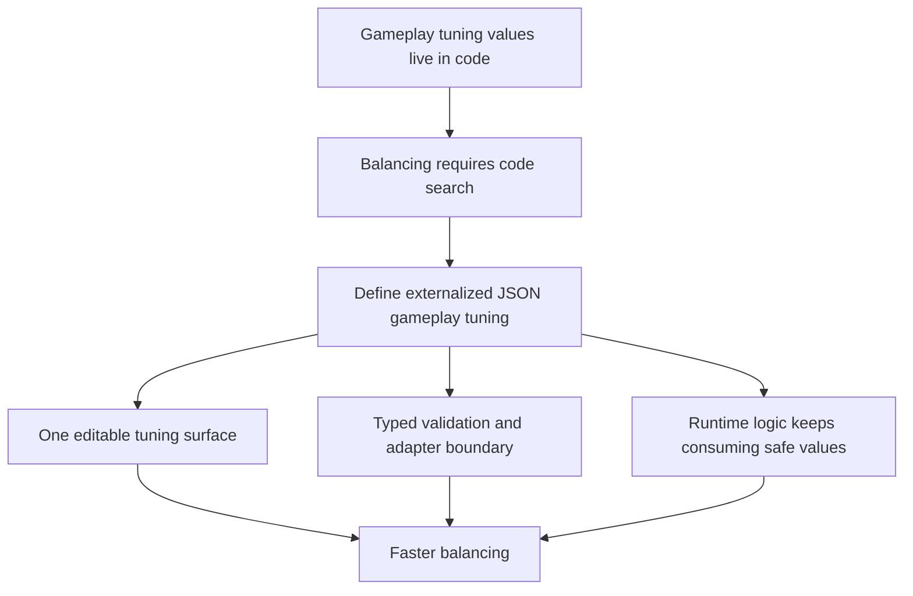

## req_052_define_an_externalized_json_gameplay_tuning_contract - Define an externalized JSON gameplay-tuning contract
> From version: 0.3.1
> Status: Done
> Understanding: 99%
> Confidence: 97%
> Complexity: Medium
> Theme: Data
> Reminder: Update status/understanding/confidence and references when you edit this doc.

# Needs
- Externalize gameplay tuning constants into a dedicated JSON artifact so balancing no longer requires searching through runtime code.
- Make the first-wave combat and spawn tuning values easy to inspect and edit in one place.
- Keep the repo compatible with fast balancing iteration while preserving validation and clear ownership.
- Distinguish balance/tuning constants from executable gameplay logic so changing values does not require touching behavior code.
- Stay compatible with the current `TypeScript-first` content architecture by introducing JSON as a targeted format for numeric tuning, not as a full authoring-model replacement.

# Context
The repository already has:
- a first hostile combat loop with spawn caps, health, damage, cooldowns, and pursuit tuning
- pickup and progression tuning such as XP, healing ratio, local pickup caps, and spawn cadence
- typed content catalogs and validation centered around Emberwake-owned TypeScript modules
- at least one precedent for repo-native JSON configuration through `runtimePerformanceBudget.json`

That means gameplay is now rich enough that tuning values are spread across meaningful contracts, but those values still live too close to code:
- hostile tuning currently sits inside runtime-facing TypeScript contracts such as `hostileCombatContract`
- pickup and progression tuning currently sits inside `pickupContract`
- values like max spawn count, max health, damage, cooldown ticks, spawn cadence, and related numbers are editable only by opening code modules

This is workable for implementation, but weak for balancing:
- balancing requires knowing where each value lives in code
- gameplay tuning is harder to review as one coherent surface
- changing a number can feel riskier because the edit happens beside behavior logic
- the product lacks one obvious source of truth for gameplay balance constants

At the same time, the current architecture explicitly prefers typed TypeScript as the baseline authoring model for structured content. This request should therefore not blindly reverse that decision.

The better posture is narrower:
1. keep structural content, ids, and cross-catalog references TypeScript-owned
2. externalize bounded gameplay-tuning constants into a dedicated JSON file or small JSON family
3. load that JSON through a typed validation boundary
4. let runtime systems consume validated tuning values rather than hard-coded numeric literals or runtime-local constant objects

Recommended target posture:
1. Treat gameplay balance numbers as authored tuning data rather than as code-local constants.
2. Keep one obvious editable JSON source for first-wave balance values such as:
   - hostile local population cap
   - hostile/player max health
   - hostile contact damage
   - hostile/player attack cooldowns
   - hostile spawn cadence and attempt count
   - pickup spawn caps and cadence
   - healing ratios
   - XP and level-progression values
3. Implement the runtime boundary as a hybrid contract:
   - one repo-owned `gameplayTuning.json` file for frequently adjusted balance values
   - one small `gameplayTuning.ts` adapter for loading, validating, and deriving runtime-safe values
4. Keep executable logic in TypeScript:
   - collision, combat resolution, spawn algorithms, and behavior flow stay in code
   - only the tuning numbers move out
5. Validate the JSON on load so malformed or unsafe values fail fast rather than silently degrading runtime behavior.
6. Keep derived runtime units possible through a thin adapter layer when raw JSON values need transformation:
   - degrees -> radians
   - chunk-relative multipliers -> world units
   - other bounded computed forms
7. Establish one repo rule for future work:
   - gameplay balance numbers that are expected to change during tuning should come from the tuning contract rather than remaining embedded inside runtime systems

Recommended first-file coverage:
1. `hostile`
   - `maxHealth`
   - `moveSpeedWorldUnitsPerSecond`
   - `acquisitionRadiusChunks` or `acquisitionRadiusWorldUnits`
   - `contactDamage`
   - `contactDamageCooldownTicks`
   - `localPopulationCap`
   - `spawnCooldownTicks`
   - `spawnAttemptCount`
   - `safeSpawnDistanceChunks` or `safeSpawnDistanceWorldUnits`
   - `despawnDistanceChunks` or `despawnDistanceWorldUnits`
2. `player`
   - `maxHealth`
   - `automaticConeAttack.damage`
   - `automaticConeAttack.cooldownTicks`
   - `automaticConeAttack.arcDegrees`
   - `automaticConeAttack.rangeWorldUnits`
   - `automaticConeAttack.visibleTicks`
3. `pickup`
   - `crystal.enemyDropCount`
   - `crystal.xpValue`
   - `gold.value`
   - `healingKit.healRatio`
   - `healingKit.spawnChancePercent`
   - `spawn.localPopulationCap`
   - `spawn.spawnCooldownTicks`
   - `spawn.spawnAttemptCount`
   - `spawn.pickupRadiusWorldUnits`
   - `spawn.safeSpawnDistanceChunks` or `spawn.safeSpawnDistanceWorldUnits`
   - `spawn.despawnDistanceChunks` or `spawn.despawnDistanceWorldUnits`
4. `progression`
   - `baseLevelXpRequired`
   - `levelXpStep`
5. `hostileSpawn`
   - `headingMemoryTicks`
   - `distanceRatioMin`
   - `distanceRatioMax`
   - `frontSectorWidthDegrees`
   - `frontSideSectorOffsetDegrees`
   - `frontSideSectorWidthDegrees`
   - `sideSectorOffsetDegrees`
   - `sideSectorWidthDegrees`
   - `rearSectorOffsetDegrees`
   - `rearSectorWidthDegrees`
6. `combatPresentation` and `hostilePathfinding`
   - excluded from `gameplayTuning` first-file ownership
   - owned by `systemTuning` so readability timings and pathfinding/search limits remain in the technical/system tuning contract

Recommended rollout priority:
1. Move `hostile`, `player`, `pickup`, and `progression` first because they are the most obvious balance-editing surface.
2. Move `hostileSpawn` next because it materially affects gameplay feel and combat readability while still remaining gameplay-owned.
3. Keep `combatPresentation`, `hostilePathfinding`, rendering cosmetics, structural content, and non-tuning technical constants out of this first file because they belong in `systemTuning` or should remain outside tuning contracts entirely.

Recommended defaults:
- introduce one dedicated gameplay-tuning JSON artifact under a stable repo-owned config/content path
- treat that JSON as the first editable source of truth for runtime balance numbers
- start with a single file such as `games/emberwake/src/config/gameplayTuning.json` rather than splitting the surface too early
- keep the first slice focused on numeric gameplay-tuning values, not entity definitions or broader content catalogs
- include at least hostile combat/spawn tuning, player combat tuning, pickup tuning, and progression tuning
- pair the JSON with a small TypeScript adapter such as `gameplayTuning.ts` so consumers still receive typed safe values
- fail fast in development and tests when the JSON is invalid, incomplete, or out of accepted bounds
- prefer explicit named fields over anonymous arrays or overly nested free-form structures
- prefer a human-editable JSON shape with fields such as `arcDegrees` or chunk-relative multipliers where that improves clarity
- allow a small TypeScript derivation layer when a value depends on engine constants such as `chunkWorldSize`
- prefer authoring user-facing angular values in degrees inside JSON, then convert them in code if radians are needed at runtime
- prefer authoring chunk-relative gameplay distances as named multipliers where that is easier to tune than raw world-unit numbers
- keep the JSON grouped by gameplay domain rather than by source file so the file reads like one balancing surface instead of a mirror of code structure
- do not require an in-app editor, remote config service, or live network fetch in this slice
- define “modifiable à la volée” as: easy local repo edits in one JSON surface with immediate developer clarity, not a full live-ops platform
- define a migration rule that runtime systems should stop owning balance literals locally once their values are present in the tuning contract

Recommended first-file shape:
- `hostile`
- `player`
- `pickup`
  - `crystal`
  - `gold`
  - `healingKit`
  - `spawn`
- `progression`
- `hostileSpawn`

Scope includes:
- externalizing first-wave gameplay tuning constants into JSON
- defining the ownership boundary between JSON tuning data and TypeScript gameplay logic
- validation and typed adaptation of the JSON into runtime-safe values
- migration of current combat/spawn/pickup/progression constants away from runtime-local constant objects where appropriate
- a stable file/folder posture for future gameplay tuning expansion
- a repo-level rule for where future gameplay tuning numbers should live
- explicit first-file field coverage for combat, spawn, pickup, progression, presentation-feel, and optional pathfinding tuning

Scope excludes:
- replacing all Emberwake content authoring with JSON
- moving ids, entity blueprints, scenario graphs, or asset references out of TypeScript
- building an in-game balance editor
- remote configuration or live-service tuning delivery
- user-generated modding support

# Acceptance criteria
- AC1: The request defines a dedicated JSON-owned surface for first-wave gameplay tuning values.
- AC2: The request defines that the slice covers practical balance numbers such as spawn caps, health, damage, cooldowns, spawn cadence, pickup values, or progression values.
- AC3: The request defines a hybrid runtime boundary with one gameplay-tuning JSON file plus a small TypeScript adapter that validates and exposes runtime-safe values.
- AC4: The request defines that executable gameplay logic remains in TypeScript while tuning numbers move to JSON.
- AC5: The request defines a validation boundary so malformed or incomplete JSON does not silently flow into runtime systems.
- AC6: The request defines how derived values are handled when runtime systems need units or forms that should not be authored directly in raw JSON.
- AC7: The request defines a repo-level expectation that gameplay balance numbers meant for tuning should come from the shared tuning contract rather than remaining embedded in runtime systems.
- AC8: The request remains compatible with the current Emberwake `TypeScript-first` content architecture by treating JSON as a bounded tuning format rather than a full authoring-model replacement.
- AC9: The request stays compatible with the static frontend architecture and does not depend on remote config delivery.
- AC10: The request explicitly enumerates the first-wave gameplay tuning domains and fields that should move into the JSON contract.
- AC11: The request defines a recommended grouping and rollout order so the tuning file is useful immediately without forcing every semi-technical constant into the first migration.

# Open questions
- Should all gameplay constants move to JSON immediately?
  Recommended default: no; move bounded tuning numbers first, keep structural or behavior-defining contracts in TypeScript.
- Should there be one large JSON file or a small family of gameplay-tuning JSON files?
  Decision: start with one clear file unless it becomes unwieldy, then split by domain later.
- Should the runtime consume raw JSON directly?
  Decision: no; route all JSON through a small TypeScript adapter that validates and derives runtime-safe values.
- Should invalid JSON fall back to defaults silently?
  Decision: no; fail fast in development and tests so bad tuning never hides behind fallback magic.
- Should values depending on engine constants be authored directly as world units?
  Decision: not always; allow authoring multipliers or human-readable forms in JSON, then derive final runtime values in a thin adapter.
- Should combat-presentation and spawn-sector-feel constants live in the same file as raw balance numbers?
  Decision: split them; keep spawn-sector feel in `gameplayTuning`, but keep combat-presentation timings in `systemTuning`.
- Should hostile pathfinding constants move in the same first migration?
  Decision: no for `gameplayTuning`; keep hostile pathfinding limits in `systemTuning` because they are technical/system knobs.
- Should this slice support live editing while the app is already running?
  Decision: no explicit live-edit tooling; focus on externalized repo-owned JSON that is fast to edit and reload.
- Where should future gameplay balance numbers live once this slice lands?
  Decision: any balance number expected to change during tuning should default to the shared gameplay-tuning contract rather than being introduced as a new local runtime literal.

# Definition of Ready (DoR)
- [x] Problem statement is explicit and user impact is clear.
- [x] Scope boundaries (in/out) are explicit.
- [x] Acceptance criteria are testable.
- [x] Dependencies and known risks are listed.

# Companion docs
- Product brief(s): `prod_002_readable_world_traversal_and_presence`, `prod_003_high_density_top_down_survival_action_direction`
- Architecture decision(s): `adr_011_use_typed_typescript_as_the_initial_data_and_config_authoring_model`, `adr_018_validate_emberwake_content_as_a_typed_cross_catalog_graph`, `adr_033_adopt_deterministic_movement_oriented_pseudo_physics_instead_of_a_full_physics_engine`, `adr_036_externalize_retunable_gameplay_and_system_tuning_as_validated_json_contracts`
- Request(s): `req_010_define_game_data_and_configuration_model`, `req_020_define_the_next_architecture_wave_for_app_state_loading_content_rendering_and_boundary_enforcement`, `req_036_define_a_first_hostile_combat_loop_with_spawns_contact_damage_and_player_cone_attack`, `req_038_define_a_first_proximity_loot_spawn_wave_with_healing_kits_and_gold`, `req_050_define_a_main_menu_polish_and_first_crystal_xp_progression_wave`

# Backlog
- `define_a_json_owned_gameplay_tuning_surface_for_first_wave_balance_values`
- `define_validation_and_adapter_rules_for_externalized_gameplay_tuning_json`
- `define_a_migration_boundary_between_runtime_contract_constants_and_authored_tuning_data`
- `define_a_single_source_of_truth_rule_for_future_gameplay_balance_numbers`
