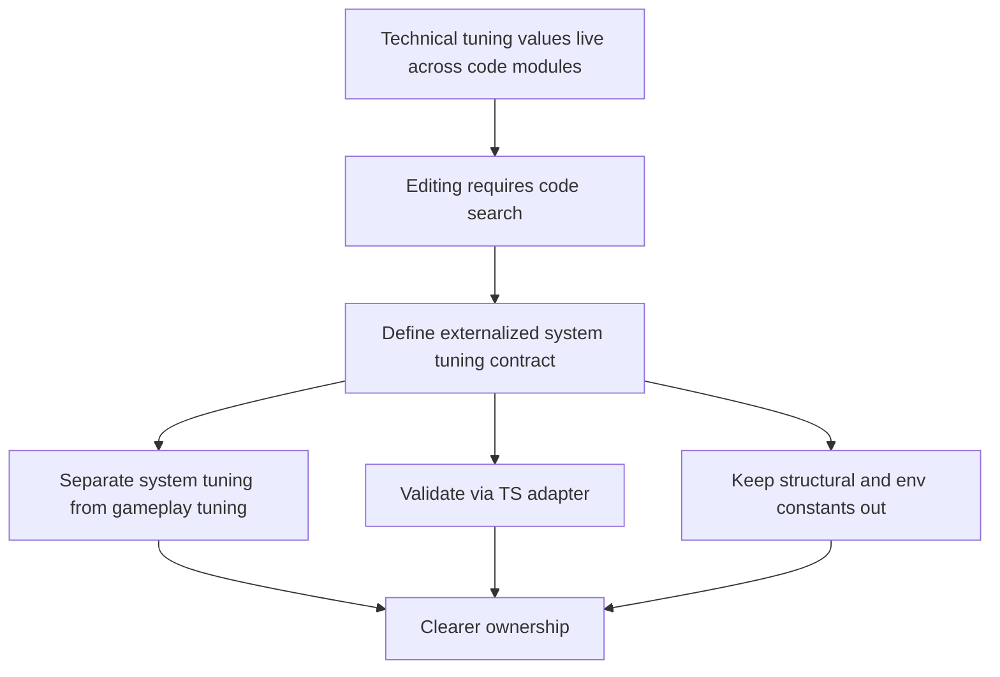

## req_053_define_an_externalized_json_system_tuning_contract - Define an externalized JSON system-tuning contract
> From version: 0.3.1
> Status: Draft
> Understanding: 99%
> Confidence: 97%
> Complexity: Medium
> Theme: Data
> Reminder: Update status/understanding/confidence and references when you edit this doc.

# Needs
- Externalize technical and system-level tuning constants into a dedicated JSON-owned surface so project-level tuning no longer requires searching across code modules.
- Separate technical/system tuning from gameplay balance so each family keeps a clear purpose and owner.
- Make input feel, viewport behavior, pathfinding/search limits, movement-surface feel, and similar system knobs easier to inspect and adjust.
- Keep structural contracts, environment config, and code ownership boundaries intact rather than dumping every constant into data files.
- Reuse the same hybrid posture proposed for gameplay tuning: JSON for editable values, TypeScript for validation, derivation, and runtime-safe access.

# Context
The repository already has:
- a new request for externalized gameplay tuning through a dedicated JSON plus TypeScript adapter posture
- repo-native JSON configuration precedent such as `runtimePerformanceBudget.json`
- multiple technical/system constants currently authored directly in TypeScript across input, viewport, AI/pathfinding, terrain-surface feel, and runtime presentation modules

Examples visible in the current codebase include:
- input tuning in `games/emberwake/src/input/singleEntityControlContract.ts`
  - desktop move speed
  - virtual-stick dead zone
  - virtual-stick max radius
- logical viewport tuning in `src/shared/constants/logicalViewport.ts`
  - mobile logical width
  - mobile logical height
  - breakpoint
- pathfinding/search tuning in `games/emberwake/src/runtime/entitySimulationIntent.ts`
  - max explored tiles
  - recompute cadence
  - search radius
  - waypoint advance threshold
- movement-surface feel tuning in `games/emberwake/src/content/world/worldData.ts`
  - speed multipliers
  - control responsiveness
  - velocity retain factors
- runtime presentation/feedback timing in modules such as `entitySimulationCombat.ts`
  - floating-number lifetime
  - hit-reaction visibility

These values are not all “game balance” in the narrow sense, but they still strongly affect:
- feel
- usability
- readability
- runtime cost
- platform behavior

Right now they are spread across feature contracts, which makes them hard to review as one technical-tuning layer.

At the same time, not every technical constant should become JSON:
- ownership strings
- enum-like ids
- environment-dependent app config
- static URLs
- strict internal invariants
- data-structure or architecture contracts

This request should therefore define a bounded second externalization track:
1. gameplay tuning gets its own contract
2. system/technical tuning gets its own contract
3. structural constants remain in TypeScript
4. deployment/environment values remain env-driven where appropriate

Recommended target posture:
1. Treat technical tuning as a first-class authored surface, but keep it separate from gameplay balance.
2. Introduce a dedicated JSON system-tuning contract such as `systemTuning.json`, optionally paired with a `systemTuning.ts` adapter.
3. Use that contract for constants that shape runtime feel, platform behavior, search limits, and presentation timing.
4. Do not move constants that are primarily:
   - structural contracts
   - domain ids
   - architecture ownership markers
   - deployment/env configuration
5. Keep human-editable units where possible:
   - degrees instead of radians
   - tile/chunk multipliers where clearer than raw world units
   - named timing/count fields instead of opaque ratios
6. Keep the same fail-fast validation posture as gameplay tuning.
7. Mirror the gameplay-tuning source-of-truth rule:
   - technical values expected to be retuned should default to the shared `systemTuning` contract rather than being introduced as new local code literals

Recommended first-file coverage:
1. `input`
   - `desktopMoveSpeedWorldUnitsPerSecond`
   - `virtualStick.deadZonePixels`
   - `virtualStick.maxRadiusPixels`
2. `viewport`
   - `mobileWidth`
   - `mobileHeight`
   - `breakpoint`
3. `hostilePathfinding`
   - `maxExploredTilesPerSolve`
   - `recomputeCadenceTicks`
   - `searchRadiusInTiles`
   - `waypointAdvanceDistanceTiles` or `waypointAdvanceDistanceWorldUnits`
4. `movementSurfaceModifiers`
   - `normal.speedMultiplier`
   - `normal.controlResponsiveness`
   - `normal.velocityRetainFactor`
   - `slippery.speedMultiplier`
   - `slippery.controlResponsiveness`
   - `slippery.velocityRetainFactor`
   - `slow.speedMultiplier`
   - `slow.controlResponsiveness`
   - `slow.velocityRetainFactor`
5. `runtimePresentation`
   - `floatingDamageNumberLifetimeTicks`
   - `hitReactionVisibleTicks`
   - other bounded presentation timings that materially affect readability but are not pure art constants
6. `camera` or `view`
   - future extension only if the project later identifies camera feel knobs that are intended to be tuned rather than hard-coded
7. `runtimeSearchAndSampling`
   - only if additional bounded technical heuristics become worth tuning centrally

Recommended exclusions:
- `appConfig` env-backed values such as app name, version, URLs, or environment flags
- ownership strings such as `debug-camera`, `player-entity`, `system-overlay`
- content ids, terrain ids, scenario ids, asset ids
- enum-like direction lists and binding-shape definitions
- architecture or contract markers that should not drift through data edits
- one-off implementation literals that are better deleted or renamed than externalized

Recommended rollout priority:
1. Move `input` and `viewport` first because they are easy to understand and often adjusted.
2. Move `runtimePresentation` and `hostilePathfinding` next because they affect feel and performance.
3. Move `movementSurfaceModifiers` if the project wants world-surface feel to become a tunable authored layer instead of fixed content-local constants.
4. Only add broader technical subdomains after the file proves useful in practice.

Recommended defaults:
- create one dedicated technical/system tuning JSON file rather than mixing technical and gameplay values together
- keep that file separate from `gameplayTuning.json` so technical tuning and gameplay balance remain independently readable and owned
- pair that JSON with a small TypeScript adapter that validates and derives runtime-safe values
- treat the file as the default home for technical values that are likely to be tuned repeatedly
- keep environment configuration in env-backed config modules, not in system tuning JSON
- keep structural or semantic contracts in TypeScript, not in system tuning JSON
- prefer grouping by technical domain (`input`, `viewport`, `hostilePathfinding`, `runtimePresentation`) rather than by source file
- allow chunk/tile multipliers or friendly units in JSON when they are clearer than raw computed world units
- fail fast when system tuning JSON is invalid or incomplete
- avoid creating a giant “misc” bucket; any value moved into the file should belong to a named domain
- treat `viewport` as eligible for system tuning as long as it remains limited to sizing/breakpoint knobs rather than broader shell/app structure
- treat movement-surface feel values as `systemTuning` for now because they behave more like technical feel tuning than rich content authoring
- treat hostile pathfinding knobs as designed in this request but migrate them after the first easiest subdomains if scope needs to stay tighter
- treat runtime readability timings such as floating-number lifetime and hit-reaction visibility as `systemTuning`, not gameplay balance
- keep camera/view tuning out of the first migration and reserve it as a future extension only
- define a repo-level migration rule that technical values likely to be retuned should default to `systemTuning` unless they are true structural invariants

Scope includes:
- externalizing selected technical/system tuning constants into JSON
- defining the boundary between technical tuning, gameplay tuning, structural constants, and env config
- validation and typed adaptation of the JSON into runtime-safe values
- a recommended first-wave field inventory for externalizable technical constants
- a rollout posture that keeps the system contract useful and comprehensible
- a repo-level rule for where future retunable technical constants should live

Scope excludes:
- moving all project constants into JSON
- replacing environment-variable configuration
- replacing structural TypeScript contracts with data files
- broad content-authoring migration away from TypeScript
- in-app tools for editing technical tuning

# Acceptance criteria
- AC1: The request defines a dedicated JSON-owned surface for technical/system tuning values separate from gameplay tuning.
- AC2: The request defines a hybrid boundary with JSON plus a small TypeScript adapter for validation and runtime-safe access.
- AC3: The request explicitly distinguishes technical/system tuning from gameplay tuning, structural constants, and env-backed config.
- AC4: The request enumerates the first-wave technical domains that are reasonable to externalize, such as input, viewport, pathfinding, movement-surface feel, and runtime-presentation timing.
- AC5: The request defines that env-backed app/deployment values should remain outside the system-tuning JSON surface.
- AC6: The request defines that structural constants, ids, ownership markers, and architecture contracts should remain in TypeScript.
- AC7: The request defines a rollout order strong enough to guide implementation without forcing every semi-technical constant into the first migration.
- AC8: The request stays compatible with the current `TypeScript-first` content architecture and static frontend deployment posture.
- AC9: The request defines that gameplay tuning and system tuning remain separate JSON contracts rather than merging into one shared file.
- AC10: The request defines that retunable technical constants should default to the `systemTuning` contract unless they are structural invariants.

# Open questions
- Should gameplay and technical tuning share one giant JSON file?
  Decision: no; keep separate contracts so balancing and system tuning remain readable and independently owned.
- Should movement-surface modifier values count as technical tuning or content tuning?
  Decision: technical/system tuning for now, unless later world authoring wants surface feel fully owned by content catalogs.
- Should viewport constants be externalized even though they are close to shell structure?
  Decision: yes, if they are treated as tunable platform/display knobs rather than hard invariants.
- Should all pathfinding limits move immediately?
  Decision: no; include them in the contract design now, but migrate them after the first easiest subdomains if scope needs to stay tighter.
- Should system-tuning JSON support env overrides?
  Decision: no additional override layer in this slice; keep it repo-local and deterministic.
- Should runtime presentation timings such as floating damage-number lifetime and hit-reaction visibility live in `systemTuning`?
  Decision: yes; they should be treated as readability/feel tuning, not gameplay balance.
- Should camera/view knobs be part of the first migration?
  Decision: no; reserve camera/view tuning as a future extension only if the project later identifies clear retunable feel knobs there.
- Should the repo adopt a default rule for future retunable technical constants?
  Decision: yes; technical values likely to be retuned should default to `systemTuning`, while true structural invariants should remain in TypeScript.

# Definition of Ready (DoR)
- [x] Problem statement is explicit and user impact is clear.
- [x] Scope boundaries (in/out) are explicit.
- [x] Acceptance criteria are testable.
- [x] Dependencies and known risks are listed.

# Companion docs
- Product brief(s): `prod_001_minimal_overlay_and_feedback_for_early_runtime`, `prod_002_readable_world_traversal_and_presence`
- Architecture decision(s): `adr_010_treat_render_build_variables_as_public_frontend_configuration`, `adr_011_use_typed_typescript_as_the_initial_data_and_config_authoring_model`, `adr_018_validate_emberwake_content_as_a_typed_cross_catalog_graph`, `adr_036_externalize_retunable_gameplay_and_system_tuning_as_validated_json_contracts`
- Request(s): `req_010_define_game_data_and_configuration_model`, `req_052_define_an_externalized_json_gameplay_tuning_contract`

# Backlog
- `define_a_json_owned_system_tuning_surface_for_externalizable_technical_constants`
- `define_validation_and_adapter_rules_for_externalized_system_tuning_json`
- `define_clear_boundaries_between_system_tuning_gameplay_tuning_structural_constants_and_env_config`
- `define_a_first_rollout_for_input_viewport_pathfinding_and_runtime_presentation_tuning`
