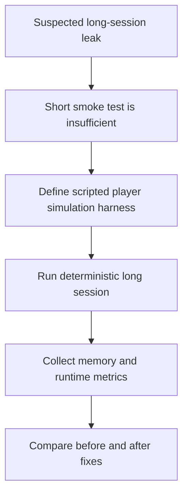

## req_054_define_a_scripted_long_session_runtime_profiling_and_player_simulation_harness - Define a scripted long-session runtime profiling and player-simulation harness
> From version: 0.5.0
> Status: Done
> Understanding: 100%
> Confidence: 98%
> Complexity: High
> Theme: Performance
> Reminder: Update status/understanding/confidence and references when you edit this doc.
> Schema version: 1.0

# Needs
- Add a repeatable way to drive the runtime for tens of seconds or multiple minutes without manual play.
- Make it possible to profile memory and runtime behavior over long sessions rather than only short smoke checks.
- Simulate player inputs through scripted movement sequences so profiling covers real traversal/runtime activity instead of idle screens.
- Support debug safety switches such as temporary invincibility so the scripted session can keep running without dying.
- Produce reproducible profiling scenarios that help confirm or falsify suspected long-session memory leaks.

# Context
The repository already has:
- browser smoke coverage that proves the runtime boots and basic movement works
- a previous runtime memory-growth investigation wave
- a canonical debug scenario shared across runtime, tests, and diagnostics

That is useful, but it still leaves one gap:
- current automation is too short-lived and too shallow to reproduce slower memory-growth symptoms with confidence
- the agent/tooling does not have a durable way to “play” for minutes
- suspected long-session memory problems are therefore difficult to reproduce deterministically

The current browser smoke posture is good at answering:
- does the app boot?
- does the runtime become ready?
- can the player move at all?

It is not yet good at answering:
- does memory continue to climb over 2 to 10 minutes?
- does repeated traversal across the world cause retained state growth?
- does combat/pickup/spawn churn accumulate under continuous play?
- does a fix actually improve long-session stability compared with the same scripted route?

Recommended target posture:
1. Treat “player simulation” as a deterministic runtime-input harness rather than as manual browser play.
2. Introduce scripted runtime-session scenarios such as:
   - move right for 20 seconds
   - move up for 15 seconds
   - alternate directions
   - rotate view while traversing
   - optionally open/close shell controls on schedule
3. Introduce a long-session profiling harness that can:
   - run one scripted scenario for a chosen duration
   - record memory/perf samples over time
   - compare start/end or interval snapshots
4. Keep the scenario deterministic enough that the same run can be replayed after a fix.
5. Add debug/runtime safety switches where needed for profiling-only runs:
   - invincible player or no-death mode
   - optional reduced or fixed hostile pressure
   - optional fixed seed and fixed scenario entry
6. Use a hybrid driver posture:
   - browser-level automation for boot and menu navigation
   - runtime-oriented input injection for the long active session once the run is live
7. Treat profiling outputs as first-class artifacts that can be compared across runs.

Recommended defaults:
- keep this harness separate from the short browser smoke check; the smoke test should stay fast
- support at least one scripted movement timeline that runs beyond the current smoke-test duration
- support profile durations such as `30s`, `2m`, and `5m`
- anchor runs to a fixed seed and a known scenario
- make invincibility available as a profiling/debug-only mode so long runs do not fail just because the player dies
- implement invincibility/no-death as an explicit runtime/debug flag rather than as an implicit side effect
- support spawn postures such as `normal`, `no-spawn`, and `fixed-spawn-pressure` so memory investigations can isolate likely causes
- define scripted input runs through a declarative timeline model rather than hard-wired imperative browser input only
- prefer injected input timelines over ad hoc DOM clicking for most of the session once runtime is active
- collect browser-side signals at intervals such as:
  - JS heap usage when available
  - runtime metrics already exposed by the app
  - optional trace or heap snapshot checkpoints if the tooling supports them
- persist profiling artifacts in a stable output path for comparison between runs
- make sampled metrics artifacts mandatory and heavier snapshots/traces optional
- start by producing comparison-friendly data rather than failing on strict budgets before a stable baseline exists
- keep the harness outside normal CI by default at first, but design it so a later dedicated job can run it
- treat this harness as useful for both memory-leak investigation and longer runtime smoke/regression checks

Scope includes:
- a scripted player-input timeline model for runtime automation
- long-session runtime execution beyond the current smoke-test window
- optional invincibility/no-death debug posture for profiling runs
- collection of memory/performance artifacts over time
- deterministic replay posture for comparing before/after fixes

Scope excludes:
- building a general-purpose game AI player
- replacing the existing short smoke suite
- adding online telemetry services
- shipping invincibility as a player-facing gameplay feature
- broad profiling of unrelated shell-only flows unless needed for a specific scenario

# Acceptance criteria
- AC1: The request defines a scripted player-simulation posture for runtime automation beyond the current short smoke test.
- AC2: The request defines long-session profiling runs over durations meaningfully longer than the current smoke interaction window.
- AC3: The request defines deterministic scenario control through a fixed seed, fixed scenario, or equivalent reproducibility posture.
- AC4: The request defines at least one profiling-safe survival posture such as invincibility or no-death mode so automated sessions can continue running.
- AC5: The request defines collection of browser-side runtime or memory signals over time rather than only one end-state assertion.
- AC6: The request defines this harness as a support tool for memory-leak investigation and regression validation, not as a general-purpose autonomous player.
- AC7: The request stays compatible with the current frontend-only/static delivery posture and repo-native testing tooling.
- AC8: The request defines a hybrid driver model with browser automation for boot and runtime-oriented input injection for the long active session.
- AC9: The request defines profiling artifacts as structured outputs suitable for later comparison between runs.

# Open questions
- Should the harness drive inputs at the browser DOM level or inject runtime control-state timelines more directly?
  Decision: allow browser-level boot/navigation, then prefer a runtime-oriented input timeline once the session is live.
- Should invincibility be the default for long profiling runs?
  Decision: available but scenario-controlled, so profiling can choose between realistic danger and uninterrupted observation.
- Should hostile spawning remain active during profiling?
  Decision: make it scenario-selectable; support at least `normal`, `no-spawn`, and `fixed-spawn-pressure`.
- Should scripted runtime scenarios be imperative code or declarative timelines?
  Decision: declarative timelines first, because they are easier to read, compare, and replay.
- Should this harness live inside the existing browser-smoke script or as a separate profiling runner?
  Decision: separate runner so smoke stays fast and profiling can grow without bloating basic CI validation.
- Should heap snapshots be mandatory?
  Decision: no; start with interval metrics as the mandatory output and keep snapshots/traces optional.
- Should long profiling runs fail on budgets immediately?
  Decision: no; first produce stable comparison data and only add hard failure thresholds once a reliable baseline exists.
- Should the harness run in normal CI from the start?
  Decision: no; keep it outside normal CI initially, but design it so a later dedicated job can run it.

# Definition of Ready (DoR)
- [x] Problem statement is explicit and user impact is clear.
- [x] Scope boundaries (in/out) are explicit.
- [x] Acceptance criteria are testable.
- [x] Dependencies and known risks are listed.

# Companion docs
- Product brief(s): `prod_001_minimal_overlay_and_feedback_for_early_runtime`, `prod_002_readable_world_traversal_and_presence`
- Architecture decision(s): `adr_022_keep_product_meta_flow_shell_owned_while_runtime_state_remains_game_preserved`, `adr_033_adopt_deterministic_movement_oriented_pseudo_physics_instead_of_a_full_physics_engine`
- Request(s): `req_013_define_frontend_testing_strategy_for_rendering_simulation_and_world_logic`, `req_047_define_a_runtime_memory_growth_investigation_and_reduction_wave`

# AI Context
- Summary: Add a repeatable way to drive the runtime for tens of seconds or multiple minutes without manual play.
- Keywords: scripted, long-session, runtime, profiling, and, player-simulation, harness, add
- Use when: Use when framing scope, context, and acceptance checks for Define a scripted long-session runtime profiling and player-simulation harness.
- Skip when: Skip when the work targets another feature, repository, or workflow stage.

# Backlog
- `item_195_define_a_scripted_runtime_player_input_timeline_for_long_session_automation`
- `item_196_define_a_profiling_safe_invincibility_and_survival_posture_for_automated_runtime_runs`
- `item_197_define_a_long_session_browser_profiling_runner_for_memory_and_runtime_metrics`
- `item_198_define_deterministic_runtime_profiling_artifacts_and_comparison_posture`
