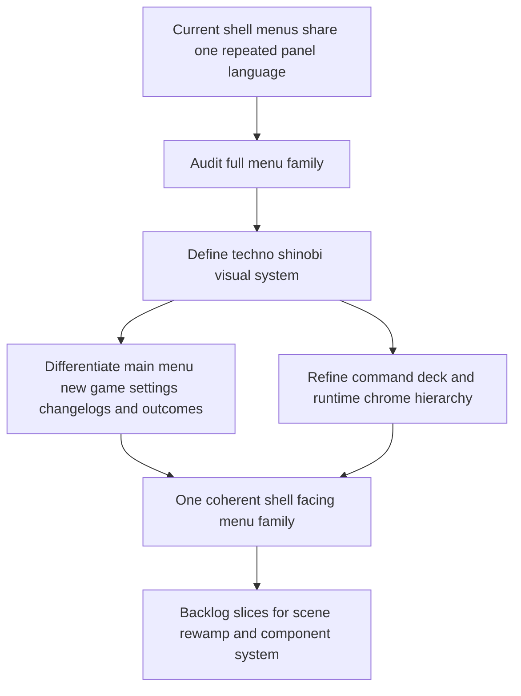

## req_055_rework_all_shell_menus_with_a_techno_shinobi_visual_direction - Rework all shell menus with a techno shinobi visual direction
> From version: 0.3.2
> Status: Draft
> Understanding: 98%
> Confidence: 95%
> Complexity: High
> Theme: UI
> Reminder: Update status/understanding/confidence and references when you edit this doc.

# Needs
- Rework the full shell menu family so `Main menu`, `New game`, `Settings`, `Changelogs`, runtime `Command deck`, and outcome surfaces read as one intentional product UI instead of adjacent tactical-console variants.
- Replace the current mostly shared panel treatment with clearer scene-specific hierarchy, stronger action emphasis, and cleaner separation between navigation, configuration, and runtime-control surfaces.
- Define a deliberate `Techno-shinobi` visual direction for menu and shell-owned surfaces: disciplined, stealthy, synthetic, and high-contrast without drifting into generic glossy cyberpunk.
- Keep the shell readable on desktop and mobile while making the menu family feel more premium, more game-native, and less like a debugging/admin layer wrapped around the runtime.
- Preserve the existing shell/runtime ownership model and menu flows while raising the visual and interaction quality of the entire menu system.

# Context
The repository already has a coherent shell structure:
- a shell-owned `Main menu` and `New game` entry flow
- a runtime `Command deck`
- a dedicated `Settings` scene with desktop-control rebinding
- shell-owned `Changelogs`, `Defeat`, and `Victory` scenes
- a runtime HUD plus diagnostics and inspection overlays

That means the information architecture exists, but the current menu family still reads as an accumulation of related panels instead of one strong product-facing UI system.

Current audit summary:
- the core shell surfaces reuse nearly the same translucent dark card treatment, so `Main menu`, `Settings`, `Changelogs`, and command-deck states do not feel structurally distinct enough
- action hierarchy is often too flat, with many controls sharing the same visual weight even when they do not share the same product importance
- all-caps labels, repeated accent borders, and repeated glassy gradients create atmosphere, but they also make the UI feel more like one debug console pattern repeated everywhere than like a curated game menu family
- the current direction leans toward tactical sci-fi console language, but it has not yet been pushed into a sharper, more ownable identity for Emberwake's menus
- mobile handling exists, but the visual system still depends heavily on stacked bordered cards and repeated panel shells

Observed product/UI issues by surface:
- `Main menu` is functional, but it does not yet feel like a memorable front door or a deliberate return hub
- `New game` works, but the naming flow still reads like a lightweight form inside the same card family rather than as a ceremonial run-entry gate
- `Settings` improved structurally, yet it still visually inherits too much of the same shell chrome as neighboring scenes
- `Changelogs` is readable, but it does not yet feel integrated into the same premium menu language as the rest of the shell
- the runtime `Command deck` is dense and capable, but its hierarchy still leans too much on repeated menu rows and subdued state labels
- `Defeat` and `Victory` use the same general panel language, so outcome-specific emotional tone remains weaker than it should be
- the runtime HUD and adjacent overlays are readable, but they currently feel closer to operational telemetry than to a product-native combat/navigation chrome

Target visual direction:
1. Treat `Techno-shinobi` as a stealth-tech interface language, not as a neon cyberpunk cliche.
2. Emphasize precision, restraint, and ritual:
   - dark ink surfaces
   - narrow luminous edges
   - segmented action blocks
   - controlled ember and cyan signals
   - sharper silhouette language than the current rounded-card family
3. Keep the UI grounded and readable:
   - no glassmorphism-first haze
   - no decorative dashboard filler
   - no fake sci-fi widgets
   - no purple-heavy default cyberpunk palette
4. Differentiate scenes through composition, action emphasis, and tonal pacing rather than only by swapping copy inside the same panel.
5. Preserve current flow logic and shell/runtime ownership while reworking the full menu presentation system.

Recommended first delivery posture:
1. Define one menu-system visual language spanning:
   - `Main menu`
   - `New game`
   - `Settings`
   - `Changelogs`
   - runtime `Command deck`
   - `Defeat` and `Victory`
2. Introduce clearer component roles:
   - navigation rails
   - primary action modules
   - secondary utility rows
   - scene headers
   - quieter metadata treatments
3. Reduce the repeated dependence on one translucent rounded rectangle for every interaction layer.
4. Give each major scene a more deliberate composition:
   - `Main menu` as a front door
   - `New game` as initiation
   - `Settings` as a technical dojo/workbench
   - `Changelogs` as an archive ledger
   - `Command deck` as a field console
   - `Defeat` and `Victory` as emotionally legible outcome states
5. Align the runtime HUD and supporting overlays with the same design family so shell-owned menus and in-run chrome no longer feel visually disconnected.

Recommended defaults for the `Techno-shinobi` posture:
- palette:
  - near-black ink backgrounds
  - charcoal and iron surfaces
  - restrained cyan for system/navigation emphasis
  - ember/orange for decisive actions and danger
  - minimal tertiary glow only when the state truly needs emphasis
- shape language:
  - moderate radii, not pills
  - more segmented frames and rails
  - sharper edge composition than the current soft-card shell
- typography:
  - retain the current font family if it still fits after exploration, but reduce the feeling of constant uppercase shouting
  - reserve uppercase for compact labels and tactical state tags, not for every primary content line
- motion:
  - subtle reveal and emphasis transitions
  - no floaty card hover theatrics
  - no decorative transform-heavy motion language
- mobile:
  - preserve hierarchy without collapsing every section into a repetitive stack of identical floating cards

Scope includes:
- a full audit-backed visual redesign brief for all shell menu surfaces
- a unified `Techno-shinobi` visual language for shell scenes and runtime command/menu chrome
- composition, hierarchy, component, spacing, and interaction-tone updates for the shell menu family
- stronger scene differentiation for `Main menu`, `New game`, `Settings`, `Changelogs`, `Defeat`, and `Victory`
- command-deck hierarchy refinements so runtime controls feel clearer and more intentional
- alignment pass on HUD and adjacent overlays where needed so they fit the same family
- desktop and mobile menu posture validation

Scope excludes:
- rewriting the current shell/runtime ownership model
- changing core save/load/session logic unless a UI presentation edge forces a small clarification
- inventing broad new gameplay systems
- replacing the current content structure with cinematic title-screen spectacle
- turning Emberwake into a generic cyberpunk UI parody
- shipping diagnostics-first chrome as the primary player-facing style

# Acceptance criteria
- AC1: The request defines a full menu-family redesign scope covering `Main menu`, `New game`, `Settings`, `Changelogs`, runtime `Command deck`, and gameplay outcome surfaces.
- AC2: The request defines a `Techno-shinobi` visual direction clearly enough to guide implementation without drifting into generic neon cyberpunk or glossy dashboard cliches.
- AC3: The request defines stronger scene differentiation so major shell scenes no longer feel like copy changes inside one repeated translucent card shell.
- AC4: The request defines a clearer action hierarchy between primary progression actions, secondary utilities, navigation, and runtime-control affordances.
- AC5: The request defines a component-language cleanup that reduces repeated visual treatment across buttons, rows, chips, cards, and panels.
- AC6: The request defines how the runtime `Command deck` should become more legible and more scene-aware without losing current capability.
- AC7: The request defines whether and how runtime HUD and adjacent shell overlays should be visually aligned with the new menu family.
- AC8: The request defines desktop and mobile expectations so the redesign does not collapse into repetitive stacked cards on smaller screens.
- AC9: The request preserves the current shell/runtime ownership model and focuses this wave on visual and interaction-language redesign rather than system-logic rearchitecture.

# Open questions
- How far should the redesign push the current typography?
  Recommended default: keep the existing family if it can carry the new direction, but reduce all-caps saturation and create clearer text-role contrast.
- Should the `Command deck` remain a floating panel or shift toward a more segmented field-console composition?
  Recommended default: keep the runtime-accessible floating posture, but restructure the inside so it reads less like one stacked card list and more like a tactical field module.
- Should `Main menu` remain centered as a single panel?
  Recommended default: no; explore a stronger front-door composition with clearer primary action emphasis and more deliberate spatial identity.
- Should `Settings` stay a generic shell card with embedded sections?
  Recommended default: no; it should feel more like a tuned control bench with explicit grouping and clearer edit-vs-navigation posture.
- How much of the HUD should move with the redesign?
  Recommended default: align its component language, spacing, and signal palette with the menu family, but keep the HUD operational and compact.
- Should `Changelogs` become more archival and editorial than the other scenes?
  Recommended default: yes; keep it in the same family, but with a calmer ledger/archive treatment rather than a combat-control posture.
- Should outcome screens use the same composition as neutral shell scenes?
  Recommended default: no; keep shared DNA, but give `Defeat` and `Victory` stronger tone separation through pacing, contrast, and action framing.

# Definition of Ready (DoR)
- [x] Problem statement is explicit and user impact is clear.
- [x] Scope boundaries (in/out) are explicit.
- [x] Acceptance criteria are testable.
- [x] Dependencies and known risks are listed.

# Companion docs
- Product brief(s): `prod_001_minimal_overlay_and_feedback_for_early_runtime`, `prod_003_high_density_top_down_survival_action_direction`, `prod_005_visual_identity_dark_fantasy_with_synthetic_energy_accents`
- Architecture decision(s): `adr_016_define_shell_scene_state_and_meta_surface_ownership`, `adr_022_keep_product_meta_flow_shell_owned_while_runtime_state_remains_game_preserved`
- Request(s): `req_030_define_a_shell_owned_main_menu_and_new_game_entry_flow`, `req_044_refine_spawn_bootstrap_pause_surface_and_escape_navigation_behaviors`, `req_045_define_a_clearer_and_more_compact_desktop_controls_settings_surface`, `req_051_define_a_shell_surface_cleanup_and_view_relative_movement_polish_wave`

# Backlog
- `item_199_define_a_techno_shinobi_visual_system_for_shell_menus_and_runtime_chrome`
- `item_200_define_a_stronger_front_door_composition_for_main_menu_and_new_game_initiation`
- `item_201_define_a_field_console_command_deck_hierarchy_for_runtime_controls`
- `item_202_define_a_techno_dojo_settings_scene_for_desktop_control_editing`
- `item_203_define_archive_and_outcome_scene_composition_rules_for_changelogs_defeat_and_victory`
- `item_204_define_player_hud_and_shell_overlay_alignment_within_the_techno_shinobi_menu_family`
