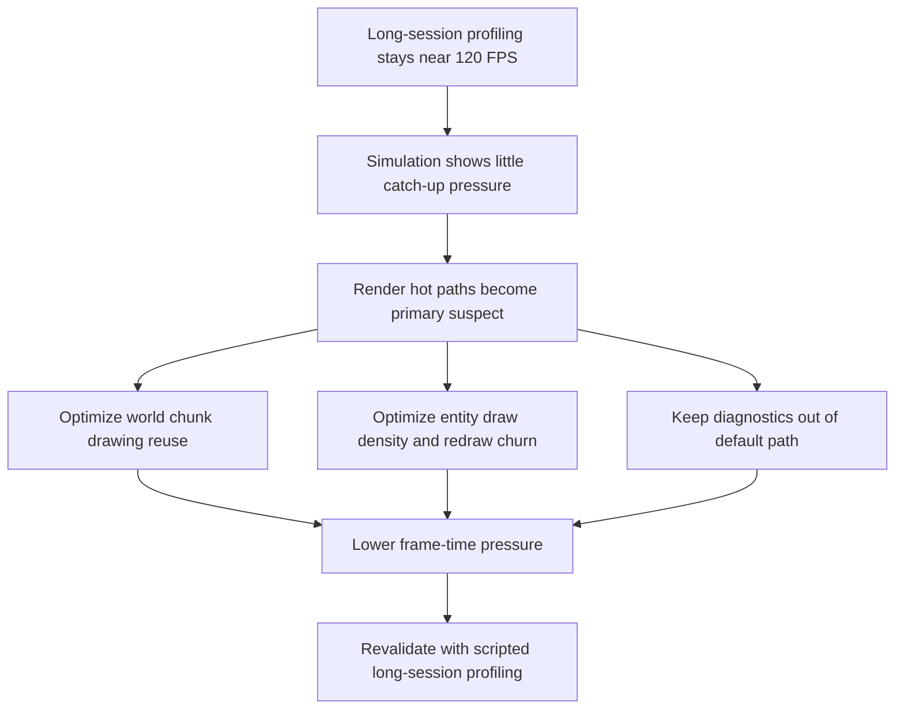

## req_056_define_a_runtime_render_hot_path_optimization_wave_for_world_and_entity_drawing - Define a runtime render hot-path optimization wave for world and entity drawing
> From version: 0.3.2
> Status: Done
> Understanding: 97%
> Confidence: 95%
> Complexity: High
> Theme: Performance
> Reminder: Update status/understanding/confidence and references when you edit this doc.

# Needs
- Reduce the frame-time cost of the player-facing runtime without widening this wave into speculative engine rewrites.
- Prioritize the rendering paths that are most likely consuming the current FPS budget: per-frame entity drawing and per-frame chunk/world drawing.
- Preserve the current gameplay feel, renderer ownership, and shell/runtime split while making the runtime more scalable under normal combat and traversal load.
- Keep diagnostics, debug text, and inspection-only work out of the normal player hot path unless explicitly enabled.
- Produce a repeatable optimization posture that can be validated with the existing long-session profiling harness and browser-side runtime telemetry.

# Context
Recent profiling on 2026-03-23 used the long-session harness introduced by `req_054` and confirmed three important signals:
- `eastbound-drift` for `120s` stayed near `120 FPS` and showed no meaningful simulation distress
- `traversal-baseline` for `120s` stayed near `120 FPS` under normal hostile pressure
- `square-loop` for `120s` also stayed near `120 FPS` while exercising traversal and chunk churn

Observed runtime telemetry across those runs:
- FPS stayed effectively flat around `120`
- catch-up behavior stayed very low
- `maxSimulationStepsLastFrameSinceReady` remained at `1-2`
- recent catch-up ratio stayed at or near `0`

That means the current bottleneck posture does not look like a simulation-step budget crisis. The stronger current hypothesis is:
1. The largest frame-time consumers are in Pixi draw work.
2. The most likely hot paths are:
   - entity drawing in `EntityScene`
   - world/chunk drawing in `WorldScene`
   - diagnostics/debug overlays only when explicitly enabled

Current code evidence:
- [EntityScene.tsx](/Users/alexandreagostini/Documents/emberwake/src/game/entities/render/EntityScene.tsx#L89) redraws every visible entity through `pixiGraphics` callbacks that call `graphics.clear()` and then rebuild circles, strokes, orientation lines, attack arcs, hit reactions, health bars, charge bars, and optional text.
- [EntityScene.tsx](/Users/alexandreagostini/Documents/emberwake/src/game/entities/render/EntityScene.tsx#L281) maps every visible entity to a distinct draw callback every render pass.
- [WorldScene.tsx](/Users/alexandreagostini/Documents/emberwake/src/game/world/render/WorldScene.tsx#L40) redraws chunk base visuals tile by tile.
- [WorldScene.tsx](/Users/alexandreagostini/Documents/emberwake/src/game/world/render/WorldScene.tsx#L100) also redraws the full background every frame, and chunk debug overlays/text are added when diagnostics are enabled.
- [useEntityWorld.ts](/Users/alexandreagostini/Documents/emberwake/src/game/entities/hooks/useEntityWorld.ts#L65) computes overlap diagnostics from tracked entities, which relies on the O(n^2) sweep in [entityOccupancy.ts](/Users/alexandreagostini/Documents/emberwake/src/game/entities/model/entityOccupancy.ts#L36). This is appropriate for diagnostics, but it should stay off the normal player path.

The practical conclusion is:
- the runtime is currently healthy enough to ship at the current content scale
- but future content growth is more likely to be constrained by render cost than by simulation cadence
- the next performance wave should therefore target render hot paths first, not simulation architecture first

Recommended target posture:
1. Treat per-frame redraw of largely static world visuals as the first optimization target.
2. Treat per-entity `Graphics` redraw density as the second optimization target.
3. Keep diagnostics and debug-only overlays explicitly segmented from the normal player render path.
4. Preserve the current deterministic runtime model and gameplay semantics while reducing draw churn.
5. Validate improvements with the existing scripted long-session harness rather than with subjective “feels faster” checks.

Recommended defaults:
- cache or prerender static chunk visuals where possible instead of rebuilding tile geometry every frame
- avoid redrawing entity sub-elements that do not need to change every frame
- simplify or split entity visual layers so expensive transient effects stay isolated from stable shapes
- keep combat readability, but prefer cheaper representations over repeated ornamental draw work
- ensure debug labels, chunk overlays, and overlap diagnostics stay behind explicit diagnostics gating
- optimize for the normal player surface first, not the diagnostics surface
- validate with `eastbound-drift`, `traversal-baseline`, and `square-loop` before/after comparisons
- treat memory improvements from reduced draw churn as a secondary benefit, not the sole success metric

Scope includes:
- optimization of player-facing runtime render hot paths
- world/chunk visual caching or reuse strategies
- entity drawing simplification, segmentation, or redraw-frequency reduction
- ensuring diagnostics-only work is isolated from the default player path
- browser-side validation of frame pacing before and after changes

Scope excludes:
- broad simulation-system rewrites
- unrelated shell/menu/UI polish
- replacing Pixi or changing the renderer stack
- speculative gameplay redesign justified only by performance anxiety
- turning diagnostics views into the optimization baseline for the player-facing runtime

# Acceptance criteria
- AC1: The request defines entity rendering and world/chunk rendering as the primary optimization targets for this wave.
- AC2: The request explicitly distinguishes render hot-path work from simulation-step optimization and explains why render is currently the higher-value target.
- AC3: The request defines a strategy to reduce or reuse static world/chunk drawing instead of rebuilding chunk visuals every frame.
- AC4: The request defines a strategy to reduce per-entity draw cost while preserving essential gameplay readability.
- AC5: The request defines diagnostics/debug overlays as explicitly gated work that should not burden the default player-facing runtime.
- AC6: The request preserves the current renderer stack and does not widen into speculative engine replacement or unrelated architectural churn.
- AC7: The request defines before/after validation through the existing scripted profiling scenarios and runtime telemetry.
- AC8: The request defines success in terms of lower frame-time pressure and healthier scalability, not just bundle size or startup timing.

# Open questions
- Should chunk visuals be cached as generated geometry, render textures, or another bounded prerender form?
  Recommended default: prefer the simplest bounded reuse posture that removes tile-by-tile redraw from the steady-state frame loop.
- Should entity visuals be split into stable and transient layers?
  Recommended default: yes; stable body shapes should be cheaper to keep around than attack arcs, hit flashes, and changing bars.
- Should health/charge bars always stay live for all combatants?
  Recommended default: keep readability, but allow cheaper or more conditional rendering if profiling shows bars are disproportionately expensive.
- Should the full-screen background fill remain a per-frame draw?
  Recommended default: revisit it only after chunk and entity hot paths, because those are more likely to dominate.
- Should diagnostics overlap detection stay computed continuously while diagnostics are open?
  Recommended default: yes if needed for diagnostics, but never on the normal player path and never as a hidden background cost.
- Should this wave also claim memory-growth reduction?
  Recommended default: only as a secondary effect; the primary framing should remain frame-time and render scalability.

# Definition of Ready (DoR)
- [x] Problem statement is explicit and user impact is clear.
- [x] Scope boundaries (in/out) are explicit.
- [x] Acceptance criteria are testable.
- [x] Dependencies and known risks are listed.

# Companion docs
- Product brief(s): `prod_001_minimal_overlay_and_feedback_for_early_runtime`, `prod_002_readable_world_traversal_and_presence`
- Architecture decision(s): `adr_002_separate_react_shell_from_pixi_runtime_ownership`, `adr_019_keep_engine_pixi_as_adapter_and_game_as_runtime_scene_composer`, `adr_025_keep_shell_chrome_event_driven_and_sample_diagnostics_off_the_runtime_hot_path`, `adr_028_budget_player_runtime_and_debug_visuals_as_separate_render_modes`, `adr_033_adopt_deterministic_movement_oriented_pseudo_physics_instead_of_a_full_physics_engine`, `adr_037_reuse_player_runtime_chunk_base_visuals_through_a_bounded_prerender_cache`, `adr_038_split_entity_player_rendering_into_stable_geometry_and_transient_combat_overlays`
- Request(s): `req_035_define_a_runtime_hot_path_optimization_wave_for_pseudo_physics_and_world_queries`, `req_047_define_a_runtime_memory_growth_investigation_and_reduction_wave`, `req_054_define_a_scripted_long_session_runtime_profiling_and_player_simulation_harness`

# Backlog
- `item_205_define_a_bounded_chunk_visual_reuse_strategy_for_player_runtime_world_rendering`
- `item_206_define_a_split_entity_render_layer_posture_for_stable_shapes_and_transient_combat_fx`
- `item_207_define_a_stricter_default_player_path_for_runtime_diagnostics_and_overlap_work`
- `item_208_define_a_before_after_runtime_profiling_matrix_for_render_hot_path_changes`

# Outcome
- The wave implemented a lower-risk world-render reuse posture by keeping chunk base visuals in local chunk space with stable retained draw callbacks instead of rebuilding equivalent tile geometry every steady-state frame.
- Entity rendering now uses local coordinates inside positioned containers, keeps pickup visuals on a memoized stable path, and makes stable versus transient combat concerns explicit without expanding the display tree into a heavier multi-layer graph.
- Default player runtime no longer pays `entitiesByChunk` and overlap-detection costs unless diagnostics are explicitly enabled.
- Validation now compares the same scripted scenarios before and after render changes using the long-session harness, with the most important result being a strong memory improvement under `traversal-baseline` and `square-loop`.
- A more aggressive off-screen chunk warm-cache experiment was evaluated and rejected during the wave because it regressed `eastbound-drift`; the accepted implementation keeps the simpler retained visible-chunk posture.
