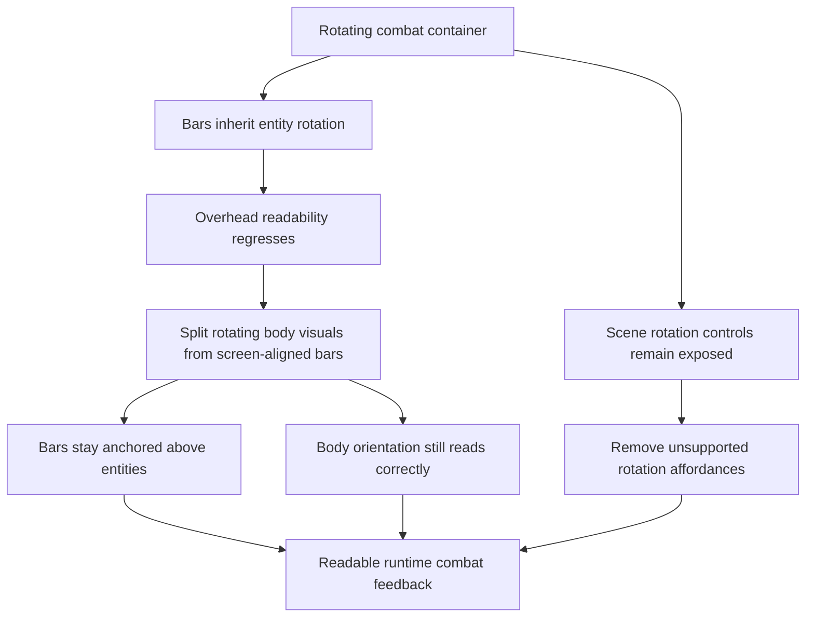

## req_057_define_a_screen_aligned_progress_bar_posture_for_runtime_entities - Define a screen-aligned progress-bar posture for runtime entities
> From version: 0.4.0
> Status: Done
> Understanding: 100%
> Confidence: 98%
> Complexity: Low
> Theme: UI
> Reminder: Update status/understanding/confidence and references when you edit this doc.

# Needs
- Remove the current presentation regression where combat progress bars visually rotate with the entity body.
- Keep health and attack-charge bars anchored above the entity while preserving a screen-aligned, easy-to-read orientation during movement and turning.
- Preserve the runtime render optimization gains from `0.4.0` instead of fixing this readability issue by reopening broader render churn or undoing the local-space entity render posture.
- Keep combat readability clear for both player and hostiles without widening this request into a larger HUD or combat-VFX redesign.
- Disable scene-rotation controls and remove their editing affordances from `Settings` so player-facing controls no longer expose a camera-rotation path that is not meant to stay active.

# Context
`0.4.0` introduced a runtime render hot-path optimization pass that moved combat-entity rendering into positioned local containers. That posture improved render structure and avoided some unnecessary world-space redraw churn, but it also introduced a visible readability regression:

- overhead progress bars now rotate when the entity rotates
- this makes health and charge state feel physically attached to body orientation instead of functioning as stable player-facing feedback
- the issue is especially visible when an entity pivots in place or quickly changes movement direction

Current code evidence:
- [EntityScene.tsx](/Users/alexandreagostini/Documents/emberwake/src/game/entities/render/EntityScene.tsx#L225) draws health and charge bars inside the same combat-entity graphics draw path as the rotating body geometry.
- [EntityScene.tsx](/Users/alexandreagostini/Documents/emberwake/src/game/entities/render/EntityScene.tsx#L343) mounts combat visuals inside a `pixiContainer` that rotates with `entity.orientation`.
- the current implementation keeps debug labels upright by applying an inverse rotation, but the progress bars do not receive equivalent treatment

The user-facing problem is straightforward:
1. body orientation should rotate with the entity
2. attack cone effects may rotate with the entity
3. overhead progress bars should remain horizontally readable to the player
4. scene-rotation controls should no longer be available to the player in runtime or in `Settings`

Recommended posture:
1. Treat overhead progress bars as player-facing readability chrome, not as body-attached geometry.
2. Keep bars spatially attached above the entity's world position.
3. Keep bars screen-aligned while the entity rotates beneath them.
4. Disable scene rotation as a player-editable control surface and remove it from the settings posture rather than carrying a half-supported camera-rotation affordance.
5. Preserve the rest of the local-space combat rendering posture unless a smaller split is needed to isolate bars from rotating geometry.
6. Prefer the lightest implementation that restores readability without introducing new unnecessary display-tree churn.

Recommended defaults:
- keep the body, hit reaction, and orientation line in the rotating entity layer
- keep attack-arc visuals rotating with the entity when appropriate
- move health and charge bars into a non-rotating child or sibling render layer
- preserve current bar sizing, color semantics, and vertical offset unless implementation reveals a specific readability issue
- remove scene-rotation bindings from the editable desktop controls surface and disable any corresponding runtime input handling exposed to players
- do not widen this request into general combat-UI redesign, nameplate return, or additional overhead widgets

Scope includes:
- defining the correct presentation contract for overhead health and charge bars on combat entities
- clarifying the separation between rotating combat geometry and non-rotating player-facing progress indicators
- restoring readable overhead bars for the player and hostile entities
- disabling scene-rotation controls as a supported player-facing interaction
- removing scene-rotation affordances from `Settings`
- preserving the current runtime render optimization posture as much as possible

Scope excludes:
- redesigning the entire entity presentation system
- changing combat numbers, balance, or attack cadence
- reintroducing removed nameplates or level labels above entities
- broad HUD, menu, or shell chrome changes
- undoing `req_056` optimizations unless a narrower targeted adjustment cannot solve the issue
- reopening a broader camera-system redesign beyond removing unsupported player rotation controls

# Acceptance criteria
- AC1: The request explicitly defines overhead health and charge bars as screen-aligned readability elements rather than rotating combat geometry.
- AC2: The request preserves bar anchoring above the entity while preventing the bars from rotating with entity orientation.
- AC3: The request preserves rotating body-facing visuals such as orientation and attack-cone presentation where appropriate.
- AC4: The request defines scene rotation as no longer supported through player-facing controls and settings affordances.
- AC5: The request keeps scope limited to this runtime entity-presentation issue plus removal of unsupported scene-rotation controls, and does not widen into unrelated HUD or shell redesign.
- AC6: The request preserves the intent of the `0.4.0` entity-render optimization posture and avoids a broad rollback of local-space rendering.
- AC7: The request defines the expected behavior for both player and hostile combatants.

# Open questions
- Should bars live in a sibling container or use inverse rotation inside the same rotated branch?
  Recommended default: use the smallest split that keeps bars screen-aligned without making the scene graph heavier than necessary.
- Should the attack arc and hit reaction remain grouped with the body?
  Recommended default: yes; those are orientation-driven combat signals, unlike the bars.
- Should pickup entities or any non-combat entities gain comparable overhead presentation?
  Recommended default: no; this request is only about existing combat progress bars.
- Should the vertical offset or width of the bars be revisited while fixing the rotation issue?
  Recommended default: no unless implementation reveals an obvious overlap or readability defect.
- Should scene rotation remain available behind a hidden shortcut or diagnostics-only path?
  Recommended default: no for player-facing controls; remove it from supported settings and runtime input unless a later request deliberately restores it under a different contract.

# Definition of Ready (DoR)
- [x] Problem statement is explicit and user impact is clear.
- [x] Scope boundaries (in/out) are explicit.
- [x] Acceptance criteria are testable.
- [x] Dependencies and known risks are listed.

# Companion docs
- Product brief(s): `prod_001_minimal_overlay_and_feedback_for_early_runtime`, `prod_003_high_density_top_down_survival_action_direction`
- Architecture decision(s): `adr_025_keep_shell_chrome_event_driven_and_sample_diagnostics_off_the_runtime_hot_path`, `adr_028_budget_player_runtime_and_debug_visuals_as_separate_render_modes`, `adr_038_split_entity_player_rendering_into_stable_geometry_and_transient_combat_overlays`
- Request(s): `req_050_define_a_main_menu_polish_and_first_crystal_xp_progression_wave`, `req_056_define_a_runtime_render_hot_path_optimization_wave_for_world_and_entity_drawing`

# Backlog
- `item_209_define_a_screen_aligned_overhead_progress_bar_posture_for_combat_entities`
- `item_210_remove_scene_rotation_controls_from_supported_player_input_and_settings`
- `item_211_define_targeted_regression_validation_for_entity_bar_alignment_and_rotation_control_removal`

# Outcome
- Combat health and charge bars now stay horizontally readable above entities while body-facing geometry continues to rotate with entity orientation.
- Scene-rotation controls are no longer exposed through supported player-facing desktop bindings or the `Settings` surface.
- Persisted runtime camera rotation is normalized back to the default posture on session load so older rotated local state does not strand the player after the control removal.
- Delivery was orchestrated through `task_049_orchestrate_screen_aligned_entity_feedback_and_scene_rotation_control_removal`, and the linked backlog slices `item_209` through `item_211` are complete.
