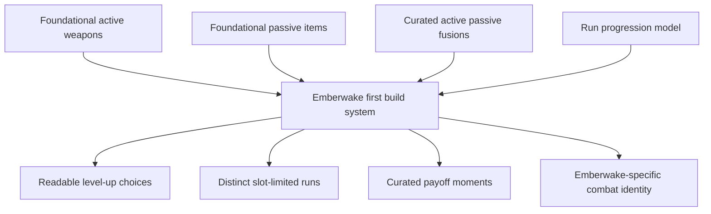

## req_058_define_a_foundational_survivor_build_system_for_weapons_passives_fusions_and_run_progression - Define a foundational survivor build system for weapons passives fusions and run progression
> From version: 0.4.0
> Status: Draft
> Understanding: 98%
> Confidence: 97%
> Complexity: High
> Theme: Gameplay
> Reminder: Update status/understanding/confidence and references when you edit this doc.

# Needs
- Define Emberwake’s first coherent survivor-like build system instead of continuing to add combat features as disconnected runtime mechanics.
- Establish one implementation-facing wave that links foundational active weapons, foundational passive items, curated active + passive fusions, and the run-level progression loop that delivers them.
- Copy the proven role grammar of early survivor-likes for speed and readability while changing naming, fantasy, visual language, and tuned behavior so the result reads as Emberwake rather than as a direct clone.
- Turn the current frontal automatic attack into the first member of a larger weapon family instead of leaving it as an isolated one-off attack.
- Give future requests and implementation work a stable build-language baseline before level-up UI, progression rewards, and larger content expansion start fragmenting.

# Context
The repository now has four aligned product briefs that together define the intended direction:
- [prod_006_foundational_survivor_weapon_roster_for_emberwake.md](/Users/alexandreagostini/Documents/emberwake/logics/product/prod_006_foundational_survivor_weapon_roster_for_emberwake.md) establishes the active-weapon posture: copy role grammar, not names, and treat the current attack as the Emberwake equivalent of a `Whip-like` starter.
- [prod_007_foundational_passive_item_direction_for_emberwake.md](/Users/alexandreagostini/Documents/emberwake/logics/product/prod_007_foundational_passive_item_direction_for_emberwake.md) establishes passives as build-shaping support items rather than filler stats.
- [prod_008_active_passive_fusion_direction_for_emberwake.md](/Users/alexandreagostini/Documents/emberwake/logics/product/prod_008_active_passive_fusion_direction_for_emberwake.md) establishes curated active + passive fusion as the payoff layer.
- [prod_009_level_up_slots_and_run_progression_model_for_emberwake.md](/Users/alexandreagostini/Documents/emberwake/logics/product/prod_009_level_up_slots_and_run_progression_model_for_emberwake.md) establishes the run-progression defaults: one starting weapon, `6` active slots, `6` passive slots, `3` level-up choices, and chest-like rewards as likely fusion payoff triggers.

Taken together, these briefs already answer the product-level “why.” What is still missing is the implementation-facing request that turns them into one delivery wave.

Current practical situation:
- the runtime already supports a first automatic frontal attack
- the game already has XP and early progression foundations
- the shell and HUD already support combat-facing UI growth better than they did in earlier versions
- but Emberwake still lacks a coherent build grammar spanning:
  - multiple active weapons
  - passive-item support choices
  - slot-limited build composition
  - fusion payoff moments
  - controlled run progression logic

Without that unified wave, implementation risks drifting into:
- weapons without passives
- passives without payoff
- fusions without a stable acquisition model
- level-up choices without clear pool or slot rules
- content added faster than the player can understand the system

Recommended delivery posture:
1. Implement the first foundational build grammar as one coherent product system, not as four unrelated features.
2. Keep the first content wave intentionally small and legible.
3. Prefer genre-proven defaults for acquisition and slot rules.
4. Spend originality on naming, fantasy, presentation, tuning, and curated combinations.
5. Treat readability and build clarity as more important than novelty in the first system pass.

Recommended defaults:
- one starting active weapon at run start
- the current frontal attack adapted into the first Emberwake `Whip-like` equivalent
- first-wave active roster of roughly `6-8` weapons
- first-wave passive roster of roughly `6-8` items
- a small curated fusion set, likely `4-6` pairings max in the first meaningful wave
- `6` active slots and `6` passive slots
- `3` level-up choices per standard level-up
- new actives and passives favored while slots remain open
- upgrades favored more heavily once a build is assembled
- fusions requiring an owned active, an owned passive key, and sufficient upgrade investment
- chest-like rewards used as likely fusion-trigger or upgrade-payoff moments

Scope includes:
- defining the first implementation wave for active weapons, passive items, fusions, and run-progression rules as one coherent build system
- mapping the current frontal attack into the first Emberwake foundational weapon role
- defining the starter content posture for the first active and passive rosters
- defining slot counts, level-up choice posture, and progression pool expectations
- defining the first curated fusion posture and the readiness constraints required for it
- defining how naming and identity should avoid direct-copy perception while preserving proven genre readability

Scope excludes:
- finalizing the full long-term roster for all future content
- designing a permanent unlock tree or broad meta-progression in this wave
- specifying every exact numeric tuning value or every exact fusion recipe immediately
- creating a combinatorial fusion matrix where everything combines with everything
- inventing a radically new progression grammar before the baseline survivor loop is proven

# Acceptance criteria
- AC1: The request defines one coherent first-wave build system scope covering active weapons, passive items, curated fusions, and run progression rather than treating them as unrelated features.
- AC2: The request explicitly adopts a survivor-like foundational grammar while requiring Emberwake-specific naming, fantasy, and presentation.
- AC3: The request defines the current frontal automatic attack as the first foundational active weapon and places it in a `Whip-like` starter role after adaptation.
- AC4: The request defines first-wave roster posture for both actives and passives at a deliberately small, implementation-friendly scale.
- AC5: The request defines separate active and passive slots plus a first default level-up choice posture for the run loop.
- AC6: The request defines curated active + passive fusions as a payoff layer rather than as a fully combinatorial system.
- AC7: The request defines fusion readiness and progression expectations clearly enough to guide later backlog slicing without requiring all exact tuning values now.
- AC8: The request keeps scope focused on the first foundational build system and does not widen into full meta-progression or exhaustive content planning.

# Open questions
- Should the first playable wave ship the full intended `6-8 / 6-8 / 4-6` posture immediately, or should it land in smaller staged slices under one shared system request?
  Recommended default: stage delivery in slices, but keep one shared request so architecture and product language remain coherent.
- Should the first character always start with the same weapon, or should a later character layer introduce different starters?
  Recommended default: start with one standardized starter weapon until the baseline build loop is proven.
- How many active weapons should have fusions in the first implementation?
  Recommended default: only a subset; enough to prove the system without making balancing and communication messy.
- Should chest-like rewards only matter for upgrades and fusions, or also occasionally grant new content choices?
  Recommended default: keep them primarily as payoff/upgrade moments at first.
- How visible should fusion-readiness information be in the early player UI?
  Recommended default: visible enough to be understandable, but not so explicit that the build loop becomes a spoiler-heavy checklist screen.

# Definition of Ready (DoR)
- [x] Problem statement is explicit and user impact is clear.
- [x] Scope boundaries (in/out) are explicit.
- [x] Acceptance criteria are testable.
- [x] Dependencies and known risks are listed.

# Companion docs
- Product brief(s): `prod_001_minimal_overlay_and_feedback_for_early_runtime`, `prod_003_high_density_top_down_survival_action_direction`, `prod_005_visual_identity_dark_fantasy_with_synthetic_energy_accents`, `prod_006_foundational_survivor_weapon_roster_for_emberwake`, `prod_007_foundational_passive_item_direction_for_emberwake`, `prod_008_active_passive_fusion_direction_for_emberwake`, `prod_009_level_up_slots_and_run_progression_model_for_emberwake`
- Architecture decision(s): `adr_019_keep_engine_pixi_as_adapter_and_game_as_runtime_scene_composer`, `adr_033_adopt_deterministic_movement_oriented_pseudo_physics_instead_of_a_full_physics_engine`, `adr_038_split_entity_player_rendering_into_stable_geometry_and_transient_combat_overlays`, `adr_039_structure_the_first_survivor_build_loop_around_separate_active_and_passive_slots`, `adr_040_use_curated_active_passive_fusions_as_the_foundational_build_payoff_layer`
- Request(s): `req_050_define_a_main_menu_polish_and_first_crystal_xp_progression_wave`

# Backlog
- `item_212_define_a_first_foundational_active_weapon_roster_and_adapt_the_current_attack_into_the_starter_weapon`
- `item_213_define_a_first_foundational_passive_item_roster_with_clear_fusion_key_families`
- `item_214_define_a_slot_limited_level_up_and_run_reward_model_for_build_growth`
- `item_215_define_a_curated_first_wave_of_active_passive_fusions_and_readiness_rules`
- `item_216_define_player_facing_build_choice_and_fusion_payoff_presentation_for_the_first_survivor_loop`
- `item_217_define_targeted_validation_for_the_foundational_survivor_build_system`
