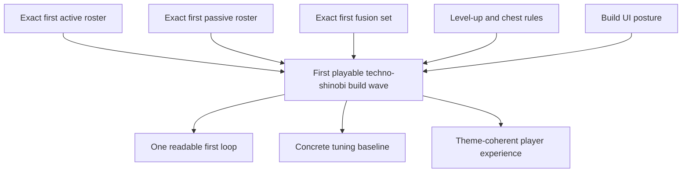

## req_059_define_a_first_playable_techno_shinobi_build_content_wave - Define a first playable techno-shinobi build content wave
> From version: 0.4.0
> Status: Draft
> Understanding: 98%
> Confidence: 97%
> Complexity: High
> Theme: Gameplay
> Reminder: Update status/understanding/confidence and references when you edit this doc.

# Needs
- Freeze the first exact content package for Emberwake’s survivor-like build loop instead of staying at abstract product direction.
- Turn the new build-system foundation into one small, implementable techno-shinobi wave with concrete weapons, passives, fusions, level-up rules, chest rules, and player-facing build presentation.
- Lock the first pass to a single-character baseline and a bounded roster so tuning and UI can converge before the system expands.
- Ensure the first content set reads as `techno-shinobi` across naming, role lines, fusion payoffs, and player-facing presentation.

# Context
The project now has the architectural and product foundation for a survivor-like build loop:
- [prod_006_foundational_survivor_weapon_roster_for_emberwake.md](/Users/alexandreagostini/Documents/emberwake/logics/product/prod_006_foundational_survivor_weapon_roster_for_emberwake.md) defines the foundational active-weapon direction.
- [prod_007_foundational_passive_item_direction_for_emberwake.md](/Users/alexandreagostini/Documents/emberwake/logics/product/prod_007_foundational_passive_item_direction_for_emberwake.md) defines passive items as build-shaping support.
- [prod_008_active_passive_fusion_direction_for_emberwake.md](/Users/alexandreagostini/Documents/emberwake/logics/product/prod_008_active_passive_fusion_direction_for_emberwake.md) defines curated active + passive fusions as the payoff layer.
- [prod_009_level_up_slots_and_run_progression_model_for_emberwake.md](/Users/alexandreagostini/Documents/emberwake/logics/product/prod_009_level_up_slots_and_run_progression_model_for_emberwake.md) defines the survivor-like progression defaults.
- [prod_010_first_playable_techno_shinobi_build_content_and_progression_defaults.md](/Users/alexandreagostini/Documents/emberwake/logics/product/prod_010_first_playable_techno_shinobi_build_content_and_progression_defaults.md) now freezes the first exact content and progression defaults for a playable v1 loop.

The project also has the supporting architecture direction:
- [adr_039_structure_the_first_survivor_build_loop_around_separate_active_and_passive_slots.md](/Users/alexandreagostini/Documents/emberwake/logics/architecture/adr_039_structure_the_first_survivor_build_loop_around_separate_active_and_passive_slots.md)
- [adr_040_use_curated_active_passive_fusions_as_the_foundational_build_payoff_layer.md](/Users/alexandreagostini/Documents/emberwake/logics/architecture/adr_040_use_curated_active_passive_fusions_as_the_foundational_build_payoff_layer.md)
- [adr_041_lock_the_first_playable_survivor_content_wave_to_one_character_and_a_small_curated_techno_shinobi_roster.md](/Users/alexandreagostini/Documents/emberwake/logics/architecture/adr_041_lock_the_first_playable_survivor_content_wave_to_one_character_and_a_small_curated_techno_shinobi_roster.md)

What is still missing is the implementation-facing wave that turns those decisions into real runtime behavior and UI.

This request should therefore define one bounded first-pass delivery that includes:
- the exact first `6` active weapons
- the exact first `6` passive items
- the exact first `4` curated fusions
- the first starting loadout rule
- the first exact item-level caps
- the first exact level-up pool and chest posture
- the first player-facing build-choice and build-tracking UI posture

The intent is not to solve long-term metagame. The intent is to ship one clear, testable, first fun loop.

Recommended implementation posture:
1. Keep the first content wave intentionally small.
2. Keep all first-wave content unlocked by default.
3. Use the current frontal attack as the basis for `Ash Lash`.
4. Treat techno-shinobi naming and presentation as a requirement, not garnish.
5. Tune for readability and proof-of-fun before tuning for maximal content variety.

# Acceptance criteria
- AC1: The request defines one bounded first-pass build-content wave with exact first active weapons, passive items, and curated fusions.
- AC2: The request fixes the first pass to one starter character baseline and one starter weapon rather than widening into multiple character variants.
- AC3: The request adopts the concrete techno-shinobi naming and identity posture from `prod_010` and requires that runtime presentation align with it.
- AC4: The request defines exact first-pass level caps for active and passive items plus the starter loadout rule.
- AC5: The request defines first-pass level-up pool rules and chest rules tightly enough to implement a playable build loop.
- AC6: The request defines a player-facing build-choice and build-tracking posture that makes new picks, upgrades, and fusion readiness legible.
- AC7: The request explicitly excludes meta-progression, unlock trees, and broader character diversity from this wave.
- AC8: The request defines a staged implementation posture that supports early playable validation before full tuning polish.

# Open questions
- Should `Cinder Arc` and `Null Canister` both ship in the first six actives, or should one be deferred if implementation complexity is too high?
  Recommended default: keep both in the target roster, but allow one to slide to a follow-up slice if the first playable loop lands faster with five fully working actives.
- Should `Vacuum Tabi` ship in the first passive six, or should the first passives stay purely combat-facing?
  Recommended default: keep `Vacuum Tabi` in the first set because it helps teach run economy and creates one non-pure-damage decision.
- How explicit should fusion-readiness communication be in the first UI pass?
  Recommended default: show restrained readiness markers on owned actives and related level-up cards, without a full recipe encyclopedia.

# Definition of Ready (DoR)
- [x] Problem statement is explicit and user impact is clear.
- [x] Scope boundaries (in/out) are explicit.
- [x] Acceptance criteria are testable.
- [x] Dependencies and known risks are listed.

# Companion docs
- Product brief(s): `prod_003_high_density_top_down_survival_action_direction`, `prod_005_visual_identity_dark_fantasy_with_synthetic_energy_accents`, `prod_006_foundational_survivor_weapon_roster_for_emberwake`, `prod_007_foundational_passive_item_direction_for_emberwake`, `prod_008_active_passive_fusion_direction_for_emberwake`, `prod_009_level_up_slots_and_run_progression_model_for_emberwake`, `prod_010_first_playable_techno_shinobi_build_content_and_progression_defaults`
- Architecture decision(s): `adr_039_structure_the_first_survivor_build_loop_around_separate_active_and_passive_slots`, `adr_040_use_curated_active_passive_fusions_as_the_foundational_build_payoff_layer`, `adr_041_lock_the_first_playable_survivor_content_wave_to_one_character_and_a_small_curated_techno_shinobi_roster`
- Request(s): `req_058_define_a_foundational_survivor_build_system_for_weapons_passives_fusions_and_run_progression`

# Backlog
- `item_218_define_the_first_exact_techno_shinobi_active_roster_and_starter_weapon_delivery`
- `item_219_define_the_first_exact_techno_shinobi_passive_roster_and_fusion_key_delivery`
- `item_220_define_first_pass_level_up_pool_and_chest_rules_for_the_techno_shinobi_build_loop`
- `item_221_define_the_first_curated_techno_shinobi_fusion_delivery_and_readiness_rules`
- `item_222_define_player_facing_level_up_and_build_tracking_ui_for_the_first_techno_shinobi_loop`
- `item_223_define_first_playable_tuning_and_validation_for_the_techno_shinobi_build_wave`
