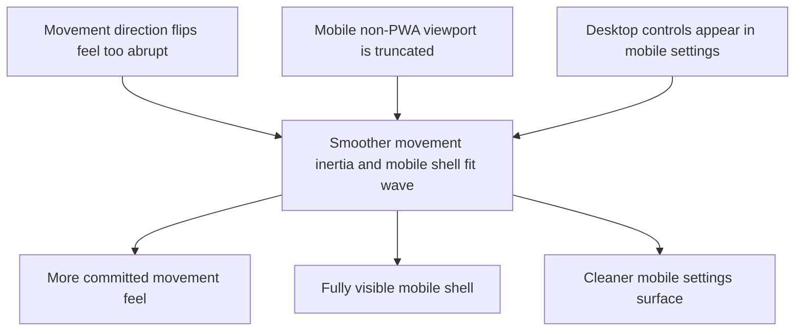

## req_060_define_a_smoother_movement_inertia_and_mobile_shell_fit_wave - Define a smoother movement inertia and mobile shell fit wave
> From version: 0.4.0
> Status: Draft
> Understanding: 98%
> Confidence: 97%
> Complexity: Medium
> Theme: Gameplay
> Reminder: Update status/understanding/confidence and references when you edit this doc.

# Needs
- Reduce the current brutality of player movement direction changes so the avatar cannot snap between opposite directions with zero expressive cost.
- Make the mobile web experience fully visible even before the game is installed as a PWA, with no bottom truncation or clipped viewport area.
- Remove or hide desktop-only control settings when the shell is being used on mobile, because they do not belong in the mobile settings surface.

# Context
The current runtime movement posture is responsive, but it is still too binary when the player flips direction. The result is a left-right twitch pattern that feels too nervous and too frictionless for the desired combat language.

What the project needs here is not heavy physics. It needs a bounded movement-inertia posture:
- input should still feel responsive
- the player should still retain control precision
- but rapid direction reversals should incur a small drift or recovery effect
- movement should read as committed rather than instantly snapped

At the same time, the mobile shell still has two practical problems:
- outside of installed PWA mode, the page can be partially truncated at the bottom on some mobile viewports
- the `Settings` surface still exposes desktop-control concerns that should not be shown on mobile

These issues belong in one bounded wave because they all affect the feel and usability of the mobile and runtime surface, but they should remain scoped:
- one movement-feel correction
- one viewport-fit correction
- one mobile settings cleanup

This request should not widen into a full camera rework, a full responsive-shell redesign, or a broad control-system rewrite.

Recommended posture:
1. Add a light directional inertia or drift rule to player movement, especially on hard reversals.
2. Make the shell use safe mobile viewport rules so the full page remains visible before PWA installation.
3. Hide desktop-control editing from mobile settings entirely rather than trying to make it partially usable there.
4. When implementing shell and settings UI changes in this wave, explicitly use `logics-ui-steering` so responsive cleanup preserves the intended shell language and avoids generic mobile patches.

# Acceptance criteria
- AC1: The request defines a bounded movement-inertia correction that reduces brutal left-right snapping without turning the game into a heavy-momentum movement model.
- AC2: The request defines the need for hard direction reversals to incur a visible but controlled drift or recovery effect.
- AC3: The request defines a mobile viewport-fit correction so the page remains fully visible outside installed PWA mode, including bottom-edge content.
- AC4: The request defines that desktop-control settings must not be shown or accessible on mobile.
- AC5: The request keeps scope bounded and explicitly avoids widening into a full movement-system rewrite or full shell redesign.

# Open questions
- Should the first-pass inertia model be purely simulation-level, purely presentation-level, or a small hybrid?
  Recommended default: use a small simulation-level correction so gameplay feel, not only visuals, changes.
- Should the drift effect apply only to reversal cases, or more generally to all direction changes?
  Recommended default: bias it toward strong reversals first so responsiveness remains high for normal steering.
- Should mobile hide the desktop-control section entirely or replace it with explanatory copy?
  Recommended default: hide it entirely on mobile for the first pass.

# Definition of Ready (DoR)
- [x] Problem statement is explicit and user impact is clear.
- [x] Scope boundaries (in/out) are explicit.
- [x] Acceptance criteria are testable.
- [x] Dependencies and known risks are listed.

# Companion docs
- Product brief(s): `prod_001_minimal_overlay_and_feedback_for_early_runtime`, `prod_003_high_density_top_down_survival_action_direction`, `prod_005_visual_identity_dark_fantasy_with_synthetic_energy_accents`
- Architecture decision(s): `adr_033_adopt_deterministic_movement_oriented_pseudo_physics_instead_of_a_full_physics_engine`
- Request(s): `req_029_define_a_lightweight_settings_scene_with_desktop_control_customization`, `req_051_define_a_shell_surface_cleanup_and_view_relative_movement_polish_wave`

# Backlog
- `item_224_define_a_light_directional_inertia_posture_for_player_movement_reversals`
- `item_225_define_a_mobile_non_pwa_viewport_fit_posture_for_full_shell_visibility`
- `item_226_remove_desktop_control_settings_from_the_mobile_shell_surface`
- `item_227_define_targeted_validation_for_movement_inertia_and_mobile_shell_fit`
