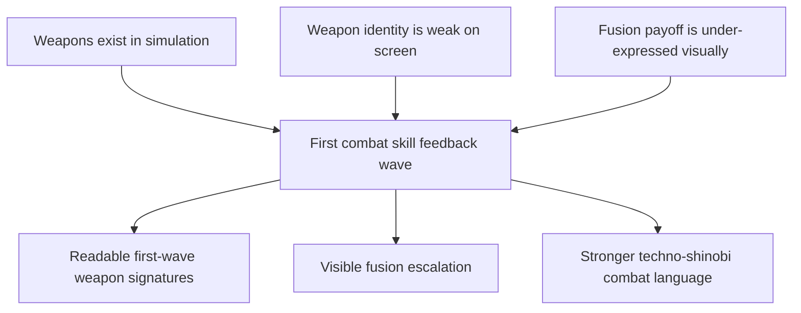

## req_061_define_a_first_combat_skill_feedback_wave_for_playable_weapons - Define a first combat skill feedback wave for playable weapons
> From version: 0.4.0
> Status: Draft
> Understanding: 98%
> Confidence: 97%
> Complexity: Medium
> Theme: Gameplay
> Reminder: Update status/understanding/confidence and references when you edit this doc.

# Needs
- Make the first playable weapon roster visibly readable in combat instead of leaving most weapon identity hidden inside simulation.
- Give each first-wave techno-shinobi active weapon a distinct on-screen feedback signature that teaches its role through motion and space control.
- Improve fusion payoff by making evolved states visibly stronger and more recognizable, not merely numerically better.
- Do this without prematurely forcing a broad rewrite toward persistent projectile gameplay objects for every skill.

# Context
The project now has a real first survivor-like build loop:
- first-wave active weapons
- first-wave passive items
- first-wave fusions
- level-up choices
- chest-driven payoff
- build tracking in the runtime shell

That means the game now solves `what the player owns`.

What it does not yet solve well enough is:

`what the player sees each owned weapon doing`

Right now, most first-wave skills are real in gameplay but weak in visual communication:
- damage resolves
- attack cadence changes
- fusion can happen
- floating damage numbers appear

but the runtime still does not strongly express:
- a lash
- a needle volley
- a kunai fan
- a lob impact
- an orbiting sutra pulse
- a hush field

The result is a product gap:
- the build system is more advanced than the combat presentation
- the roster feels flatter than it really is
- players cannot learn weapon roles quickly through sight
- fusion payoff lacks enough visible escalation

This request should define one bounded wave that adds readable first-pass combat-skill feedback for the playable weapon roster.

Recommended posture:
1. Add a compact attack-feedback event layer emitted by the current combat resolution.
2. Render transient techno-shinobi skill feedback from those events.
3. Keep first-wave visuals short-lived, readable, and role-specific.
4. Differentiate fusion states through intensified signatures, not a whole second architecture.
5. Avoid widening into a full projectile-simulation rewrite unless a later wave proves that necessity.

# Acceptance criteria
- AC1: The request defines a bounded first-pass combat-skill feedback wave for the playable weapon roster rather than a broad full-combat renderer rewrite.
- AC2: The request defines the need for each first-wave active weapon to gain a distinct readable visual signature aligned with its role.
- AC3: The request defines fusion states as visually intensified forms of known weapon signatures rather than entirely unrelated effects.
- AC4: The request defines a compact simulation-to-presentation contract, such as transient attack-feedback events, that allows weapon visuals to be added without immediately requiring persistent projectile entities for every skill.
- AC5: The request keeps the wave scoped away from a full projectile-gameplay rewrite, full VFX polish pass, or audio-system expansion.

# Open questions
- Should the first pass include temporary zone markers for `Cinder Arc` and `Null Canister`, or stay entirely instantaneous?
  Recommended default: yes, include short bounded markers because those roles are spatial and delayed by nature.
- Should the first pass render feedback for passives directly?
  Recommended default: no, let passives shape the weapon visuals indirectly through cadence, multiplicity, and footprint.
- Should the event contract expose exact hit targets or just weapon-local effect shapes?
  Recommended default: expose enough origin/target/impact data to support readable weapon signatures without overfitting to one renderer.

# Definition of Ready (DoR)
- [x] Problem statement is explicit and player-facing impact is clear.
- [x] Scope boundaries (in/out) are explicit.
- [x] Acceptance criteria are testable.
- [x] Dependencies and known risks are listed.

# Companion docs
- Product brief(s): `prod_010_first_playable_techno_shinobi_build_content_and_progression_defaults`, `prod_011_techno_shinobi_combat_skill_feedback_direction_for_first_playable_weapons`
- Architecture decision(s): `adr_038_split_entity_player_rendering_into_stable_geometry_and_transient_combat_overlays`, `adr_042_separate_weapon_simulation_from_transient_combat_skill_feedback_presentation`
- Request(s): `req_058_define_a_foundational_survivor_build_system_for_weapons_passives_fusions_and_run_progression`, `req_059_define_a_first_playable_techno_shinobi_build_content_wave`

# Backlog
- `item_228_define_a_transient_attack_feedback_event_contract_for_first_wave_playable_weapons`
- `item_229_define_a_transient_runtime_renderer_slice_for_weapon_traces_pulses_and_zone_markers`
- `item_230_define_readable_first_pass_techno_shinobi_skill_signatures_for_the_six_playable_active_weapons`
- `item_231_define_first_pass_fusion_visual_intensification_rules_for_playable_weapon_feedback`
- `item_232_define_targeted_validation_for_first_wave_weapon_feedback_readability_and_runtime_cost`
