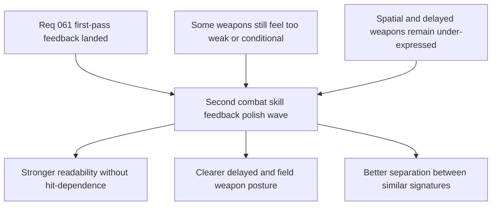

## req_062_define_a_second_combat_skill_feedback_polish_wave_for_underexpressed_weapons - Define a second combat skill feedback polish wave for underexpressed weapons
> From version: 0.4.0
> Status: Done
> Understanding: 100%
> Confidence: 98%
> Complexity: Medium
> Theme: Gameplay
> Reminder: Update status/understanding/confidence and references when you edit this doc.

# Needs
- Strengthen the first-wave combat-skill feedback where the current first pass still reads as too weak, too conditional, or too similar across some weapons.
- Ensure each first-wave active weapon remains legible even when it does not immediately land a visible hit on a hostile.
- Improve the spatial readability of delayed, orbit, and field-style weapons so players can read where their control is being exerted.
- Preserve the bounded transient-feedback posture introduced in `req_061` instead of widening straight into a full projectile-gameplay rewrite.

# Context
`req_061` successfully established the first combat-skill feedback wave:
- a bounded `combatSkillFeedbackEvents` seam exists
- the runtime owns a dedicated transient feedback layer
- the first six active weapons now emit distinct first-pass signatures
- fusion states already intensify those signatures in a bounded way

That first pass closed the biggest visibility gap, but it also made the remaining weaknesses clearer.

What still feels under-expressed today:
- some weapon feedback only appears when hostile targets are actually resolved, which means certain skills can still feel visually absent in low-contact moments
- `Cinder Arc` currently communicates impact, but not enough of a lobbed travel or anticipation posture
- `Orbit Sutra` communicates pulse, but not yet enough persistent orbital presence
- `Null Canister` communicates a zone marker, but not yet enough field occupation or hush-area identity
- `Guided Senbon` and `Shade Kunai` both render as line-based attacks and need stronger separation in silhouette and cadence

This creates a second-order product gap:
- the roster is now readable in principle, but not yet equally expressive across all weapon roles
- some weapons still feel quieter than their gameplay importance
- some signatures disappear too completely when no target is resolved
- delayed/field weapons need stronger world-space teaching so players can plan around them

This request should define one bounded second wave focused on polishing those weak spots rather than replacing the current feedback architecture.

Recommended posture:
1. Keep the `combatSkillFeedbackEvents` seam and transient-render-layer posture introduced in `req_061`.
2. Add bounded pre-hit, travel, or linger feedback where role readability requires it.
3. Strengthen under-expressed spatial weapons first: `Cinder Arc`, `Orbit Sutra`, `Null Canister`.
4. Increase silhouette separation between line-based precision and fan-based burst weapons.
5. Stay scoped away from a full persistent-projectile simulation rewrite unless a later wave proves it necessary.

# Acceptance criteria
- AC1: The request defines a bounded second combat-skill feedback polish wave rather than reopening the entire weapon-presentation architecture.
- AC2: The request defines the need for certain weapon signatures to remain readable even when no immediate hit is resolved.
- AC3: The request defines targeted polish for under-expressed first-wave weapons, especially `Cinder Arc`, `Orbit Sutra`, and `Null Canister`.
- AC4: The request defines stronger visual separation between `Guided Senbon` and `Shade Kunai` so they do not both read as near-identical line attacks.
- AC5: The request keeps the wave aligned with the transient techno-shinobi feedback posture from `req_061` and stays scoped away from a full projectile-system rewrite, broad VFX framework expansion, or audio-system pass.

# Open questions
- Should non-hit feedback be emitted for every attack attempt, or only for weapon roles that need anticipation and occupancy?
  Recommended default: only for roles that need it, so the wave stays bounded and avoids unnecessary noise.
- Should `Cinder Arc` gain a visible travel arc, an anticipation reticle, or both?
  Recommended default: prefer a short anticipation/travel cue plus the existing impact burst.
- Should `Orbit Sutra` become persistently visible, or just pulse more often and more clearly?
  Recommended default: prefer a light persistent orbital presence rather than only stronger pulse bursts.
- Should `Null Canister` emphasize field edges, interior texture, or both?
  Recommended default: strengthen the edge and add a subtle internal pattern so the field reads as occupied without becoming noisy.

# Definition of Ready (DoR)
- [x] Problem statement is explicit and grounded in observed runtime feedback gaps.
- [x] Scope boundaries (in/out) are explicit.
- [x] Acceptance criteria are testable.
- [x] Dependencies and known risks are listed.

# Companion docs
- Product brief(s): `prod_012_second_pass_combat_skill_feedback_polish_for_underexpressed_weapons`
- Architecture decision(s): `adr_042_separate_weapon_simulation_from_transient_combat_skill_feedback_presentation`, `adr_043_extend_transient_weapon_feedback_with_bounded_anticipation_and_linger_states`
- Request(s): `req_061_define_a_first_combat_skill_feedback_wave_for_playable_weapons`

# Backlog
- `item_233_define_a_non_hit_readability_posture_for_polished_weapon_feedback`
- `item_234_define_a_stronger_cinder_arc_anticipation_and_travel_signature_without_full_projectiles`
- `item_235_define_a_more_present_orbit_sutra_and_null_canister_spatial_ownership_signature`
- `item_236_define_clearer_visual_role_separation_between_guided_senbon_and_shade_kunai`
- `item_237_define_targeted_validation_for_second_pass_weapon_feedback_polish`
