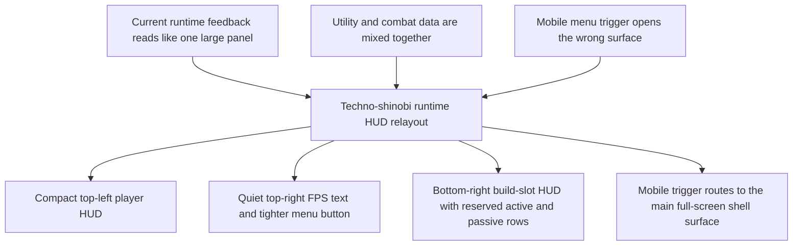

## req_063_define_a_techno_shinobi_runtime_hud_relayout_and_mobile_menu_entry_wave - Define a techno-shinobi runtime HUD relayout and mobile menu entry wave
> From version: 0.4.0
> Status: Done
> Understanding: 100%
> Confidence: 98%
> Complexity: Medium
> Theme: UI
> Reminder: Update status/understanding/confidence and references when you edit this doc.

# Needs
- Transform the current runtime feedback card into a true HUD with clearer screen anchoring and better combat ergonomics.
- Split the current information density into three distinct runtime blocks instead of one large mixed panel.
- Tighten the top-right menu trigger so it reads like a compact HUD control instead of an oversized floating callout.
- On mobile, make the menu trigger route to the main full-screen shell surface instead of opening the floating command-deck panel.

# Context
The current runtime feedback panel successfully exposes useful data, but it still behaves like a compact dashboard card rather than a proper gameplay HUD.

Right now, the same surface mixes:
- player identity and progression
- runtime utility metrics
- active skill inventory
- passive inventory

in one large block that sits over the playfield.

That creates multiple product/UI problems:
- the HUD occupies too much contiguous space
- the most important combat information does not feel anchored to the edges of the screen
- utility metrics like `FPS` compete visually with player-critical information
- active skills read more like text rows in a panel than like quick combat-reference slots
- the HUD does not clearly reserve future build-slot space, so remaining capacity is not taught visually
- the top-right `Command deck` trigger is visually too large for a runtime HUD control
- on mobile, the floating panel behavior is the wrong interaction model; the trigger should route to the main full-screen shell surface instead

This request should define one bounded HUD relayout wave that keeps the techno-shinobi identity while making the runtime chrome more screen-native.

Target layout:
- `(a)` player identity and progression:
  - `Name`
  - `Level`
  - `HP`
  - `XP`
  - `Gold`
  - anchored in a compact HUD panel at the top-left
- `(b)` utility metrics:
  - `FPS` only
  - rendered as a small, quiet text element aligned at the top-right
  - `Gold` leaves this block and moves into `(a)`
- `(c)` build slots:
  - anchored in a compact panel at the bottom-right
  - should move away from text-list presentation and toward a more HUD-like slot posture
  - should reserve visible slot positions even when some slots are still empty so build capacity remains legible
  - should use two lines of slots as the recommended default:
    - one line for active skills
    - one line for passive items
  - icon-first presentation with level badge is the recommended default

Additional posture:
- the visual language must stay firmly `techno-shinobi`
- the top-right menu button must become more compact
- on mobile, tapping the menu button should open the main screen shell entry flow, not the floating command-deck panel
- for this wave, implementation should explicitly use `logics-ui-steering` so the HUD layout avoids generic overlay patterns and stays coherent with the established shell direction

# Acceptance criteria
- AC1: The request defines a bounded runtime HUD relayout wave rather than a broad rewrite of every shell overlay.
- AC2: The request defines the runtime HUD as three distinct blocks:
  - `(a)` top-left player/progression block with `Name`, `Level`, `HP`, `XP`, and `Gold`
  - `(b)` top-right `FPS` as small text only
  - `(c)` bottom-right build-slot block
- AC3: The request defines that `Gold` moves into block `(a)` and no longer shares a utility card with `FPS`.
- AC4: The request defines block `(c)` as a more HUD-like presentation, with icon-first slots and visible level badges as the recommended default posture.
- AC5: The request defines that block `(c)` should reserve visible slot positions even when not all build slots are occupied, so the HUD teaches remaining build capacity.
- AC6: The request defines the recommended default posture for block `(c)` as two rows of reserved slots:
  - one row for active skills
  - one row for passive items
- AC7: The request defines that the top-right menu trigger must become more compact than the current `Command deck` button.
- AC8: The request defines that, on mobile, the menu trigger opens the main full-screen shell surface instead of the floating command-deck panel.
- AC9: The request keeps the visual direction explicitly aligned with the `techno-shinobi` theme and calls for `logics-ui-steering` during implementation.

# Open questions
- Should block `(c)` include passive slots immediately, or only active slots?
  Recommended default: yes, reserve both rows immediately so the HUD teaches full build capacity from the start, even if some slots are empty.
- Should the top-left player block remain a framed panel or become a looser stacked HUD cluster?
  Recommended default: keep a very compact framed cluster so the techno-shinobi language stays controlled and intentional.
- Should the mobile menu trigger open the runtime `pause/settings` shell entry directly or route first through the broader main shell scene?
  Recommended default: open the main full-screen shell surface for consistency with mobile navigation expectations.
- Do active-skill icons need bespoke final art in this wave?
  Recommended default: no, use disciplined placeholder iconography or abstract slot marks first, provided the HUD posture is correct.

# Definition of Ready (DoR)
- [x] Problem statement is explicit and player-facing impact is clear.
- [x] Scope boundaries (in/out) are explicit.
- [x] Acceptance criteria are testable.
- [x] Dependencies and known risks are listed.

# Companion docs
- Product brief(s): `prod_013_techno_shinobi_runtime_hud_and_menu_entry_direction`
- Architecture decision(s): `adr_016_define_shell_scene_state_and_meta_surface_ownership`, `adr_044_split_runtime_hud_into_anchored_blocks_and_route_mobile_menu_entry_to_the_full_screen_shell_surface`
- Request(s): `req_055_rework_all_shell_menus_with_a_techno_shinobi_visual_direction`, `req_059_define_a_first_playable_techno_shinobi_build_content_wave`

# Backlog
- `item_238_define_a_compact_top_left_player_progression_hud_block`
- `item_239_define_a_quiet_top_right_fps_text_and_compact_runtime_menu_trigger`
- `item_240_define_a_bottom_right_reserved_build_slot_hud_for_active_and_passive_capacity`
- `item_241_route_the_mobile_runtime_menu_trigger_to_the_full_screen_shell_surface`
- `item_242_define_ui_steering_validation_for_the_runtime_hud_relayout_wave`
