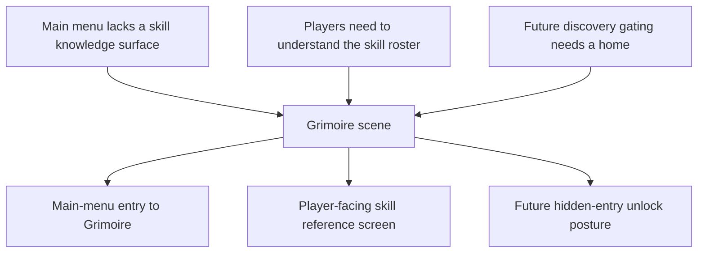

## req_064_define_a_grimoire_scene_for_skill_discovery_and_future_unlock_gating - Define a grimoire scene for skill discovery and future unlock gating
> From version: 0.4.0
> Status: Done
> Understanding: 100%
> Confidence: 98%
> Complexity: Medium
> Theme: UI
> Reminder: Update status/understanding/confidence and references when you edit this doc.

# Needs
- Add a new entry in the main menu that opens a dedicated screen listing the game’s skills.
- Give players a clear place to understand what each skill does outside live combat pressure.
- Establish the right long-term posture for discoverability: in the future, grimoire entries should stay hidden until the player has unlocked or seen them at least once in a run.

# Context
The project now has a real first playable build loop:
- active weapons
- passive items
- fusions
- level-up choices
- runtime HUD tracking

That means the game is starting to accumulate build knowledge that players need to understand somewhere other than the runtime itself.

Right now, the shell provides:
- `Main menu`
- `Settings`
- `Changelogs`

but it does not yet provide a player-facing codex or knowledge surface for the skill roster.

This creates a product gap:
- players can obtain skills in a run without having a stable reference screen to understand them
- the shell lacks a natural long-term discovery surface for build content
- future unlock-driven progression has no obvious home yet

This request should define a new shell scene reachable from the main menu.

Recommended naming posture:
- use `Grimoire` or a close techno-shinobi-compatible derivative
- keep the term strong, short, and clearly associated with knowledge/discovery

Recommended functional posture for the first wave:
1. Add a main-menu entry that opens the new `Grimoire` scene.
2. The scene lists known skills in a player-readable format.
3. The scene helps players understand the roster, not tune or equip it.
4. The first pass may show the full authored roster if necessary for implementation simplicity.
5. The scene must already be structurally compatible with future hidden-entry gating.

Recommended future posture:
- grimoire entries should become hidden or unavailable until the player has unlocked, seen, or otherwise discovered them at least once in gameplay
- hidden entries should feel intentionally undiscovered, not missing by accident
- this future gating should be anticipated now in information architecture, even if not fully implemented in the first pass

# Acceptance criteria
- AC1: The request defines a new main-menu entry leading to a dedicated `Grimoire`-style screen.
- AC2: The request defines the new screen as a player-facing skill reference surface rather than an equipment, tuning, or debug screen.
- AC3: The request defines that the screen should list and explain skills in a player-readable way.
- AC4: The request defines that future hidden-entry gating must be anticipated, so entries can later be locked until discovered in gameplay.
- AC5: The request keeps the first wave bounded and does not widen immediately into a full meta-progression, collection-completion, or lore-encyclopedia system.

# Open questions
- Should the first pass list only active skills, or active skills plus passives and fusions?
  Recommended default: include the full skill family surface, but structure it clearly by category.
- Should undiscovered entries be completely hidden in the future, or shown as redacted placeholders?
  Recommended default: keep this open for a later wave, but architect the screen so either approach remains possible.
- Should the grimoire be purely textual in the first pass, or include icons and compact visual signatures?
  Recommended default: include iconography where practical, but prioritize readable structure and comprehension first.
- Should the scene sit visually closer to `Changelogs`, `Settings`, or become its own stronger archive/codex posture?
  Recommended default: give it its own codex/archive posture while remaining consistent with the shell’s techno-shinobi language.

# Definition of Ready (DoR)
- [x] Problem statement is explicit and player-facing impact is clear.
- [x] Scope boundaries (in/out) are explicit.
- [x] Acceptance criteria are testable.
- [x] Dependencies and known risks are listed.

# Companion docs
- Product brief(s): `prod_014_shell_codex_archive_direction_for_grimoire_and_bestiary`
- Architecture decision(s): `adr_016_define_shell_scene_state_and_meta_surface_ownership`, `adr_045_model_grimoire_and_bestiary_as_shell_owned_discovery_gated_archive_scenes`
- Request(s): `req_058_define_a_foundational_survivor_build_system_for_weapons_passives_fusions_and_run_progression`, `req_059_define_a_first_playable_techno_shinobi_build_content_wave`

# Backlog
- `item_243_define_main_menu_codex_archive_entry_posture_for_grimoire_and_bestiary_access`
- `item_244_define_a_player_facing_grimoire_scene_for_skill_discovery_and_future_unlock_gating`
- `item_246_define_a_shared_discovery_gating_and_unknown_entry_posture_for_codex_archive_scenes`
- `item_247_define_techno_shinobi_codex_archive_presentation_and_validation_for_grimoire_and_bestiary`
