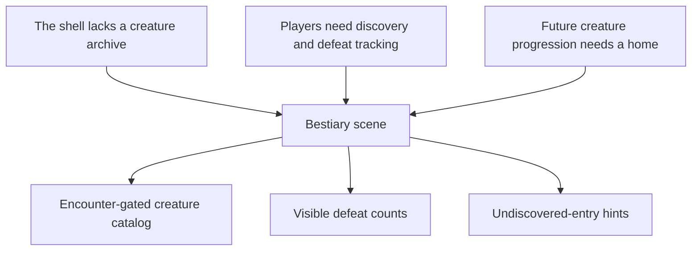

## req_065_define_a_bestiary_scene_for_discovered_and_defeated_creatures - Define a bestiary scene for discovered and defeated creatures
> From version: 0.4.0
> Status: Draft
> Understanding: 99%
> Confidence: 98%
> Complexity: Medium
> Theme: UI
> Reminder: Update status/understanding/confidence and references when you edit this doc.

# Needs
- Add a new shell screen dedicated to the game’s creatures.
- Let players consult a catalog of creatures they have already encountered in gameplay.
- Show defeat-oriented progression signals, such as how many times a creature has been killed.
- Keep undiscovered or unseen creatures hidden enough to preserve discovery, while still hinting that more entries exist.

# Context
The project is starting to accumulate not only build content, but also combat-facing enemy content that players may want to understand and track over time.

The shell currently lacks a dedicated codex surface for creatures:
- there is no player-facing catalog of encountered enemies
- there is no persistent place to understand what has already been seen
- there is no obvious home for future creature progression, discovery, or run-history signals

This creates a product gap similar to the missing skill-reference gap:
- creatures exist in gameplay, but not yet in a player-facing archive
- the game cannot yet acknowledge discovery and hunting progress in a clear shell-owned way
- future collection/progression hooks have no obvious home

This request should define a dedicated `Bestiary`-style scene, parallel to the future `Grimoire`, but focused on creatures rather than skills.

Recommended functional posture for the first wave:
1. Add a new shell entry leading to a dedicated creature catalog screen.
2. The scene lists creatures the player has already encountered.
3. Each visible creature entry can expose at least:
   - creature name
   - a compact presentation block
   - defeat count, such as `times defeated`
4. The screen is informative and archival, not a tuning, debug, or spawn-control surface.
5. Creatures that have not yet been encountered should not be fully revealed.

Recommended discovery posture:
- a creature should only become fully visible in the bestiary once the player has already crossed or discovered it in gameplay
- if needed, the bestiary may show a subtle placeholder or “unknown entry” hint to imply that more remains to be discovered
- undiscovered entries must feel intentional, not like missing data or broken content

Recommended future posture:
- the bestiary should later support richer creature knowledge:
  - encounter count
  - defeat count
  - category/faction grouping
  - notes, traits, or lore
- but this first request should stay bounded to discovery, visibility gating, and basic kill-tracking presentation

# Acceptance criteria
- AC1: The request defines a dedicated `Bestiary`-style shell scene for creatures.
- AC2: The request defines the scene as a player-facing archive/reference surface rather than a debug or tuning screen.
- AC3: The request defines that visible entries should be limited to creatures already encountered in gameplay.
- AC4: The request defines that creature entries should support defeat-oriented progress data, such as `times defeated`.
- AC5: The request defines that undiscovered creatures should not be fully visible, while still allowing a light hint or stub that more entries exist.
- AC6: The request stays bounded and does not immediately widen into a full lore encyclopedia, collection-completion metagame, or advanced analytics screen.

# Open questions
- Should a creature unlock in the bestiary on `first sight` or only on `first kill`?
  Recommended default: unlock on first sight, while defeat count remains separate progression data.
- Should undiscovered entries appear as redacted slots, silhouettes, or just a generic unknown line?
  Recommended default: use a subtle unknown-entry hint that implies missing discoveries without revealing too much structure.
- Should the first pass group creatures by category, or stay as a flat list?
  Recommended default: start with a flat or lightly grouped list so the first wave stays bounded.
- Should this screen be a sibling to `Grimoire` in the main menu, or part of a broader codex family later?
  Recommended default: implement it as its own sibling screen now, while leaving room for a broader codex family later.

# Definition of Ready (DoR)
- [x] Problem statement is explicit and player-facing impact is clear.
- [x] Scope boundaries (in/out) are explicit.
- [x] Acceptance criteria are testable.
- [x] Dependencies and known risks are listed.

# Companion docs
- Product brief(s): `prod_014_shell_codex_archive_direction_for_grimoire_and_bestiary`
- Architecture decision(s): `adr_016_define_shell_scene_state_and_meta_surface_ownership`, `adr_045_model_grimoire_and_bestiary_as_shell_owned_discovery_gated_archive_scenes`
- Request(s): `req_064_define_a_grimoire_scene_for_skill_discovery_and_future_unlock_gating`

# Backlog
- `item_243_define_main_menu_codex_archive_entry_posture_for_grimoire_and_bestiary_access`
- `item_245_define_a_player_facing_bestiary_scene_for_discovered_creatures_and_defeat_tracking`
- `item_246_define_a_shared_discovery_gating_and_unknown_entry_posture_for_codex_archive_scenes`
- `item_247_define_techno_shinobi_codex_archive_presentation_and_validation_for_grimoire_and_bestiary`
