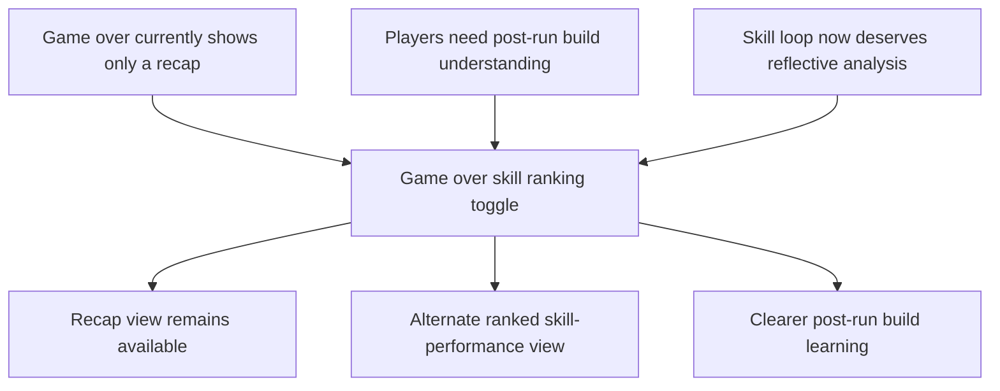

## req_066_define_a_game_over_skill_ranking_view_toggle - Define a game over skill ranking view toggle
> From version: 0.4.0
> Status: Draft
> Understanding: 99%
> Confidence: 98%
> Complexity: Medium
> Theme: UI
> Reminder: Update status/understanding/confidence and references when you edit this doc.

# Needs
- Extend the `game over` screen so it can switch between the current recap view and a second view dedicated to skill performance.
- Let players inspect the skills used during the run in a ranked top-down order from strongest to weakest.
- Turn the defeat screen into a more informative post-run analysis surface without replacing the existing recap.

# Context
The current `game over` scene already provides a compact recap:
- session name
- survived time
- traversal distance
- hostile defeats
- gold

This is useful, but it does not yet help players understand `how their build actually performed`.

The project now has a real skill/build loop:
- active skills
- passives
- fusions
- runtime combat feedback

That means the end-of-run shell can now support a stronger reflective surface:
- not just `what happened`
- but also `which skills carried the run`

This creates a product opportunity:
- players can better understand build outcomes after a defeat
- the game can make run-to-run learning more explicit
- the `game over` screen becomes more than a flat recap card

This request should define a bounded extension of the defeat screen.

Recommended posture:
1. Keep the current recap view.
2. Add a switch, toggle, or segmented control that lets the player alternate between:
   - the current recap
   - a skill-ranking view
3. The skill-ranking view should list skills used during the run from most powerful to least powerful.
4. The skill-ranking view should feel like post-run analysis, not like a full combat log.
5. The wave should stay bounded to `game over` and not widen immediately into a full analytics suite.

Recommended default content for the skill-ranking view:
- skill name
- compact category marker if useful
- rank order from strongest to weakest
- one or two compact performance signals

Recommended default posture for “most powerful”:
- use one clearly defined ranking metric, rather than mixing too many indicators
- the default should be a combat-impact metric that is understandable and stable across runs
- additional metrics can appear later, but this first wave should prioritize clarity over richness

# Acceptance criteria
- AC1: The request defines a bounded UI toggle or switch on the `game over` screen.
- AC2: The request defines that the player can alternate between the current recap view and a second skill-ranking view.
- AC3: The request defines that the skill-ranking view lists run-used skills from strongest to weakest.
- AC4: The request defines the skill-ranking view as a compact post-run analysis surface rather than a full combat log or analytics dashboard.
- AC5: The request keeps the current recap available and does not replace it outright.
- AC6: The request stays bounded to the defeat/game-over surface and does not immediately widen into a broader meta-progression or run-history system.

# Open questions
- What should define `most powerful` in the first pass?
  Recommended default: use one primary combat-impact metric, ideally total damage contribution if available; otherwise use the closest credible authored runtime-impact metric.
- Should the first pass rank only active skills, or include passives/fusions as well?
  Recommended default: rank active skills first, because they are easiest for players to interpret as direct run contributors.
- Should the toggle also appear on `victory`, or only on `game over` for now?
  Recommended default: keep this wave bounded to `game over` first.
- Should the ranking view use bars, percentages, or simple ordered rows?
  Recommended default: use simple ordered rows first, then layer richer comparison visuals later if needed.

# Definition of Ready (DoR)
- [x] Problem statement is explicit and player-facing impact is clear.
- [x] Scope boundaries (in/out) are explicit.
- [x] Acceptance criteria are testable.
- [x] Dependencies and known risks are listed.

# Companion docs
- Product brief(s): `prod_015_post_run_outcome_analysis_direction_for_skill_performance`
- Architecture decision(s): `adr_027_expose_gameplay_outcomes_as_a_game_owned_shell_consumable_contract`, `adr_046_expose_post_run_skill_performance_summaries_as_shell_consumable_outcome_data`
- Request(s): `req_058_define_a_foundational_survivor_build_system_for_weapons_passives_fusions_and_run_progression`, `req_059_define_a_first_playable_techno_shinobi_build_content_wave`

# Backlog
- `item_248_define_a_game_over_view_toggle_between_recap_and_skill_ranking_analysis`
- `item_249_define_a_first_pass_skill_performance_summary_contract_for_post_run_ranking`
- `item_250_define_a_compact_skill_ranking_presentation_for_game_over_analysis`
- `item_251_define_targeted_validation_for_game_over_skill_analysis_readability_and_metric_credibility`
